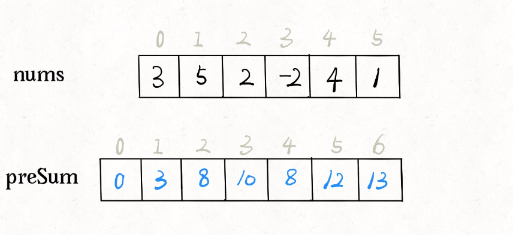

# Frequency_Array (and) Prefix_Sum

## Table of Contents

<!-- TOC depthFrom:1 depthTo:6 withLinks:1 updateOnSave:1 orderedList:0 -->

- [Frequency_Array (and) Prefix_Sum](#c-data-structures-and-algorithms-cheat-sheet) - [Table of Contents](#table-of-contents) - [1.0 Frequency_Array](#10-frequency_array) - [1.1 Overview](#11-overview) - [1.2 Solution](#12-solution) - [1.2.1 Use of two loops](#121-use-of-two-loops) - [1.2.2 Using Map](#122-using-map) - [2.0 Prefix_Sum](#20-prefix_sum) - [2.1 What is Prefix Sum](#21-what-is-prefix-sum) - [2.2 Balanced Trees](#22-balanced-trees) - [2.3 Binary Search](#23-binary-search) - [2.4 Depth-First Search](#24-depth-first-search) - [2.5 Breadth-First Search](#25-breadth-first-search)
<!-- /TOC -->

---

## 1.0 Frequency_Array

---

### 1.1 Overview

Given an array, we have found the number of occurrences of each element in the array.


```
Example 1:
Input: arr[] = {10,5,10,15,10,5};
Output: 10  3
	    5   2
        15  1
Explanation: 10 occurs 3 times in the array
	         5 occurs 2 times in the array
             15 occurs 1 time in the array

Example2:
Input: arr[] = {2,2,3,4,4,2};
Output: 2  3
	    3  1
        4  2
Explanation: 2 occurs 3 times in the array
	         3 occurs 1 time in the array
             4 occurs 2 time in the array
```

---

### 1.2 Solution

---

### 1.2.1 Use of two loops

**Intuition:** We can simply use two loops, in which the first loop points to one element and the second loop finds that element in the remaining array. We will keep track of the occurrence of that same element by maintaining a count variable. We also have to maintain a visited array so that it will keep track of the duplicate elements that we already count.

**Approach:**

- Make a visited array of type boolean.
- Use the first loop to point to an element of the array.
- Initialize the variable count to 1.
- Make that index true in the visited array.
- Run second loop, if we find the element then mark the visited index - true and increase the count.
- If the visited index is already true then skip the other steps.


Code:

```c++
#include <bits/stdc++.h>
using namespace std;

void countFreq(int arr[], int n)
{
    vector<bool> visited(n, false);

    for (int i = 0; i < n; i++) {

        // Skip this element if already processed
        if (visited[i] == true)
            continue;

        // Count frequency
        int count = 1;
        for (int j = i + 1; j < n; j++) {
            if (arr[i] == arr[j]) {
                visited[j] = true;
                count++;
            }
        }
        cout << arr[i] << " " << count << endl;
    }
}

int main()
{
    int arr[] = {10,5,10,15,10,5};
    int n = sizeof(arr) / sizeof(arr[0]);
    countFreq(arr, n);
    return 0;
}
```

Output

```
10 3
5  2
15 1
```

**Time Complexity:** O(N\*N)

**Space Complexity:** O(N)

---

### 1.2.2 Using Map

**Intuition:** We can use a map of value and frequency pair, in which we can easily update the frequency of an element if it is already present in the map, if it is not present in the map then insert it in the map with frequency as 1. After completing all the iterations, print the value frequency pair.

**About unordered_map**

```
Internally unordered_map is implemented using Hash Table
The key provided to map are hashed into indices of a hash table that is why the performance of data structure depends on hash function a lot but on an average
The cost of search, insert and delete from the hash table is O(1).
```

**Approach:**

- Take a unordered_map/HashMap of <Any data type , Integer> pair.
- Use a for loop to iterate the array.
- If the element is not present in the map then insert it with - - - frequency 1, otherwise increase the existing frequency by 1.
- Print the value frequency pair.


code :

```c++
#include <bits/stdc++.h>
using namespace std;

void Frequency(int arr[], int n)
{
    unordered_map<int, int> map;

    for (int i = 0; i < n; i++)
        map[arr[i]]++;

    // Traverse through map and print frequencies
    for (auto x : map)
        cout << x.first << " " << x.second << endl;
}

int main()
{
    int arr[] = {10,5,10,15,10,5};
    int n = sizeof(arr) / sizeof(arr[0]);
    Frequency(arr, n);
    return 0;
}
```

Output

```
15 1
10 3
5  2
```

**Time Complexity:** O(N)

**Space Complexity:** O(n)

---

---

## 2.0 Prefix_Sum

Let's talk about a simple but interesting algorithm problem today. Find the number of subarrays which sums to k.


The most intuitive way is using brute force - find all the subarrays, sum up and compare with k.
The tricky part is, how to find the sum of a subarray fast? For example, you're given an array nums, and asked to implement API sum(i, j) which returns the sum of nums[i..j]. Furthermore, the API will be very frequently used. How do you plan to implement this API?
Due to the high frequency, it is very inefficient to traverse through nums[i..j] each time. Is there a quick method which find the sum in time complexity of O(1)? There is a technique called Prefix Sum.

---

### 2.1 What is Prefix Sum

The idea of Prefix SUm goes like this: for a given array nums, create another array to store the sum of prefix for pre-processing:

```c++
int n = nums.length;
// array of prefix sum
int[] preSum = new int[n + 1];
preSum[0] = 0;
for (int i = 0; i < n; i++)
    preSum[i + 1] = preSum[i] + nums[i];
```



The meaning of preSum is easy to understand. preSum[i] is the sum of nums[0..i-1]. If we want to calculate the sum of nums[i..j], we just need to perform preSum[j+1] - preSum[i] instead of traversing the whole subarray.
Coming back to the original problem. If we want to find the number of subarrays which sums to k respectively, it's straightforward to implement using Prefix Sum technique:

```c++
int subarraySum(int[] nums, int k) {
    int n = nums.length;
    // initialize prefix sum
    int[] sum = new int[n + 1];
    sum[0] = 0;
    for (int i = 0; i < n; i++)
        sum[i + 1] = sum[i] + nums[i];

    int ans = 0;
    // loop through all subarrays by brute force
    for (int i = 1; i <= n; i++)
        for (int j = 0; j < i; j++)
            // sum of nums[j..i-1]
            if (sum[i] - sum[j] == k)
                ans++;

    return ans;
}
```

The time complexity of this solution is O(N^2), while the space complexity is O(N). This is not the optimal solution yet. However, we can apply some cool techniques to reduce the time complexity further, after understanding how Prefix Sum and arrays can work together through this solution.

---

### 2.2 Balanced Trees

- Balanced trees are a special type of tree which maintains its balance to ensure `O(log(n))` operations
- When trees are not balanced the benefit of `log(n)` operations is lost due to the highly vertical structure
- Examples of balanced trees:
  - AVL Trees
  - Red-Black Trees

---

### 2.3 Binary Search

**Idea:**

1. If current element, return
2. If less than current element, look left
3. If more than current element, look right
4. Repeat

**Data Structures:**

- Tree
- Sorted array

**Space:**

- `O(1)`

**Best Case:**

- `O(1)`

**Worst Case:**

- `O(log n)`

**Average:**

- `O(log n)`

**Visualization:**

## 

### 2.4 Depth-First Search

**Idea:**

1. Start at root node
2. Recursively search all adjacent nodes and mark them as searched
3. Repeat

**Data Structures:**

- Tree
- Graph

**Space:**

- `O(V)`, `V = number of verticies`

**Performance:**

- `O(E)`, `E = number of edges`

**Visualization:**

## 

### 2.5 Breadth-First Search

**Idea:**

1. Start at root node
2. Search neighboring nodes first before moving on to next level

**Data Structures:**

- Tree
- Graph

**Space:**

- `O(V)`, `V = number of verticies`

**Performance:**

- `O(E)`, `E = number of edges`

**Visualization:**


