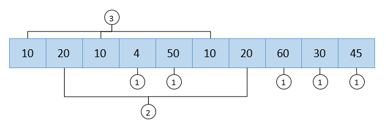
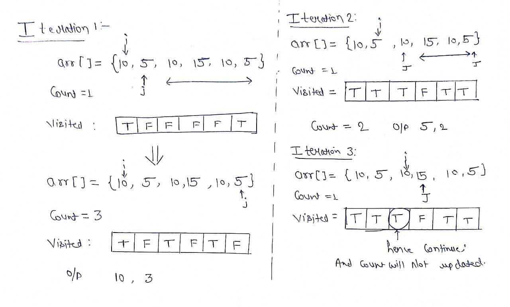
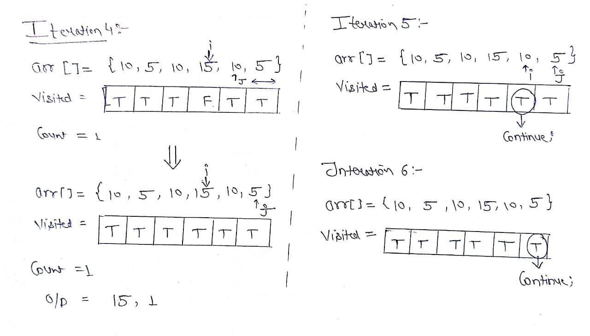
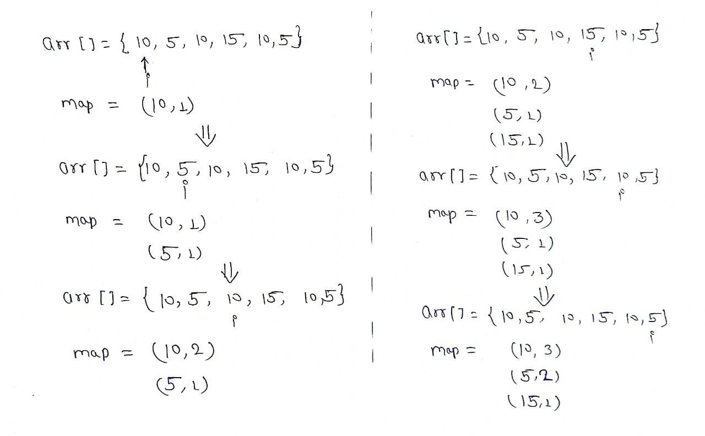
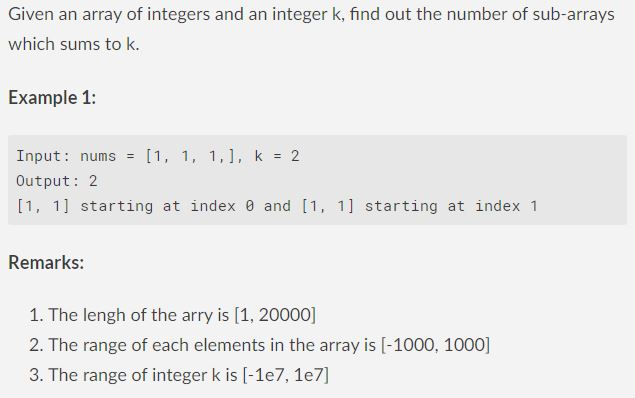

# Frequency_Array (and) Prefix_Sum 

## Table of Contents

<!-- TOC depthFrom:1 depthTo:6 withLinks:1 updateOnSave:1 orderedList:0 -->

<<<<<<< HEAD
- [Frequency_Array (and) Prefix_Sum](#c-data-structures-and-algorithms-cheat-sheet)
	- [Table of Contents](#table-of-contents)
	- [1.0 Frequency_Array](#10-frequency_array)
		- [1.1 Overview](#11-overview)
		- [1.2 Solution](#12-solution)
		   - [1.2.1 Use of two loops](#121-use-of-two-loops)
		   - [1.2.2 Using Map](#122-using-map)
	- [2.0 Prefix_Sum](#20-prefix_sum)
		- [2.1 What is Prefix Sum](#21-what-is-prefix-sum)
		- [2.2 1D Prefix Sums](#22-1d-prefix-sums)
		- [2.3 2D Prefix Sums](#23-2d-prefix-sums)
		- [2.4 Use Cases and Application of Prefix Sum](#24-use-cases-and-application-of-prefix-sum)
=======
- [Frequency_Array (and) Prefix_Sum](#c-data-structures-and-algorithms-cheat-sheet) - [Table of Contents](#table-of-contents) - [1.0 Frequency_Array](#10-frequency_array) - [1.1 Overview](#11-overview) - [1.2 Solution](#12-solution) - [1.2.1 Use of two loops](#121-use-of-two-loops) - [1.2.2 Using Map](#122-using-map) - [2.0 Prefix_Sum](#20-prefix_sum) - [2.1 What is Prefix Sum](#21-what-is-prefix-sum) - [2.2 1D Prefix Sums](#22-1d-prefix-sums) - [2.3 2D Prefix Sums](#23-2d-prefix-sums) - [2.4 Use Cases and Application of Prefix Sum](#24-use-cases-and-application-of-prefix-sum)
>>>>>>> 70b30d6 (first commit)
<!-- /TOC -->

------------------------------------------------------------------
## 1.0 Frequency_Array
<<<<<<< HEAD
-----------------------------------------------------------------
-----
=======

---

---

>>>>>>> 70b30d6 (first commit)
### 1.1 Overview
Given an array, we have found the number of occurrences of each element in the array.


```
Example 1:
Input: arr[] = {10,5,10,15,10,5};
Output: 10  3
	    5   2
        15  1
Explanation: 10 occurs 3 times in the array
	         5 occurs 2 times in the array
             15 occurs 1 time in the array

Example2: 
Input: arr[] = {2,2,3,4,4,2};
Output: 2  3
	    3  1
        4  2
Explanation: 2 occurs 3 times in the array
	         3 occurs 1 time in the array
             4 occurs 2 time in the array
```

-------------------------------------------------------
### 1.2 Solution
------------------------------------------------------
### 1.2.1 Use of two loops
**Intuition:** We can simply use two loops, in which the first loop points to one element and the second loop finds that element in the remaining array. We will keep track of the occurrence of that same element by maintaining a count variable. We also have to maintain a visited array so that it will keep track of the duplicate elements that we already count.  

**Approach:** 

- Make a visited array of type boolean.
- Use the first loop to point to an element of the array.
- Initialize the variable count to 1.
- Make that index true in the visited array.
- Run second loop, if we find the element then mark the visited index - true and increase the count.
- If the visited index is already true then skip the other steps.




Code:
```c++
#include <bits/stdc++.h>
using namespace std;
 
void countFreq(int arr[], int n)
{
    vector<bool> visited(n, false);
 
    for (int i = 0; i < n; i++) {
 
        // Skip this element if already processed
        if (visited[i] == true)
            continue;
 
        // Count frequency
        int count = 1;
        for (int j = i + 1; j < n; j++) {
            if (arr[i] == arr[j]) {
                visited[j] = true;
                count++;
            }
        }
        cout << arr[i] << " " << count << endl;
    }
}
 
int main()
{
    int arr[] = {10,5,10,15,10,5};
    int n = sizeof(arr) / sizeof(arr[0]);
    countFreq(arr, n);
    return 0;
}
```
Output
```
10 3
5  2
15 1
```
**Time Complexity:** O(N*N)

**Space Complexity:**  O(N)

-------------------------------------------------------
### 1.2.2 Using Map
**Intuition:** We can use a map of value and frequency pair, in which we can easily update the frequency of an element if it is already present in the map, if it is not present in the map then insert it in the map with frequency as 1. After completing all the iterations, print the value frequency pair. 

**About unordered_map**
```
Internally unordered_map is implemented using Hash Table
The key provided to map are hashed into indices of a hash table that is why the performance of data structure depends on hash function a lot but on an average
The cost of search, insert and delete from the hash table is O(1).
```
**Approach:**

- Take a unordered_map/HashMap of <Any data type , Integer> pair.
- Use a for loop to iterate the array.
- If the element is not present in the map then insert it with - - -  frequency 1, otherwise increase the existing frequency by 1.
- Print the value frequency pair.



code : 
```c++
#include <bits/stdc++.h>
using namespace std;
 
void Frequency(int arr[], int n)
{
    unordered_map<int, int> map;
 
    for (int i = 0; i < n; i++)
        map[arr[i]]++;
 
    // Traverse through map and print frequencies
    for (auto x : map)
        cout << x.first << " " << x.second << endl;
}
 
int main()
{
    int arr[] = {10,5,10,15,10,5};
    int n = sizeof(arr) / sizeof(arr[0]);
    Frequency(arr, n);
    return 0;
}
```
Output
```
15 1
10 3
5  2
```
**Time Complexity:** O(N)

**Space Complexity:** O(n)

-------------------------------------------------------
-------------------------------------------------------
## 2.0 Prefix_Sum
Let's talk about a simple but interesting algorithm problem today. Find the number of subarrays which sums to k.



The most intuitive way is using brute force - find all the subarrays, sum up and compare with k.
The tricky part is, how to find the sum of a subarray fast? For example, you're given an array nums, and asked to implement API sum(i, j) which returns the sum of nums[i..j]. Furthermore, the API will be very frequently used. How do you plan to implement this API?
Due to the high frequency, it is very inefficient to traverse through nums[i..j] each time. Is there a quick method which find the sum in time complexity of O(1)? There is a technique called Prefix Sum.

--------------------------------------------------------
### 2.1 What is Prefix Sum

We are calculating the prefix sum for the same set of indices multiple times. Is there a way to use the result of the previous prefix sum in the sum of the next prefix sum?

Observe that the result of the (i + 1)th prefix sum is equal to the result of the ith prefix sum + the current element in the array.

We can avoid recalculating the whole prefix sum at each index. We can just use the value of the prefix sum from the previous iteration and add the current array element to it.

**Implementation**

```c++
vector<int> getCumulativeSum(vector<int> &arr) {
   vector<int> cumulativeSum(n);
   cumulativeSum[0] = arr[0];
   for (int i = 1; i < arr.size(); i++) {
       cumulativeSum[i] = cumulativeSum[i - 1] + arr[i];
   }
   return cumulativeSum;
<<<<<<< HEAD
}
```
**Time Complexity:** O(n)

**Space Complexity:** O(n)

-------------------------------------------------------
### 2.2 1D Prefix Sums
Let's say we have a one-indexed integer array $\texttt{arr}$ of size $N$ and we
want to compute the value of

$$\texttt{arr}[a]+\texttt{arr}[a+1]+\cdots+\texttt{arr}[b]$$

for $Q$ different pairs $(a,b)$ satisfying $1\le a\le b\le N$. We'll use the
following example with $N = 6$:

|Index $i$ | 1 | 2 | 3 | 4 | 5 | 6 |
|----------|---|---|---|---|---|---|
| arr[i]   | 1 | 6 | 4 | 2 | 5 | 3 |

Naively, for every query, we can iterate through all entries from index $a$ to
index $b$ to add them up. Since we have $Q$ queries and each query requires a
maximum of $\mathcal{O}(N)$ operations to calculate the sum, our total time
complexity is $\mathcal{O}(NQ)$. For most problems of this nature, the
constraints will be $N, Q \leq 10^5$, so $NQ$ is on the order of $10^{10}$. This
is not acceptable; it will almost certainly exceed the time limit.

Instead, we can use prefix sums to process these array sum queries. We designate
a prefix sum array $\texttt{prefix}$. First, because we're 1-indexing the array,
set $\texttt{prefix}[0]=0$, then for indices $k$ such that $1 \leq k \leq n$,
define the prefix sum array as follows:

$$\texttt{prefix}[k]=\sum_{i=1}^{k} \texttt{arr}[i]$$

Basically, what this means is that the element at index $k$ of the prefix sum
array stores the sum of all the elements in the original array from index $1$ up
to $k$. This can be calculated easily in $\mathcal{O}(N)$ by the following
formula for each $1\le k\le n$:

$$\texttt{prefix}[k]=\texttt{prefix}[k-1]+\texttt{arr}[k]$$

For the example case, our prefix sum array looks like this:

|Index $i$ |0 | 1 | 2 | 3 | 4 | 5 | 6 |
|--------- |--|---|---|---|---|---|---|
| prefix[i]|0 | 1 | 7 | 11 | 13 | 18 | 21 |

Now, when we want to query for the sum of the elements of $\texttt{arr}$ between
(1-indexed) indices $a$ and $b$ inclusive, we can use the following formula:

$$\sum_{i=L}^{R} \texttt{arr}[i] = \sum_{i=1}^{R} \texttt{arr}[i] - \sum_{i=1}^{L-1} \texttt{arr}[i]$$

Using our definition of the elements in the prefix sum array, we have

$$\sum_{i=L}^{R} \texttt{arr}[i]= \texttt{prefix}[R]-\texttt{prefix}[L-1]$$

Since we are only querying two elements in the prefix sum array, we can
calculate subarray sums in $\mathcal{O}(1)$ per query, which is much better than
the $\mathcal{O}(N)$ per query that we had before. Now, after an
$\mathcal{O}(N)$ preprocessing to calculate the prefix sum array, each of the
$Q$ queries takes $\mathcal{O}(1)$ time. Thus, our total time complexity is
$\mathcal{O}(N+Q)$, which should now pass the time limit.

Let's do an example query and find the subarray sum between indices $a = 2$ and
$b = 5$, inclusive, in the 1-indexed $\texttt{arr}$. From looking at the
original array, we see that this is

$$\sum_{i=2}^{5} \texttt{arr}[i] = 6 + 4 + 2 + 5 = 17.$$

|Index $i$ | 1 | 2 | 3 | 4 | 5 | 6 |
|----------|---|---|---|---|---|---|
| arr[i]   | 1 | $\textcolor{blue}{\text{6}}$  | $\textcolor{blue}{\text{4}}$ | $\textcolor{blue}{\text{2}}$ | $\textcolor{blue}{\text{5}}$ | 3 |

Using prefix sums:

$$\texttt{prefix}[5] - \texttt{prefix}[1] = 18 - 1 = 17.$$

|Index $i$ |0 | 1 | 2 | 3 | 4 | 5 | 6 |
|--------- |--|---|---|---|---|---|---|
| prefix[i]|$\textcolor{red}{\text{0}}$  | $\textcolor{red}{\text{1}}$ | $\textcolor{green}{\text{7}}$ | $\textcolor{green}{\text{11}}$ | $\textcolor{green}{\text{13}}$ | $\textcolor{green}{\text{18}}$ | 21 |

These are also known as partial sums.

```c++
#include <bits/stdc++.h>
using namespace std;

#define sz(x) (int)size(x)

using ll = long long;
using vl = vector<ll>;

vl psum(const vl& a) {
	vl psum(sz(a)+1);
	for (int i = 0; i < sz(a); ++i)
		psum[i+1] = psum[i]+a[i];
	// or partial_sum(begin(a),end(a),begin(psum)+1);
	return psum;
}

int main() {
	int N, Q;
	cin >> N >> Q;
	vl a(N);
	for (ll& x: a)
		cin >> x;
	vl p = psum(a);
	for (int i = 0; i < Q; ++i) {
		int l, r;
		cin >> l >> r;
		cout << p[r] - p[l] << "\n";
	}
}
```

-------------------------------------------------------
### 2.3 2D Prefix Sums
=======
}
```

**Time Complexity:** O(n)

**Space Complexity:** O(n)
>>>>>>> 70b30d6 (first commit)

Now, what if we wanted to process $Q$ queries for the sum over a subrectangle of
a 2D matrix with $N$ rows and $M$ columns? Let's assume both rows and columns
are 1-indexed, and we use the following matrix as an example:

<<<<<<< HEAD
|0 | 0 | 0 | 0 | 0 | 0 |
|--|---|---|---|---|---|
| 0| 1 | 5 | 6 | 11| 8 |
| 0| 1 | 7 | 11| 9 | 4 |
| 0| 4 | 6 | 1 | 3 | 2 |
| 0| 7 | 5 | 4 | 2 | 3 |

Naively, each sum query would then take $\mathcal{O}(NM)$ time, for a total of
$\mathcal{O}(QNM)$. This is too slow.
=======
### 2.2 1D Prefix Sums

Let's say we have a one-indexed integer array $\texttt{arr}$ of size $N$ and we
want to compute the value of

$$\texttt{arr}[a]+\texttt{arr}[a+1]+\cdots+\texttt{arr}[b]$$

for $Q$ different pairs $(a,b)$ satisfying $1\le a\le b\le N$. We'll use the
following example with $N = 6$:

| Index $i$ | 1   | 2   | 3   | 4   | 5   | 6   |
| --------- | --- | --- | --- | --- | --- | --- |
| arr[i]    | 1   | 6   | 4   | 2   | 5   | 3   |

Naively, for every query, we can iterate through all entries from index $a$ to
index $b$ to add them up. Since we have $Q$ queries and each query requires a
maximum of $\mathcal{O}(N)$ operations to calculate the sum, our total time
complexity is $\mathcal{O}(NQ)$. For most problems of this nature, the
constraints will be $N, Q \leq 10^5$, so $NQ$ is on the order of $10^{10}$. This
is not acceptable; it will almost certainly exceed the time limit.

Instead, we can use prefix sums to process these array sum queries. We designate
a prefix sum array $\texttt{prefix}$. First, because we're 1-indexing the array,
set $\texttt{prefix}[0]=0$, then for indices $k$ such that $1 \leq k \leq n$,
define the prefix sum array as follows:

$$\texttt{prefix}[k]=\sum_{i=1}^{k} \texttt{arr}[i]$$

Basically, what this means is that the element at index $k$ of the prefix sum
array stores the sum of all the elements in the original array from index $1$ up
to $k$. This can be calculated easily in $\mathcal{O}(N)$ by the following
formula for each $1\le k\le n$:

$$\texttt{prefix}[k]=\texttt{prefix}[k-1]+\texttt{arr}[k]$$

For the example case, our prefix sum array looks like this:

| Index $i$ | 0   | 1   | 2   | 3   | 4   | 5   | 6   |
| --------- | --- | --- | --- | --- | --- | --- | --- |
| prefix[i] | 0   | 1   | 7   | 11  | 13  | 18  | 21  |

Now, when we want to query for the sum of the elements of $\texttt{arr}$ between
(1-indexed) indices $a$ and $b$ inclusive, we can use the following formula:

$$\sum_{i=L}^{R} \texttt{arr}[i] = \sum_{i=1}^{R} \texttt{arr}[i] - \sum_{i=1}^{L-1} \texttt{arr}[i]$$

Using our definition of the elements in the prefix sum array, we have

$$\sum_{i=L}^{R} \texttt{arr}[i]= \texttt{prefix}[R]-\texttt{prefix}[L-1]$$

Since we are only querying two elements in the prefix sum array, we can
calculate subarray sums in $\mathcal{O}(1)$ per query, which is much better than
the $\mathcal{O}(N)$ per query that we had before. Now, after an
$\mathcal{O}(N)$ preprocessing to calculate the prefix sum array, each of the
$Q$ queries takes $\mathcal{O}(1)$ time. Thus, our total time complexity is
$\mathcal{O}(N+Q)$, which should now pass the time limit.

Let's do an example query and find the subarray sum between indices $a = 2$ and
$b = 5$, inclusive, in the 1-indexed $\texttt{arr}$. From looking at the
original array, we see that this is

$$\sum_{i=2}^{5} \texttt{arr}[i] = 6 + 4 + 2 + 5 = 17.$$

| Index $i$ | 1   | 2                            | 3                            | 4                            | 5                            | 6   |
| --------- | --- | ---------------------------- | ---------------------------- | ---------------------------- | ---------------------------- | --- |
| arr[i]    | 1   | $\textcolor{blue}{\text{6}}$ | $\textcolor{blue}{\text{4}}$ | $\textcolor{blue}{\text{2}}$ | $\textcolor{blue}{\text{5}}$ | 3   |

Using prefix sums:

$$\texttt{prefix}[5] - \texttt{prefix}[1] = 18 - 1 = 17.$$

| Index $i$ | 0                           | 1                           | 2                             | 3                              | 4                              | 5                              | 6   |
| --------- | --------------------------- | --------------------------- | ----------------------------- | ------------------------------ | ------------------------------ | ------------------------------ | --- |
| prefix[i] | $\textcolor{red}{\text{0}}$ | $\textcolor{red}{\text{1}}$ | $\textcolor{green}{\text{7}}$ | $\textcolor{green}{\text{11}}$ | $\textcolor{green}{\text{13}}$ | $\textcolor{green}{\text{18}}$ | 21  |

These are also known as partial sums.

```c++
#include <bits/stdc++.h>
using namespace std;

#define sz(x) (int)size(x)

using ll = long long;
using vl = vector<ll>;

vl psum(const vl& a) {
	vl psum(sz(a)+1);
	for (int i = 0; i < sz(a); ++i)
		psum[i+1] = psum[i]+a[i];
	// or partial_sum(begin(a),end(a),begin(psum)+1);
	return psum;
}

int main() {
	int N, Q;
	cin >> N >> Q;
	vl a(N);
	for (ll& x: a)
		cin >> x;
	vl p = psum(a);
	for (int i = 0; i < Q; ++i) {
		int l, r;
		cin >> l >> r;
		cout << p[r] - p[l] << "\n";
	}
}
```
>>>>>>> 70b30d6 (first commit)

Let's take the following example region, which we want to sum:

<<<<<<< HEAD
|0 | 0 | 0 | 0 | 0 | 0 |
|--|---|---|---|---|---|
| 0| 1 | 5 | 6 | 11| 8 |
| 0| 1 | $\textcolor{blue}{\text{7}}$ | $\textcolor{blue}{\text{11}}$| $\textcolor{blue}{\text{9}}$ | 4 |
| 0| 4 | $\textcolor{blue}{\text{6}}$ | $\textcolor{blue}{\text{1}}$ | $\textcolor{blue}{\text{3}}$ | 2 |
| 0| 7 | 5 | 4 | 2 | 3 |

Manually summing all the cells, we have a submatrix sum of $7+11+9+6+1+3 = 37$.

The first logical optimization would be to do one-dimensional prefix sums of
each row. Then, we'd have the following row-prefix sum matrix. The desired
subarray sum of each row in our desired region is simply the green cell minus
the red cell in that respective row. We do this for each row to get
$(28-1) + (14-4) = 37$.

|0 | 0 | 0 | 0 | 0 | 0 |
|--|---|---|---|---|---|
| 0| 1 | 6 | 12| 23| 31|
| 0| $\textcolor{red}{\text{1}}$ | 8 | 19| $\textcolor{green}{\text{28}}$| 32|
| 0| $\textcolor{red}{\text{4}}$ | 10| 11| $\textcolor{green}{\text{14}}$| 16|
| 0| 7 | 12| 16| 18| 21|

Now, if we wanted to find a submatrix sum, we could break up the submatrix into
a subarray for each row, and then add their sums, which would be calculated
using the prefix sums method described earlier. Since the matrix has $N$ rows,
the time complexity of this is $\mathcal{O}(QN)$. This might be fast enough for
$Q=10^5$ and $N=10^3$, but we can do better.

In fact, we can do two-dimensional prefix sums. In our two dimensional prefix
sum array, we have

$$\texttt{prefix}[a][b]=\sum_{i=1}^{a} \sum_{j=1}^{b} \texttt{arr}[i][j].$$

This can be calculated as follows for row index $1 \leq i \leq n$ and column
index $1 \leq j \leq m$:

$$\begin{aligned} \texttt{prefix}[i][j] =& \, \texttt{prefix}[i-1][j]+ \texttt{prefix}[i][j-1] \\ &- \texttt{prefix}[i-1][j-1]+ \texttt{arr}[i][j] \end{aligned}$$

-----------------------------------------------------------
The submatrix sum between rows $a$ and $A$ and columns $b$ and $B$, can thus be
expressed as follows:

$$\begin{aligned} \sum_{i=a}^{A} \sum_{j=b}^{B} \texttt{arr}[i][j]=&\,\texttt{prefix}[A][B] - \texttt{prefix}[a-1][B] \\ &- \texttt{prefix}[A][b-1] + \texttt{prefix}[a-1][b-1] \end{aligned}$$

Summing the blue region from above using the 2D prefix sums method, we add the
value of the green square, subtract the values of the red squares, and then add
the value of the gray square. In this example, we have

$$65-23-6+1 = 37,$$

as expected.

|0 | 0 | 0 | 0 | 0 | 0 |
|--|---|---|---|---|---|
| 0| $\textcolor{gray}{\text{1}}$ | 6 | 12| $\textcolor{red}{\text{23}}$| 31|
| 0| 2 | 14| 31| 51| 63|
| 0| $\textcolor{red}{\text{6}}$ | 24| 42| $\textcolor{green}{\text{65}}$| 79|
| 0| 13| 36| 58| 83|100|

Since no matter the size of the submatrix we are summing, we only need to access
four values of the 2D prefix sum array, this runs in 
$\mathcal{O}(1)$
 per query
after an 
$\mathcal{O}(NM)$
 preprocessing.

 ```c++
 #include <iostream>
#include <vector>

using namespace std;

constexpr int MAX_SIDE = 1000;
int tree_pref[MAX_SIDE + 1][MAX_SIDE + 1];
int forest[MAX_SIDE + 1][MAX_SIDE + 1];

int main() {
	ios_base::sync_with_stdio(0);
	cin.tie(0);

	int N;
	int Q;
	cin >> N >> Q;
	// read in the initial trees
	for (int i = 0; i < N; i++) {
		for (int j = 0; j < N; j++) {
			char a;
			cin >> a;
			forest[i + 1][j + 1] += a == '*';
		}
	}

	// build the prefix sum array
	for (int i = 1; i <= N; i++) {
		for (int j = 1; j <= N; j++) {
			tree_pref[i][j] = forest[i][j]
						+ tree_pref[i - 1][j]
						+ tree_pref[i][j - 1]
						- tree_pref[i - 1][j - 1];
		}
	}

	for (int q = 0; q < Q; q++) {
		int from_row, to_row, from_col, to_col;
		cin >> from_row >> from_col >> to_row >> to_col;
		cout << tree_pref[to_row][to_col]
				- tree_pref[from_row - 1][to_col]
				- tree_pref[to_row][from_col - 1]
				+ tree_pref[from_row - 1][from_col - 1] << '\n';
	}
}
 ```

-------------------------------------------------------
### 2.4 Use Cases and Application of Prefix Sum

- Equilibrium index of an array - The equilibrium index can be defined as the index in the array such that the sum of elements of lower indices is equal to the sum of elements of higher indices. This can easily be found by traversing the prefixSum array once and for each index i checking if the sum of range [0, i] is equal to the sum of range [i+1, n - 1].

- Find if there exists a subarray with sum 0 - Given an array consisting of integers (possibly negative integers). Check if there exists a non-empty subarray such that the sum of elements in it is 0. This can be checked using the prefixSum and some simple hashing concepts.

- Find the minimum farthest checkpoint reachable - Given a card with a certain amount of fuel, find the farthest reachable approach if it costs 1 unit of fuel in covering 1 unit of distance. The brute force apporach requires 
O(n) time, while if we use the concept of prefixSum and binary search it can be optimized to 
O(logn).


-------------------------------------------------------
=======
### 2.3 2D Prefix Sums

Now, what if we wanted to process $Q$ queries for the sum over a subrectangle of
a 2D matrix with $N$ rows and $M$ columns? Let's assume both rows and columns
are 1-indexed, and we use the following matrix as an example:

| 0   | 0   | 0   | 0   | 0   | 0   |
| --- | --- | --- | --- | --- | --- |
| 0   | 1   | 5   | 6   | 11  | 8   |
| 0   | 1   | 7   | 11  | 9   | 4   |
| 0   | 4   | 6   | 1   | 3   | 2   |
| 0   | 7   | 5   | 4   | 2   | 3   |

Naively, each sum query would then take $\mathcal{O}(NM)$ time, for a total of
$\mathcal{O}(QNM)$. This is too slow.

Let's take the following example region, which we want to sum:

| 0   | 0   | 0                            | 0                             | 0                            | 0   |
| --- | --- | ---------------------------- | ----------------------------- | ---------------------------- | --- |
| 0   | 1   | 5                            | 6                             | 11                           | 8   |
| 0   | 1   | $\textcolor{blue}{\text{7}}$ | $\textcolor{blue}{\text{11}}$ | $\textcolor{blue}{\text{9}}$ | 4   |
| 0   | 4   | $\textcolor{blue}{\text{6}}$ | $\textcolor{blue}{\text{1}}$  | $\textcolor{blue}{\text{3}}$ | 2   |
| 0   | 7   | 5                            | 4                             | 2                            | 3   |

Manually summing all the cells, we have a submatrix sum of $7+11+9+6+1+3 = 37$.

The first logical optimization would be to do one-dimensional prefix sums of
each row. Then, we'd have the following row-prefix sum matrix. The desired
subarray sum of each row in our desired region is simply the green cell minus
the red cell in that respective row. We do this for each row to get
$(28-1) + (14-4) = 37$.

| 0   | 0                           | 0   | 0   | 0                              | 0   |
| --- | --------------------------- | --- | --- | ------------------------------ | --- |
| 0   | 1                           | 6   | 12  | 23                             | 31  |
| 0   | $\textcolor{red}{\text{1}}$ | 8   | 19  | $\textcolor{green}{\text{28}}$ | 32  |
| 0   | $\textcolor{red}{\text{4}}$ | 10  | 11  | $\textcolor{green}{\text{14}}$ | 16  |
| 0   | 7                           | 12  | 16  | 18                             | 21  |

Now, if we wanted to find a submatrix sum, we could break up the submatrix into
a subarray for each row, and then add their sums, which would be calculated
using the prefix sums method described earlier. Since the matrix has $N$ rows,
the time complexity of this is $\mathcal{O}(QN)$. This might be fast enough for
$Q=10^5$ and $N=10^3$, but we can do better.

In fact, we can do two-dimensional prefix sums. In our two dimensional prefix
sum array, we have

$$\texttt{prefix}[a][b]=\sum_{i=1}^{a} \sum_{j=1}^{b} \texttt{arr}[i][j].$$

This can be calculated as follows for row index $1 \leq i \leq n$ and column
index $1 \leq j \leq m$:

$$\begin{aligned} \texttt{prefix}[i][j] =& \, \texttt{prefix}[i-1][j]+ \texttt{prefix}[i][j-1] \\ &- \texttt{prefix}[i-1][j-1]+ \texttt{arr}[i][j] \end{aligned}$$

---

The submatrix sum between rows $a$ and $A$ and columns $b$ and $B$, can thus be
expressed as follows:

$$\begin{aligned} \sum_{i=a}^{A} \sum_{j=b}^{B} \texttt{arr}[i][j]=&\,\texttt{prefix}[A][B] - \texttt{prefix}[a-1][B] \\ &- \texttt{prefix}[A][b-1] + \texttt{prefix}[a-1][b-1] \end{aligned}$$

Summing the blue region from above using the 2D prefix sums method, we add the
value of the green square, subtract the values of the red squares, and then add
the value of the gray square. In this example, we have

$$65-23-6+1 = 37,$$

as expected.

| 0   | 0                            | 0   | 0   | 0                              | 0   |
| --- | ---------------------------- | --- | --- | ------------------------------ | --- |
| 0   | $\textcolor{gray}{\text{1}}$ | 6   | 12  | $\textcolor{red}{\text{23}}$   | 31  |
| 0   | 2                            | 14  | 31  | 51                             | 63  |
| 0   | $\textcolor{red}{\text{6}}$  | 24  | 42  | $\textcolor{green}{\text{65}}$ | 79  |
| 0   | 13                           | 36  | 58  | 83                             | 100 |

Since no matter the size of the submatrix we are summing, we only need to access
four values of the 2D prefix sum array, this runs in
$\mathcal{O}(1)$
per query
after an
$\mathcal{O}(NM)$
preprocessing.

```c++
#include <iostream>
#include <vector>

using namespace std;

constexpr int MAX_SIDE = 1000;
int tree_pref[MAX_SIDE + 1][MAX_SIDE + 1];
int forest[MAX_SIDE + 1][MAX_SIDE + 1];

int main() {
	ios_base::sync_with_stdio(0);
	cin.tie(0);

	int N;
	int Q;
	cin >> N >> Q;
	// read in the initial trees
	for (int i = 0; i < N; i++) {
		for (int j = 0; j < N; j++) {
			char a;
			cin >> a;
			forest[i + 1][j + 1] += a == '*';
		}
	}

	// build the prefix sum array
	for (int i = 1; i <= N; i++) {
		for (int j = 1; j <= N; j++) {
			tree_pref[i][j] = forest[i][j]
						+ tree_pref[i - 1][j]
						+ tree_pref[i][j - 1]
						- tree_pref[i - 1][j - 1];
		}
	}

	for (int q = 0; q < Q; q++) {
		int from_row, to_row, from_col, to_col;
		cin >> from_row >> from_col >> to_row >> to_col;
		cout << tree_pref[to_row][to_col]
				- tree_pref[from_row - 1][to_col]
				- tree_pref[to_row][from_col - 1]
				+ tree_pref[from_row - 1][from_col - 1] << '\n';
	}
}
```

---

### 2.4 Use Cases and Application of Prefix Sum

- Equilibrium index of an array - The equilibrium index can be defined as the index in the array such that the sum of elements of lower indices is equal to the sum of elements of higher indices. This can easily be found by traversing the prefixSum array once and for each index i checking if the sum of range [0, i] is equal to the sum of range [i+1, n - 1].

- Find if there exists a subarray with sum 0 - Given an array consisting of integers (possibly negative integers). Check if there exists a non-empty subarray such that the sum of elements in it is 0. This can be checked using the prefixSum and some simple hashing concepts.

- Find the minimum farthest checkpoint reachable - Given a card with a certain amount of fuel, find the farthest reachable approach if it costs 1 unit of fuel in covering 1 unit of distance. The brute force apporach requires
  O(n) time, while if we use the concept of prefixSum and binary search it can be optimized to
  O(logn).

---
>>>>>>> 70b30d6 (first commit)
