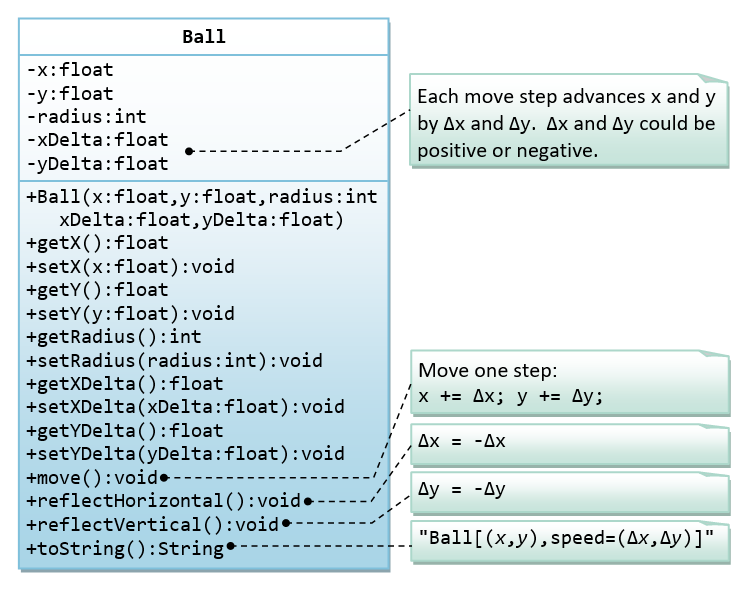

# OOP Exercises

## Table of Contents

<!-- TOC depthFrom:1 depthTo:6 withLinks:1 updateOnSave:1 orderedList:0 -->

- [C plus plus Programming Tutorial](#c-data-structures-and-algorithms-cheat-sheet)
  - [Table of Contents](#table-of-contents)
  - [1.0 Exercises on Classes](#10-exercises-on-classes)
    - [1.1 Ex: Yet Another Circle Class](#11-ex--yet-another-circle-class)
    - [1.2  Ex: The Rectangle Class](#12--ex--the-rectangle-class)
    - [1.3  Ex: The Employee Class](#13--ex--the-employee-class)
    - [1.4  Ex: The InvoiceItem Class](#14--ex--the-invoiceitem-class)
    - [1.5  Ex: The Account Class](#15-ex--the-account-class)
    - [1.6  Ex: The Date Class](#16-the-date-class)
    - [1.7  Ex: The Time Class](#17--ex--the-time-class)
    - [1.8  Ex: The Ball Class](#18--ex--the-ball-class)
  - [2.0 Exercises on Composition](#20-exercises-on-composition)
    - [2.1 Ex: The Author and Book Classes - Your Turn](#21-ex--the-author-and-book-classes---your-turn)
    - [2.2 Ex: The Customer and Invoice classes](#22-ex--the-customer-and-invoice-classes)
    - [2.3 Ex: The Customer and Account classes](#23-ex--the-customer-and-account-classes)
    - [2.4 Ex: The MyPoint Class](#24-ex--the-mypoint-class)
    - [2.5 Ex: The MyLine and MyPoint Classes](#25-ex--the-myline-and-mypoint-classes)
    - [2.6 Ex: The MyCircle and MyPoint Classes](#26-ex--the-mycircle-and-mypoint-classes)
    - [2.7 Ex: The MyTriangle and MyPoint Classes](#27-ex--the-mytriangle-and-mypoint-classes)
  - [3.0 Exercises on Inheritance](#30-exercises-on-inheritance)
     - [3.1 Ex: Superclass Person and its subclasses](#31-ex--superclass-person-and-its-subclasses)
     - [3.2 Ex: Point2D and Point3D](#32-ex--point2d-and-point3d)
     - [3.3 Ex: Point and MovablePoint](#33-ex--point-and-movablepoint)
     - [3.4 Ex: Superclass Shape and its subclasses Circle, Rectangle and Square](#34-ex--superclass-shape-and-its-subclasses-circle-rectangle-and-square)
     - [3.5 Ex: Superclass Animal and its subclasses](#35-ex--superclass-animal-and-its-subclasses)
  - [4.0 Exercises on Polymorphism, Abstract Classes and Interfaces](#40-exercises-on-polymorphism-abstract-classes-and-interfaces)
     - [4.1 Ex: Abstract Superclass Shape and Its Concrete Subclasses](#41-ex--abstract-superclass-shape-and-its-concrete-subclasses)
     - [4.2 Ex: GeometricObject Interface and its Implementation Classes Circle and Rectangle](#42--ex--geometricobject-interface-and-its-implementation-classes-circle-and-rectangle)
     - [4.3 Ex: Movable Interface and its Implementation MovablePoint Class](#43-ex--movable-interface-and-its-implementation-movablepoint-class)
     - [4.4 Ex: Movable Interface and its Implementation Classes MovablePoint and MovableCircle](#44-ex--movable-interface-and-its-implementation-classes-movablepoint-and-movablecircle)
     - [4.5 Ex: Interfaces Resizable and GeometricObject](#45-ex--interfaces-resizable-and-geometricobject)
     - [4.6 Ex: Abstract Superclass Animal and its Implementation Subclasses](#46-ex--abstract-superclass-animal-and-its-implementation-subclasses)
     - [4.7 Ex: Interface Movable and its implementation subclasses MovablePoint and MovableCircle](#47-ex--interface-movable-and-its-implementation-subclasses-movablepoint-and-movablecircle)
## <!-- /TOC -->

---------------------

--------

## 1.0 Exercises on Classes

-----

-----


### 1.1 Ex: Yet Another Circle Class
A class called Circle, which models a circle with a radius, is designed as shown in the following class diagram. Write the Circle class.


##### `Below is a Test Driver to test :`

```c++
int main()
{
    // Test Constructors and toString()
    Circle c1(1.1);
    cout <<  c1.toString() << endl;
    Circle c2; // default constructor
    cout <<  c2.toString() << endl;
    // Test setter and getter
    c1.setRadius(2.2);
    cout <<  c1.toString() << endl;
    cout << "radius is: " << c1.getRadius() << endl;
    // Test getArea() and getCircumference()
    cout << "area is: " <<  c1.getArea() << endl;
    cout << "circumference is: " << c1.getCircumference() << endl;
    //=========================================
    return 0;
}

```

#### `The expected output is:`
```c++
Circle[radius=1.100000]
Circle[radius=1.000000]
Circle[radius=2.200000]
radius is: 2.2
area is: 15.2053
circumference is: 13.823
```

`solution:`

```c++
#include <bits/stdc++.h>
#define _CRT_SECURE_NO_WARNINGS
#define ll long long
#define PI 3.141592653
using namespace std;
using namespace std::chrono;
//======================================
class Circle{
private:
    double radius;
public:
    //Constructors
    Circle(){radius=1.0;}
    Circle (double radius){ this->radius=radius;}
    //Getter
    double getRadius(){return radius;}
    //Setter
    void setRadius (double radius){ this->radius=radius;}
    //method
    double getArea(){return PI*radius*radius;}
    double  getCircumference (){return 2*PI*radius;}
    string toString(){
        string temp="Circle[radius=";
        temp+= to_string(radius)+"]";
        return temp;
    }
};
int main()
{
    // Test Constructors and toString()
    Circle c1(1.1);
    cout <<  c1.toString() << endl;
    Circle c2; // default constructor
    cout <<  c2.toString() << endl;
    // Test setter and getter
    c1.setRadius(2.2);
    cout <<  c1.toString() << endl;
    cout << "radius is: " << c1.getRadius() << endl;
    // Test getArea() and getCircumference()
    cout << "area is: " <<  c1.getArea() << endl;
    cout << "circumference is: " << c1.getCircumference() << endl;
    //=========================================
    return 0;
}
```

------------------------------

### 1.2  Ex: The Rectangle Class

A class called Rectangle, which models a rectangle with a length and a width (in float), is designed as shown in the following class diagram. Write the Rectangle class.


##### `Below is a Test Driver to test :`

```c++
int main()
{
    // Test constructors and toString()
    // You need to append a 'f' or 'F' to a float literal
    Rectangle r1 (1.2f, 3.4f);
    cout << r1.toString() << endl;  // toString()
    Rectangle r2 ;  // default constructor
    cout << r2.toString() << endl;

    // Test setters and getters
    r1.setLength(5.6f);
    r1.setWidth(7.8f);
    cout << r1.toString() << endl;  // toString()
    cout << "length is: " << r1.getLength() << endl;
    cout << "width is: "  << r1.getWidth() << endl;

    // Test getArea() and getPerimeter()
    cout << "area is: " << r1.getArea() << endl;
    cout << "perimeter is: " <<  r1.getPerimeter() << endl;
    //=========================================
    return 0;
}
```

`The expected output is: `

```c++
Rectangle[length=1.200000,width=3.400000]
Rectangle[length=1.000000,width=1.000000]
Rectangle[length=5.600000,width=7.800000]
length is: 5.6
width is: 7.8
area is: 43.68
perimeter is: 26.8
```
`solution :`

```c++
#include <bits/stdc++.h>
#define _CRT_SECURE_NO_WARNINGS
#define ll long long
#define PI 3.141592653
using namespace std;
using namespace std::chrono;
//======================================
class Rectangle{
private:
    float length;
    float width;
public:
    //Constructor
    Rectangle(){length=1.0f,width=1.0f;}
    Rectangle(float length, float width){ this->length=length, this->width=width;}
    //getter
    float getLength(){return length;}
    float getWidth(){return width;}
    //setter
    void setLength (float length){ this->length=length;}
    void setWidth (float width){ this->width=width;}
    //method
    double getArea(){return length*width;}
    double getPerimeter(){return 2*(length+width);}
    string toString(){
        string temp="Rectangle[length=";
        temp+= to_string(length)+",width="+ to_string(width)+"]";
        return temp;
    }
};
int main()
{
    // Test constructors and toString()
    // You need to append a 'f' or 'F' to a float literal
    Rectangle r1 (1.2f, 3.4f);
    cout << r1.toString() << endl;  // toString()
    Rectangle r2 ;  // default constructor
    cout << r2.toString() << endl;

    // Test setters and getters
    r1.setLength(5.6f);
    r1.setWidth(7.8f);
    cout << r1.toString() << endl;  // toString()
    cout << "length is: " << r1.getLength() << endl;
    cout << "width is: "  << r1.getWidth() << endl;

    // Test getArea() and getPerimeter()
    cout << "area is: " << r1.getArea() << endl;
    cout << "perimeter is: " <<  r1.getPerimeter() << endl;
    //=========================================
    return 0;
}
```

-------------------------------------------


### 1.3  Ex: The Employee Class

A class called Employee, which models an employee with an ID, name and salary, is designed as shown in the following class diagram. The method raiseSalary(percent) increases the salary by the given percentage. Write the Employee class.


##### `Below is a Test Driver to test :`

```c++
int main()
{
    // Test constructor and toString()
    Employee e1 (8, "Peter", "Tan", 2500);
    cout << e1.toString() << endl;  // toString();

    // Test Setters and Getters
    e1.setSalary(999);
    cout << e1.toString() << endl;  // toString();
    cout << "id is: "  <<  e1.getId() << endl;
    cout << "firstname is: " <<  e1.getFirstName() << endl;
    cout << "lastname is: " <<  e1.getLastName() << endl;
    cout << "salary is: " <<  e1.getSalary() << endl;

    cout << "name is: " << e1.getName() << endl;
    cout << "annual salary is: " <<  e1.getAnnualSalary() << endl; // Test method

    // Test raiseSalary()
    cout << e1.raiseSalary(10) << endl;
    cout << e1.toString() << endl;
    //=========================================
    return 0;
}
```

`The expected output is: `

```c++
id is: 8
firstname is: Peter
lastname is: Tan
salary is: 999
name is: Peter Tan
annual salary is: 11988
1098
Employee[id=8,name=Peter Tan,salary=1098]
```
`solution :`

```c++
#include <bits/stdc++.h>
#define _CRT_SECURE_NO_WARNINGS
#define ll long long
#define PI 3.141592653
using namespace std;
using namespace std::chrono;
//======================================
class Employee{
private:
    int id;
    string firstName;
    string lastName;
    int salary;
public:
    //Constructor
    Employee (int id, string firstName , string lastName , int salary){
        this->id=id;
        this->firstName=firstName;
        this->lastName=lastName;
        this->salary=salary;
    }
    //getter
    int getId(){return id;}
    string getFirstName(){return firstName;}
    string getLastName(){return lastName;}
    string getName(){return firstName+" "+lastName;}
    int getSalary(){return salary;}
    //setter
    void setSalary (int salary){ this->salary=salary;}
    //method
    int getAnnualSalary(){return 12*salary;}
    int raiseSalary (int percent){salary+=(salary*percent*0.01);return salary;}
    string toString(){
        string temp="Employee[id="+ to_string(id)+",name="+firstName+" "+lastName+",salary="+ to_string(salary)+"]";
        return temp;
    }

};
int main()
{
    // Test constructor and toString()
    Employee e1 (8, "Peter", "Tan", 2500);
    cout << e1.toString() << endl;  // toString();

    // Test Setters and Getters
    e1.setSalary(999);
    cout << e1.toString() << endl;  // toString();
    cout << "id is: "  <<  e1.getId() << endl;
    cout << "firstname is: " <<  e1.getFirstName() << endl;
    cout << "lastname is: " <<  e1.getLastName() << endl;
    cout << "salary is: " <<  e1.getSalary() << endl;

    cout << "name is: " << e1.getName() << endl;
    cout << "annual salary is: " <<  e1.getAnnualSalary() << endl; // Test method

    // Test raiseSalary()
    cout << e1.raiseSalary(10) << endl;
    cout << e1.toString() << endl;
    //=========================================
    return 0;
}
```

--------------------------------------


### 1.4  Ex: The InvoiceItem Class

A class called InvoiceItem, which models an item of an invoice, with ID, description, quantity and unit price, is designed as shown in the following class diagram. Write the InvoiceItem class.


##### `Below is a Test Driver to test :`

```c++
int main()
{

    // Test constructor and toString()
    InvoiceItem inv1 ("A101", "Pen Red", 888, 0.08);
    cout << inv1.toString() << endl;  // toString();

    // Test Setters and Getters
    inv1.setQty(999);
    inv1.setUnitPrice(0.99);
    cout << inv1.toString() << endl;  // toString();
    cout << "id is: " <<  inv1.getId() << endl;
    cout << "desc is: " << inv1.getDesc() << endl;
    cout << "qty is: "  << inv1.getQty() << endl;
    cout << "unitPrice is: " <<  inv1.getUnitPrice() << endl;

    // Test getTotal()
    cout << "The total is: "  <<  inv1.getTotal() << endl;
    //=========================================
    return 0;
}
```

`The expected output is: `

```c++
InvoiceItem[id=?A101, desc=Pen Red, qty=888,unitPrice=0.080000]
InvoiceItem[id=?A101, desc=Pen Red, qty=999,unitPrice=0.990000]
id is: A101
desc is: Pen Red
qty is: 999
unitPrice is: 0.99
The total is: 989.01
```
`solution :`

```c++
#include <bits/stdc++.h>
#define _CRT_SECURE_NO_WARNINGS
#define ll long long
#define PI 3.141592653
using namespace std;
using namespace std::chrono;
//======================================
class InvoiceItem{
private:
    string id;
    string desc;
    int qty;
    double unitPrice;
public:
    //Constructor
    InvoiceItem(string id, string desc, int qty, double unitPrice){
        this->id=id;
        this->desc=desc;
        this->qty=qty;
        this->unitPrice=unitPrice;
    }
    //getter
    string getId(){return id;}
    string getDesc(){return desc;}
    int getQty(){return qty;}
    double getUnitPrice(){return unitPrice;}
    //setter
    void setQty (int qty){ this->qty=qty;}
    void setUnitPrice (double unitPrice){ this->unitPrice=unitPrice;}
    //method
    double getTotal(){return unitPrice*qty;}
    string toString(){
        string temp="InvoiceItem[id=?"+id+", desc="+desc+", qty="+ to_string(qty)+",unitPrice="+to_string(unitPrice)+"]";
        return temp;
    }

};
int main()
{

    // Test constructor and toString()
    InvoiceItem inv1 ("A101", "Pen Red", 888, 0.08);
    cout << inv1.toString() << endl;  // toString();

    // Test Setters and Getters
    inv1.setQty(999);
    inv1.setUnitPrice(0.99);
    cout << inv1.toString() << endl;  // toString();
    cout << "id is: " <<  inv1.getId() << endl;
    cout << "desc is: " << inv1.getDesc() << endl;
    cout << "qty is: "  << inv1.getQty() << endl;
    cout << "unitPrice is: " <<  inv1.getUnitPrice() << endl;

    // Test getTotal()
    cout << "The total is: "  <<  inv1.getTotal() << endl;
    //=========================================
    return 0;
}
```


-------------------------


### 1.5 Ex: The Account Class

A class called Account, which models a bank account of a customer, is designed as shown in the following class diagram. The methods credit(amount) and debit(amount) add or subtract the given amount to the balance. The method transferTo(anotherAccount, amount) transfers the given amount from this Account to the given anotherAccount. Write the Account class.


##### `Below is a Test Driver to test :`

```c++
int main()
{

    // Test constructor and toString()
    Account a1("A101", "Tan Ah Teck", 88);
    cout << a1.toString() << endl;  // toString();
    Account a2("A102", "Kumar"); // default balance
    cout << a2.toString() << endl;

    // Test Getters
    cout << "ID: " << a1.getID() << endl;
    cout << "Name: " <<  a1.getName() << endl;
    cout << "Balance: " <<  a1.getBalance() << endl;

    // Test credit() and debit()
    a1.credit(100);
    cout << a1.toString() << endl;
    a1.debit(50);
    cout << a1.toString() << endl;
    a1.debit(500);  // debit() error
    cout << a1.toString() << endl;

    // Test transfer()
    a1.transferTo(a2, 100);  // toString()
    cout << a1.toString() << endl;
    cout << a2.toString() << endl;
    //=========================================
    return 0;
}
```

`The expected output is: `

```c++
Account [id=A101, name=Tan Ah Teck, balance=88]
Account [id=A102, name=Kumar, balance=0]
ID: A101
Name: Tan Ah Teck
Balance: 88
Account [id=A101, name=Tan Ah Teck, balance=188]
Account [id=A101, name=Tan Ah Teck, balance=138]
Amount exceeded balance
Account [id=A101, name=Tan Ah Teck, balance=138]
Account [id=A101, name=Tan Ah Teck, balance=38]
Account [id=A102, name=Kumar, balance=100]
```
`solution :`

```c++
#include <bits/stdc++.h>
#define _CRT_SECURE_NO_WARNINGS
#define ll long long
#define PI 3.141592653
using namespace std;
using namespace std::chrono;
//======================================
class Account{
private:
    string id;
    string name;
    int balance= 0;
public:
    //Constructor
    Account (string id, string name){ this->id=id, this->name=name;}
    Account (string id, string name, int balance){this->id=id, this->name=name, this->balance=balance;}
    //getter
    string getID(){return id;}
    string getName(){return name;}
    int getBalance(){return balance;}
    //setter

    //method
    int credit (int amount){balance+=amount;return balance;}
    int debit (int amount){
        if(amount<=balance)balance-=amount;
        else cout << "Amount exceeded balance" << endl;
        return balance;
    }
    int transferTo( Account &another,int amount){
        if(amount<=balance) {
            balance -= amount;
            another.credit(amount);
        }
        else cout << "Amount exceeded balance" << endl;
        return balance;
    }
    string toString(){
        string temp="Account [id="+id+", name="+name+", balance="+ to_string(balance)+"]";
        return temp;
    }
};
int main()
{

    // Test constructor and toString()
    Account a1("A101", "Tan Ah Teck", 88);
    cout << a1.toString() << endl;  // toString();
    Account a2("A102", "Kumar"); // default balance
    cout << a2.toString() << endl;

    // Test Getters
    cout << "ID: " << a1.getID() << endl;
    cout << "Name: " <<  a1.getName() << endl;
    cout << "Balance: " <<  a1.getBalance() << endl;

    // Test credit() and debit()
    a1.credit(100);
    cout << a1.toString() << endl;
    a1.debit(50);
    cout << a1.toString() << endl;
    a1.debit(500);  // debit() error
    cout << a1.toString() << endl;

    // Test transfer()
    a1.transferTo(a2, 100);  // toString()
    cout << a1.toString() << endl;
    cout << a2.toString() << endl;
    //=========================================
    return 0;
}
```

-----------


### 1.6 The Date Class


##### `Below is a Test Driver to test :`

```c++
int main()
{
    // Test constructor and toString()
    Date d1(1, 2, 2014);
    cout << d1.toString() << endl;  // toString()

    // Test Setters and Getters
    d1.setMonth(12);
    d1.setDay(9);
    d1.setYear(2099);
    cout << d1.toString() << endl;  // toString()
    cout << "Month: " << d1.getMonth() << endl;
    cout << "Day: " << d1.getDay() << endl;
    cout << "Year: " << d1.getYear() << endl;

    // Test setDate()
    d1.setDate(3, 4, 2016);
    cout << d1.toString() << endl;  // toString()
    //=========================================
    return 0;
}
```

`The expected output is: `

```c++
1/2/2014
9/12/2099
Month: 12
Day: 9
Year: 2099
3/4/2016
```
`solution :`

```c++
#include <bits/stdc++.h>
#define _CRT_SECURE_NO_WARNINGS
#define ll long long
#define PI 3.141592653
using namespace std;
using namespace std::chrono;
//======================================
class Date{
private:
    int day;
    int month;
    int year;
public:
    //Constructor
    Date (int day, int month, int year){ this->day=day, this->month=month, this->year=year;}
    //getter
    int getDay(){return day;}
    int getMonth(){return month;}
    int getYear(){return year;}
    //setter
    void setDay(int day){ this->day=day;}
    void setMonth(int month){ this->month=month;}
    void setYear (int year){ this->year=year;}
    void setDate(int day, int month, int year){this->day=day, this->month=month, this->year=year;}
    //method
    string toString(){
        string temp= to_string(day)+"/"+ to_string(month)+"/"+ to_string(year);
        return temp;
    }
};
int main()
{
    // Test constructor and toString()
    Date d1(1, 2, 2014);
    cout << d1.toString() << endl;  // toString()

    // Test Setters and Getters
    d1.setMonth(12);
    d1.setDay(9);
    d1.setYear(2099);
    cout << d1.toString() << endl;  // toString()
    cout << "Month: " << d1.getMonth() << endl;
    cout << "Day: " << d1.getDay() << endl;
    cout << "Year: " << d1.getYear() << endl;

    // Test setDate()
    d1.setDate(3, 4, 2016);
    cout << d1.toString() << endl;  // toString()
    //=========================================
    return 0;
}
```

-------------------------------


### 1.7  Ex: The Time Class

A class called Time, which models a time instance, is designed as shown in the following class diagram. The methods nextSecond() and previousSecond() shall advance or rewind this instance by one second, and return this instance, so as to support chaining operation such as t1.nextSecond().nextSecond(). Write the Time class.


##### `Below is a Test Driver to test :`

```c++
int main()
{
    // Test constructors and toString()
    Time t1(1, 2, 3);
   cout << t1.toString() << endl;  // toString()

    // Test Setters and Getters
    t1.setHour(4);
    t1.setMinute(5);
    t1.setSecond(6);
    cout << t1.toString() << endl;  // toString()
    cout << "Hour: " << t1.getHour() << endl;
    cout << "Minute: " << t1.getMinute() << endl;
    cout << "Second: " << t1.getSecond() << endl;

    // Test setTime()
    t1.setTime(23, 59, 58);
    cout << t1.toString() << endl;  // toString()

    // Test nextSecond();
    cout << t1.nextSecond().toString() << endl;
    cout << t1.nextSecond().nextSecond().toString() << endl;
    // Test previousSecond()
    cout << t1.previousSecond().toString() << endl;
    cout << t1.previousSecond().previousSecond().toString() << endl;
    //=========================================
    return 0;
}
```

`The expected output is: `

```c++
01:02:03
04:05:06
Hour: 4
Minute: 5
Second: 6
23:59:58
23:59:59
00:00:01
23:59:59
23:59:57
```
`solution :`

```c++
#include <bits/stdc++.h>
#define _CRT_SECURE_NO_WARNINGS
#define ll long long
#define PI 3.141592653
using namespace std;
using namespace std::chrono;
//======================================
class Time{
private:
    int hour;
    int minute;
    int second;
public:
    //Constructor
    Time (int hour, int minute, int second){ this->hour=hour, this->minute=minute, this->second=second;}
    //getter
    int getHour (){return hour;}
    int getMinute(){return minute;}
    int getSecond (){return second;}
    //setter
    void setHour (int hour){ this->hour=hour;}
    void setMinute (int minute){ this->minute=minute;}
    void setSecond (int second){ this->second=second;}
    void setTime (int hour, int minute, int second){ this->hour=hour, this->minute=minute, this->second=second;}
    //method
    Time nextSecond (){
        second++;
        minute+=(second>=60);
        second%=60;
        hour+=(minute>=60);
        minute%=60;
        hour%=24;
        Time temp= Time(hour,minute,second);
        return temp;
    }
    Time previousSecond(){
        second--;
        minute-=(second<0);
        second=(second<0?59:second);
        hour-=(minute<0);
        minute=(minute<0?59:minute);
        hour=(hour<0?23:hour);
        Time temp= Time(hour,minute,second);
        return temp;
    }
    string toString(){
        string temp= (to_string(hour).size()==1?"0"+ to_string(hour): to_string(hour))+
                ":"+ (to_string(minute).size()==1?"0"+ to_string(minute): to_string(minute))+
                ":"+ (to_string(second).size()==1?"0"+ to_string(second): to_string(second));
        return temp;
    }
};
int main()
{
    // Test constructors and toString()
    Time t1(1, 2, 3);
   cout << t1.toString() << endl;  // toString()

    // Test Setters and Getters
    t1.setHour(4);
    t1.setMinute(5);
    t1.setSecond(6);
    cout << t1.toString() << endl;  // toString()
    cout << "Hour: " << t1.getHour() << endl;
    cout << "Minute: " << t1.getMinute() << endl;
    cout << "Second: " << t1.getSecond() << endl;

    // Test setTime()
    t1.setTime(23, 59, 58);
    cout << t1.toString() << endl;  // toString()

    // Test nextSecond();
    cout << t1.nextSecond().toString() << endl;
    cout << t1.nextSecond().nextSecond().toString() << endl;
    // Test previousSecond()
    cout << t1.previousSecond().toString() << endl;
    cout << t1.previousSecond().previousSecond().toString() << endl;
    //=========================================
    return 0;
}
```

-------------


### 1.8  Ex: The Ball Class

A class called Ball, which models a bouncing ball, is designed as shown in the following class diagram. It contains its radius, x and y position. Each move-step advances the x and y by delta-x and delta-y, respectively. delta-x and delta-y could be positive or negative. The reflectHorizontal() and reflectVertical() methods could be used to bounce the ball off the walls. Write the Ball class. Study the test driver on how the ball bounces.





##### `Below is a Test Driver to test :`

```c++
int main()
{
    // Test constructor and toString()
    Ball ball(1.1f, 2.2f, 10, 3.3f, 4.4f);
    cout << ball.toString() << endl;  // toString()

    // Test Setters and Getters
    ball.setX(80.0f);
    ball.setY(35.0f);
    ball.setRadius(5);
    ball.setXDelta(4.0f);
    ball.setYDelta(6.0f);
    cout << ball.toString() << endl;  // toString()
    cout << "x is: " <<  ball.getX() << endl;
    cout << "y is: " << ball.getY() << endl;
    cout << "radius is: " << ball.getRadius() << endl;
    cout << "xDelta is: " << ball.getXDelta() << endl;
    cout << "yDelta is: " << ball.getYDelta() << endl;

    // Bounce the ball within the boundary
    float xMin = 0.0f;
    float xMax = 100.0f;
    float yMin = 0.0f;
    float yMax = 50.0f;
    for (int i = 0; i < 15; i++) {
        ball.move();
        cout << ball.toString() << endl;  // toString()
        float xNew = ball.getX();
        float yNew = ball.getY();
        int radius = ball.getRadius();
        // Check boundary value to bounce back
        if ((xNew + radius) > xMax || (xNew - radius) < xMin) {
            ball.reflectHorizontal();
        }
        if ((yNew + radius) > yMax || (yNew - radius) < yMin) {
            ball.reflectVertical();
        }
    }
    //=========================================
    return 0;
}
```

`The expected output is: `

```c++
Ball[(1.100000,2.200000), speed= (3.000000,4.400000)]
Ball[(80.000000,35.000000), speed= (4.000000,6.000000)]
x is: 80
y is: 35
radius is: 5
xDelta is: 4
yDelta is: 6
Ball[(84.000000,41.000000), speed= (4.000000,6.000000)]
Ball[(88.000000,47.000000), speed= (4.000000,6.000000)]
Ball[(92.000000,41.000000), speed= (4.000000,-6.000000)]
Ball[(96.000000,35.000000), speed= (4.000000,-6.000000)]
Ball[(92.000000,29.000000), speed= (-4.000000,-6.000000)]
Ball[(88.000000,23.000000), speed= (-4.000000,-6.000000)]
Ball[(84.000000,17.000000), speed= (-4.000000,-6.000000)]
Ball[(80.000000,11.000000), speed= (-4.000000,-6.000000)]
Ball[(76.000000,5.000000), speed= (-4.000000,-6.000000)]
Ball[(72.000000,-1.000000), speed= (-4.000000,-6.000000)]
Ball[(68.000000,5.000000), speed= (-4.000000,6.000000)]
Ball[(64.000000,11.000000), speed= (-4.000000,6.000000)]
Ball[(60.000000,17.000000), speed= (-4.000000,6.000000)]
Ball[(56.000000,23.000000), speed= (-4.000000,6.000000)]
Ball[(52.000000,29.000000), speed= (-4.000000,6.000000)]

```
`solution :`

```c++
#include <bits/stdc++.h>
#define _CRT_SECURE_NO_WARNINGS
#define ll long long
#define PI 3.141592653
using namespace std;
using namespace std::chrono;
//======================================
class Ball{
private:
    float x;
    float y;
    int radius;
    float xDelta;
    float yDelta;
public:
    //Constructor
    Ball(float x, float y, float radius, int xDelta , float yDelta){
        this->x=x;
        this->y=y;
        this->radius=radius;
        this->xDelta=xDelta;
        this->yDelta=yDelta;
    }
    //getter
    float getX(){return x;}
    float getY(){return y;}
    int getRadius(){return radius;}
    float getXDelta(){return xDelta;}
    float getYDelta(){return yDelta;}
    //setter
    void setX(float x){ this->x=x;}
    void setY(float y){ this->y=y;}
    void setRadius (int radius){ this->radius=radius;}
    void setXDelta (float xDelta){ this->xDelta=xDelta;}
    void setYDelta (float yDelta){ this->yDelta=yDelta;}
    //method
    void move(){x+=xDelta,y+=yDelta;}
    void reflectHorizontal(){xDelta=-xDelta;}
    void reflectVertical(){yDelta=-yDelta;}
    string toString(){
        string temp= "Ball[("+ to_string(x)+","+ to_string(y)+"), speed= ("+ to_string(xDelta)+","+ to_string(yDelta)+")]";
        return temp;
    }
};
int main()
{
    // Test constructor and toString()
    Ball ball(1.1f, 2.2f, 10, 3.3f, 4.4f);
    cout << ball.toString() << endl;  // toString()

    // Test Setters and Getters
    ball.setX(80.0f);
    ball.setY(35.0f);
    ball.setRadius(5);
    ball.setXDelta(4.0f);
    ball.setYDelta(6.0f);
    cout << ball.toString() << endl;  // toString()
    cout << "x is: " <<  ball.getX() << endl;
    cout << "y is: " << ball.getY() << endl;
    cout << "radius is: " << ball.getRadius() << endl;
    cout << "xDelta is: " << ball.getXDelta() << endl;
    cout << "yDelta is: " << ball.getYDelta() << endl;

    // Bounce the ball within the boundary
    float xMin = 0.0f;
    float xMax = 100.0f;
    float yMin = 0.0f;
    float yMax = 50.0f;
    for (int i = 0; i < 15; i++) {
        ball.move();
        cout << ball.toString() << endl;  // toString()
        float xNew = ball.getX();
        float yNew = ball.getY();
        int radius = ball.getRadius();
        // Check boundary value to bounce back
        if ((xNew + radius) > xMax || (xNew - radius) < xMin) {
            ball.reflectHorizontal();
        }
        if ((yNew + radius) > yMax || (yNew - radius) < yMin) {
            ball.reflectVertical();
        }
    }
    //=========================================
    return 0;
}
```

----------

----------

## 2.0 Exercises on Composition


------

------

### 2.1 Ex: The Author and Book Classes - Your Turn

A class called Author, which models an author of a book, is designed as shown in the class diagram. A class called Book, which models a book written by ONE author and composes an instance of Author as its instance variable, is also shown. Write the Author and Book classes.


##### `Below is a Test Driver to test :`

```c++
int main()
{
    // Test Author class
    Author a1("Tan Ah Teck", "ahteck@nowhere.com");
    cout << a1.toString() << endl;

    a1.setEmail("ahteck@somewhere.com");
    cout << a1.toString() << endl;
    cout << "name is: " <<  a1.getName() << endl;
    cout << "email is: " << a1.getEmail() << endl;

    // Test Book class
    Book b1("12345", "Java for dummies", a1, 8.8, 88);
    cout << b1.toString() << endl;

    b1.setPrice(9.9);
    b1.setQty(99);
    cout << b1.toString() << endl;
    cout << "isbn is: " << b1.getIsbn() << endl;
    cout << "name is: " << b1.getName() << endl;
    cout << "price is: " << b1.getPrice() << endl;
    cout << "qty is: " << b1.getQty() << endl;
    cout << "author is: " << b1.getAuthor().toString() << endl;  // Author's toString()
    cout << "author's name: " << b1.getAuthorName() << endl;
    cout << "author's name: " + b1.getAuthor().getName() << endl;
    cout << "author's email: " + b1.getAuthor().getEmail() << endl;
    //=========================================
    return 0;
}
```

`The expected output is: `

```c++
Author [name=Tan Ah Teck, email=ahteck@nowhere.com]
Author [name=Tan Ah Teck, email=ahteck@somewhere.com]
name is: Tan Ah Teck
email is: ahteck@somewhere.com
Book [isbn=12345, name=Java for dummies,Author [name=Tan Ah Teck, email=ahteck@somewhere.com], price=8.800000, qty=88]
Book [isbn=12345, name=Java for dummies,Author [name=Tan Ah Teck, email=ahteck@somewhere.com], price=9.900000, qty=99]
isbn is: 12345
name is: Java for dummies
price is: 9.9
qty is: 99
author is: Author [name=Tan Ah Teck, email=ahteck@somewhere.com]
author's name: Tan Ah Teck
author's name: Tan Ah Teck
author's email: ahteck@somewhere.com

```
`solution :`

```c++
#include <bits/stdc++.h>
#define _CRT_SECURE_NO_WARNINGS
#define ll long long
#define PI 3.141592653
using namespace std;
using namespace std::chrono;
//======================================
class Author{
private:
    string name;
    string email;
public:
    //Constructor
    Author (string name, string email){ this->name=name, this->email=email;}
    //getter
    string getName(){return name;}
    string getEmail(){return email;}
    //setter
    void setEmail (string email){ this->email=email;}
    //method
    string toString(){
        string temp="Author [name="+name+", email="+email+"]";
        return temp;
    }
};
class Book{
private:
    string isbn;
    string name;
    Author author;
    double price;
    int qty;
public:
    //Constructor
    Book (string isbn, string name, Author author , double price): author(author.getName(),author.getEmail()){
        this->isbn=isbn;
        this->name=name;
        this->author=author;
        this->price=price;
    }
    Book (string isbn, string name, Author author , double price, int qty): author(author.getName(),author.getEmail()){
        this->isbn=isbn;
        this->name=name;
        this->author=author;
        this->price=price;
        this->qty=qty;
    }
    //getter
    string getIsbn(){return isbn;}
    string getName(){return name;}
    string getAuthorName(){return author.getName();}
    Author getAuthor(){return author;}
    double getPrice(){return price;}
    int getQty(){return qty;}
    //setter
    void setPrice (double price){ this->price=price;}
    void setQty (int qty){ this->qty=qty;}
    //method
    string toString(){
        string temp="Book [isbn="+isbn+", name="+name+","+author.toString()+", price="+ to_string(price)+", qty="+to_string(qty)+"]";
        return temp;
    }
};
int main()
{
    // Test Author class
    Author a1("Tan Ah Teck", "ahteck@nowhere.com");
    cout << a1.toString() << endl;

    a1.setEmail("ahteck@somewhere.com");
    cout << a1.toString() << endl;
    cout << "name is: " <<  a1.getName() << endl;
    cout << "email is: " << a1.getEmail() << endl;

    // Test Book class
    Book b1("12345", "Java for dummies", a1, 8.8, 88);
    cout << b1.toString() << endl;

    b1.setPrice(9.9);
    b1.setQty(99);
    cout << b1.toString() << endl;
    cout << "isbn is: " << b1.getIsbn() << endl;
    cout << "name is: " << b1.getName() << endl;
    cout << "price is: " << b1.getPrice() << endl;
    cout << "qty is: " << b1.getQty() << endl;
    cout << "author is: " << b1.getAuthor().toString() << endl;  // Author's toString()
    cout << "author's name: " << b1.getAuthorName() << endl;
    cout << "author's name: " + b1.getAuthor().getName() << endl;
    cout << "author's email: " + b1.getAuthor().getEmail() << endl;
    //=========================================
    return 0;
}
```

---

### 2.2 Ex: The Customer and Invoice classes

A class called Customer, which models a customer in a transaction, is designed as shown in the class diagram. A class called Invoice, which models an invoice for a particular customer and composes an instance of Customer as its instance variable, is also shown. Write the Customer and Invoice classes.


##### `Below is a Test Driver to test :`

```c++
int main()
{
    // Test Customer class
    Customer c1(88, "Tan Ah Teck", 10);
    cout << c1.toString() << endl;  // Customer's toString()

    c1.setDiscount(8);
    cout << c1.toString() << endl;
    cout << "id is: " << c1.getId() << endl;
    cout << "name is: " << c1.getName() << endl;
    cout << "discount is: " << c1.getDiscount() << endl;

    // Test Invoice class
    Invoice inv1 (101, c1, 888.8);
    cout << inv1.toString() << endl;

    inv1.setAmount(999.9);
    cout << inv1.toString() << endl;
    cout << "id is: " << inv1.getId() << endl;
    cout << "customer is: " << inv1.getCustomer().toString() << endl;  // Customer's toString()
    cout << "amount is: " << inv1.getAmount() << endl;
    cout << "customer's id is: " <<  inv1.getCustomerId() << endl;
    cout << "customer's name is: " << inv1.getCustomerName() << endl;
    cout << "customer's discount is: " << inv1.getCustomerDiscount() << endl;
    cout << "amount after discount is: " <<  inv1.getAmountAfterDiscount() << endl;
    //=========================================
    return 0;
}
```

`The expected output is: `

```c++
Tan Ah Teck(88) (10%)
Tan Ah Teck(88) (8%)
id is: 88
name is: Tan Ah Teck
discount is: 8
Invoice [id=101, customer=Tan Ah Teck(88) (8%), amount=888.800000]
Invoice [id=101, customer=Tan Ah Teck(88) (8%), amount=999.900000]
id is: 101
customer is: Tan Ah Teck(88) (8%)
amount is: 999.9
customer's id is: 88
customer's name is: Tan Ah Teck
customer's discount is: 8
amount after discount is: 919.908

```
`solution :`

```c++
#include <bits/stdc++.h>
#define _CRT_SECURE_NO_WARNINGS
#define ll long long
#define PI 3.141592653
using namespace std;
using namespace std::chrono;
//======================================
class Customer{
private:
    int id;
    string name;
    int discount;
public:
    //Constructor
    Customer(int id,string name, int discount){ this->id=id, this->name=name, this->discount=discount;}
    //getter
    int getId(){return id;}
    string getName(){return name;}
    int getDiscount(){return discount;}
    //setter
    void setDiscount (int discount){ this->discount=discount;}
    //method
    string toString(){
        string temp=name+"("+ to_string(id)+") ("+ to_string(discount)+"%)";
        return temp;
    }
};
class Invoice{
private:
    int id;
    Customer customer;
    double amount;
public:
    //Constructor
    Invoice (int id,Customer customer,double amount): customer(customer.getId(),customer.getName(),customer.getDiscount()){
        this->id=id;
        this->customer=customer;
        this->amount=amount;
    }
    //getter
    int getId(){return id;}
    Customer getCustomer(){return customer;}
    double getAmount (){return amount;}
    int getCustomerId(){return customer.getId();}
    string getCustomerName(){return customer.getName();}
    int getCustomerDiscount(){return customer.getDiscount();}
    double getAmountAfterDiscount(){
        amount-=(amount*customer.getDiscount()*0.01);
        return amount;
    }
    //setter
    void setCustomer (Customer customer){ this->customer=customer;}
    void setAmount (double amount){ this->amount=amount;}
    //method
    string toString(){
        string temp="Invoice [id="+ to_string(id)+", customer="+customer.toString()+", amount="+ to_string(amount)+"]";
        return temp;
    }
};
int main()
{
    // Test Customer class
    Customer c1(88, "Tan Ah Teck", 10);
    cout << c1.toString() << endl;  // Customer's toString()

    c1.setDiscount(8);
    cout << c1.toString() << endl;
    cout << "id is: " << c1.getId() << endl;
    cout << "name is: " << c1.getName() << endl;
    cout << "discount is: " << c1.getDiscount() << endl;

    // Test Invoice class
    Invoice inv1 (101, c1, 888.8);
    cout << inv1.toString() << endl;

    inv1.setAmount(999.9);
    cout << inv1.toString() << endl;
    cout << "id is: " << inv1.getId() << endl;
    cout << "customer is: " << inv1.getCustomer().toString() << endl;  // Customer's toString()
    cout << "amount is: " << inv1.getAmount() << endl;
    cout << "customer's id is: " <<  inv1.getCustomerId() << endl;
    cout << "customer's name is: " << inv1.getCustomerName() << endl;
    cout << "customer's discount is: " << inv1.getCustomerDiscount() << endl;
    cout << "amount after discount is: " <<  inv1.getAmountAfterDiscount() << endl;
    //=========================================
    return 0;
}
```

---

### 2.3 Ex: The Customer and Account classes


The Customer class models a customer is design as shown in the class diagram. Write the codes for the Customer class and a test driver to test all the public methods.

The Account class models a bank account, design as shown in the class diagram, composes a Customer instance (written earlier) as its member. Write the codes for the Account class and a test driver to test all the public methods.


##### `Below is a Test Driver to test :`

```c++
int main()
{
    // Test Customer class
    Customer c1(88, "Tan Ah Teck", 'm');
    cout << c1.toString() << endl;  // Customer's toString()

    cout << "id is: " << c1.getId() << endl;
    cout << "name is: " << c1.getName() << endl;
    cout << "gender is: " << c1.getGender() << endl;

    // Test Invoice class
    Account  inv1 (101, c1, 888.8);
    cout << inv1.toString() << endl;

    inv1.setBalance(999.9);
    cout << inv1.toString() << endl;
    cout << "id is: " << inv1.getId() << endl;
    cout << "customer is: " << inv1.getCustomer().toString() << endl;  // Customer's toString()
    cout << "balance is: " << inv1.getBalance() << endl;
    cout << "customer's id is: " <<  inv1.getCustomer().getId() << endl;
    cout << "customer's name is: " << inv1.getCustomerName() << endl;
    cout << "customer's gender is: " << inv1.getCustomer().getGender() << endl;

    inv1.withdraw(9000);
    cout << inv1.toString() << endl;

    inv1.deposit(900);
    cout << inv1.toString() << endl;

    //=========================================
    return 0;
}
```

`The expected output is: `

```c++
Tan Ah Teck(88)
id is: 88
name is: Tan Ah Teck
gender is: m
Tan Ah Teck(88) balance=$888.800000
Tan Ah Teck(88) balance=$999.900000
id is: 101
customer is: Tan Ah Teck(88)
balance is: 999.9
customer's id is: 88
customer's name is: Tan Ah Teck
customer's gender is: m
amount withdrawn exceeds the current balance!
Tan Ah Teck(88) balance=$999.900000
Tan Ah Teck(88) balance=$1899.900000

```
`solution :`

```c++
#include <bits/stdc++.h>
#define _CRT_SECURE_NO_WARNINGS
#define ll long long
#define PI 3.141592653
using namespace std;
using namespace std::chrono;
//======================================
class Customer{
private:
    int id;
    string name;
    char gender;
public:
    //Constructor
    Customer(int id,string name, char gender){ this->id=id, this->name=name, this->gender=gender;}
    //getter
    int getId(){return id;}
    string getName(){return name;}
    char getGender(){return gender;}
    //setter

    //method
    string toString(){
        string temp=name+"("+ to_string(id)+ ")";
        return temp;
    }
};
class Account{
private:
    int id;
    Customer customer;
    double balance = 0.0;
public:
    //Constructor
    Account (int id,Customer customer,double balance): customer(customer.getId(),customer.getName(),customer.getGender()){
        this->id=id;
        this->balance=balance;
        this->customer=customer;
    }
    Account (int id,Customer customer): customer(customer.getId(),customer.getName(),customer.getGender()){
        this->id=id;
        this->customer=customer;
    }
    //getter
    int getId(){return id;}
    Customer getCustomer(){return customer;}
    double getBalance (){return balance;}
    string getCustomerName(){return customer.getName();}
    //setter
    void setBalance (double balance){ this->balance=balance;}
    //method
    Account deposit (double amount){
        balance+=amount;
        Account temp=Account(id,customer,balance);
        return temp;
    }
    Account withdraw (double amount){
        if(amount<=balance) balance-=amount;
        else cout << "amount withdrawn exceeds the current balance!\n";
        Account temp=Account(id,customer,balance);
        return temp;
    }
    string toString(){
        string temp=customer.toString()+" balance=$"+ to_string(balance);
        return temp;
    }
};
int main()
{
    // Test Customer class
    Customer c1(88, "Tan Ah Teck", 'm');
    cout << c1.toString() << endl;  // Customer's toString()

    cout << "id is: " << c1.getId() << endl;
    cout << "name is: " << c1.getName() << endl;
    cout << "gender is: " << c1.getGender() << endl;

    // Test Invoice class
    Account  inv1 (101, c1, 888.8);
    cout << inv1.toString() << endl;

    inv1.setBalance(999.9);
    cout << inv1.toString() << endl;
    cout << "id is: " << inv1.getId() << endl;
    cout << "customer is: " << inv1.getCustomer().toString() << endl;  // Customer's toString()
    cout << "balance is: " << inv1.getBalance() << endl;
    cout << "customer's id is: " <<  inv1.getCustomer().getId() << endl;
    cout << "customer's name is: " << inv1.getCustomerName() << endl;
    cout << "customer's gender is: " << inv1.getCustomer().getGender() << endl;

    inv1.withdraw(9000);
    cout << inv1.toString() << endl;

    inv1.deposit(900);
    cout << inv1.toString() << endl;

    //=========================================
    return 0;
}
```

---

### 2.4 Ex: The MyPoint Class

A class called MyPoint, which models a 2D point with x and y coordinates, is designed as shown in the class diagram.


##### `Below is a Test Driver to test :`

```c++
int main()
{
    MyPoint p1;  // Test constructor
    cout << p1.toString() << endl;      // Test toString()
    p1.setX(8);   // Test setters
    p1.setY(6);
    cout << "x is: " << p1.getX() << endl;  // Test getters
    cout << "y is: " << p1.getY() << endl;
    p1.setXY(3, 0);   // Test setXY()
    cout << p1.getXY()[0] << endl;  // Test getXY()
    cout << p1.getXY()[1] << endl;
    cout << p1.toString() << endl;

    MyPoint p2 (0, 4);  // Test another constructor
    cout << p2.toString() << endl;
    // Testing the overloaded methods distance()
    cout << p1.distance(p2) << endl;    // which version?
    cout << p2.distance(p1) << endl;    // which version?
    cout << p1.distance(5, 6) << endl;  // which version?
    cout << p1.distance();      // which version?
    //=========================================
    return 0;
}
```

#### `The expected output is:`
```c++
(0,0)
x is: 8
y is: 6
3
0
(3,0)
(0,4)
5
5
6.32456
3
```

`solution :`
```c++
#include <bits/stdc++.h>
#define _CRT_SECURE_NO_WARNINGS
#define ll long long
#define PI 3.141592653
using namespace std;
using namespace std::chrono;
//======================================
class MyPoint{
private:
    int x;
    int y;
public:
    //Constructor
    MyPoint(){x=y=0;}
    MyPoint(int x,int y){this->x=x,this->y=y;}
    //getter
    int getX(){return x;}
    int getY(){return y;}
    int* getXY(){
        static int arr[2];
        arr[0]=x;
        arr[1]=y;
        return arr;
    }
    //setter
    void setX(int x){this->x=x;}
    void setY(int y){this->y=y;}
    void setXY(int x,int y){this->x=x,this->y=y;}
    //method
    double distance (int x,int y){return (double)(sqrt(pow((x-this->x),2)+ pow((y-this->y),2)));}
    double distance (MyPoint another){return (double)(sqrt(pow((another.getX()-this->x),2)+ pow((another.getY()-this->y),2)));}
    double distance(){return (double)(sqrt(pow((0-this->x),2)+ pow((0-this->y),2)));}
    string toString(){
        string temp="("+ to_string(x)+","+ to_string(y)+")";
        return temp;
    }
};
int main()
{
    MyPoint p1;  // Test constructor
    cout << p1.toString() << endl;      // Test toString()
    p1.setX(8);   // Test setters
    p1.setY(6);
    cout << "x is: " << p1.getX() << endl;  // Test getters
    cout << "y is: " << p1.getY() << endl;
    p1.setXY(3, 0);   // Test setXY()
    cout << p1.getXY()[0] << endl;  // Test getXY()
    cout << p1.getXY()[1] << endl;
    cout << p1.toString() << endl;

    MyPoint p2 (0, 4);  // Test another constructor
    cout << p2.toString() << endl;
    // Testing the overloaded methods distance()
    cout << p1.distance(p2) << endl;    // which version?
    cout << p2.distance(p1) << endl;    // which version?
    cout << p1.distance(5, 6) << endl;  // which version?
    cout << p1.distance();      // which version?
    //=========================================
    return 0;
}
```


---

### 2.5 Ex: The MyLine and MyPoint Classes

A class called MyLine, which models a line with a begin point at (x1, y1) and an end point at (x2, y2), is designed as shown in the class diagram. The MyLine class uses two MyPoint instances (written in the earlier exercise) as its begin and end points. Write the MyLine class. Also write a test driver to test all the public methods in the MyLine class.


##### `Below is a Test Driver to test :`

```c++
int main()
{
    MyPoint p1(2,3),p2(7,8);
    MyLine l1(1, 2, 3, 4);   // Test constructor
    cout << l1.toString() << endl;         // Test toString()
    l1.setBegin(p1);                       // Test setters
    l1.setEnd(p2);
    cout << "begin is: " << l1.getBegin().toString() << endl;  // Test getters
    cout << "end is: " << l1.getEnd().toString() << endl;
    l1.setBeginXY(3, 0);   // Test setXY()
    l1.setEndXY(3, 5);     // Test setXY()
    cout << l1.getBeginXY()[0] << endl;  // Test getXY()
    cout << l1.getBeginXY()[1] << endl;
    cout << l1.toString() << endl;

    MyLine l2(p1,p2);  // Test another constructor
    cout << l2.toString() << endl;
    // Testing methods Length()
    cout << l2.getLength() << endl;
    // Testing methods Gradient()
    cout << l2.getGradient() << endl;
    //=========================================
    return 0;
}
```

#### `The expected output is:`
```c++
MyLine[begin(1,2),end(3,4)]
begin is: (2,3)
end is: (7,8)
3
0
MyLine[begin(3,0),end(3,5)]
MyLine[begin(2,3),end(7,8)]
7.07107
0.785398
```

`solution :`
```c++
#include <bits/stdc++.h>
#define _CRT_SECURE_NO_WARNINGS
#define ll long long
#define PI 3.141592653
using namespace std;
using namespace std::chrono;
//======================================
class MyPoint{
private:
    int x;
    int y;
public:
    //Constructor
    MyPoint(){x=y=0;}
    MyPoint(int x,int y){this->x=x,this->y=y;}
    //getter
    int getX(){return x;}
    int getY(){return y;}
    int* getXY(){
        static int arr[2];
        arr[0]=x;
        arr[1]=y;
        return arr;
    }
    //setter
    void setX(int x){this->x=x;}
    void setY(int y){this->y=y;}
    void setXY(int x,int y){this->x=x,this->y=y;}
    //method
    double distance (int x,int y){return (double)(sqrt(pow((x-this->x),2)+ pow((y-this->y),2)));}
    double distance (MyPoint another){return (double)(sqrt(pow((another.getX()-this->x),2)+ pow((another.getY()-this->y),2)));}
    double distance(){return (double)(sqrt(pow((0-this->x),2)+ pow((0-this->y),2)));}
    string toString(){
        string temp="("+ to_string(x)+","+ to_string(y)+")";
        return temp;
    }
};
class MyLine{
private:
    MyPoint begin;
    MyPoint end;
public:
    //Constructor
    MyLine (int x1,int y1,int x2,int y2):begin(x1,y1),end(x2,y2){}
    MyLine (MyPoint begin, MyPoint end){ this->begin=begin, this->end=end;}
    //getter
    MyPoint getBegin(){return begin;}
    MyPoint getEnd(){return end;}
    int getBeginX(){return begin.getX();}
    int getBeginY(){return begin.getY();}
    int getEndX(){return end.getX();}
    int getEndY(){return end.getY();}
    int* getBeginXY(){return begin.getXY();}
    int* getEndXY(){return end.getXY();}
    //setter
    void setBegin (MyPoint begin){ this->begin=begin;}
    void setEnd (MyPoint end){ this->end=end;}
    void setBeginX (int x){begin.setX(x);}
    void setBeginY (int y){begin.setY(y);}
    void setEndX (int x){end.setX(x);}
    void setEndY(int y){end.setY(y);}
    void setBeginXY(int x, int y){begin.setXY(x,y);}
    void setEndXY(int x, int y){end.setXY(x,y);}
    //method
    double getLength(){return begin.distance(end);}
    double getGradient(){return (double)(atan2(end.getY()-begin.getY(),end.getX()-begin.getX()));}
    string toString(){
        string temp="MyLine[begin"+begin.toString()+",end"+end.toString()+"]";
        return temp;
    }
};
int main()
{
    MyPoint p1(2,3),p2(7,8);
    MyLine l1(1, 2, 3, 4);   // Test constructor
    cout << l1.toString() << endl;         // Test toString()
    l1.setBegin(p1);                       // Test setters
    l1.setEnd(p2);
    cout << "begin is: " << l1.getBegin().toString() << endl;  // Test getters
    cout << "end is: " << l1.getEnd().toString() << endl;
    l1.setBeginXY(3, 0);   // Test setXY()
    l1.setEndXY(3, 5);     // Test setXY()
    cout << l1.getBeginXY()[0] << endl;  // Test getXY()
    cout << l1.getBeginXY()[1] << endl;
    cout << l1.toString() << endl;

    MyLine l2(p1,p2);  // Test another constructor
    cout << l2.toString() << endl;
    // Testing methods Length()
    cout << l2.getLength() << endl;
    // Testing methods Gradient()
    cout << l2.getGradient() << endl;
    //=========================================
    return 0;
}
```


---

### 2.6 Ex: The MyCircle and MyPoint Classes

A class called MyCircle, which models a circle with a center and a radius, is designed as shown in the class diagram. The MyCircle class uses a MyPoint instance (written in the earlier exercise) as its center.


##### `Below is a Test Driver to test :`

```c++
int main()
{
    MyPoint p1(0,0);
    MyPoint p2(6,0);
    MyCircle c1(p1,6);   // Test constructor
    cout << c1.toString() << endl;         // Test toString()
    c1.setRadius(9);                       // Test setters
    c1.setCenter(p2);
    cout << "center is: " << c1.getCenter().toString() << endl;  // Test getters
    cout << "radius is: " << c1.getRadius() << endl;
    c1.setCenterXY(3, 0);   // Test setXY()
    cout << c1.getCenterXY()[0] << endl;  // Test getXY()
    cout << c1.getCenterXY()[1] << endl;
    cout << c1.toString() << endl;

    MyCircle c2(2,4,6);  // Test another constructor
    cout << c2.toString() << endl;
    // Testing methods Area()
    cout << c2.getArea() << endl;
    // Testing methods Circumference()
    cout << c2.getCircumference() << endl;
    // Testing methods distance()
    cout << c2.distance(c1) << endl;
    //=========================================
    return 0;
}
```

#### `The expected output is:`
```c++
MyCircle [radius=6, center=(0,0)]
center is: (6,0)
radius is: 9
3
0
MyCircle [radius=9, center=(3,0)]
MyCircle [radius=6, center=(2,4)]
113.097
37.6991
4.12311
```

`solution :`
```c++
#include <bits/stdc++.h>
#define _CRT_SECURE_NO_WARNINGS
#define ll long long
#define PI 3.141592653
using namespace std;
using namespace std::chrono;
//======================================
class MyPoint{
private:
    int x;
    int y;
public:
    //Constructor
    MyPoint(){x=y=0;}
    MyPoint(int x,int y){this->x=x,this->y=y;}
    //getter
    int getX(){return x;}
    int getY(){return y;}
    int* getXY(){
        static int arr[2];
        arr[0]=x;
        arr[1]=y;
        return arr;
    }
    //setter
    void setX(int x){this->x=x;}
    void setY(int y){this->y=y;}
    void setXY(int x,int y){this->x=x,this->y=y;}
    //method
    double distance (int x,int y){return (double)(sqrt(pow((x-this->x),2)+ pow((y-this->y),2)));}
    double distance (MyPoint another){return (double)(sqrt(pow((another.getX()-this->x),2)+ pow((another.getY()-this->y),2)));}
    double distance(){return (double)(sqrt(pow((0-this->x),2)+ pow((0-this->y),2)));}
    string toString(){
        string temp="("+ to_string(x)+","+ to_string(y)+")";
        return temp;
    }
};
class MyCircle{
private:
    MyPoint center;
    int radius;
public:
    //Constructor
    MyCircle(): center(0, 0){ radius=1;}
    MyCircle(int x,int y, int radius): center(x, y){ this->radius=radius;}
    MyCircle (MyPoint center,int radius){ this->center=center, this->radius=radius;}
    //getter
    MyPoint getCenter(){return center;}
    int getRadius(){return radius;}
    int getCenterX(){return center.getX();}
    int getCenterY(){return center.getY();}
    int* getCenterXY(){return center.getXY();}
    //setter
    void setCenter(MyPoint center){ this->center=center;}
    void setRadius (int radius){ this->radius=radius;}
    void setCenterX (int x){center.setX(x);}
    void setCenterY (int y){center.setY(y);}
    void setCenterXY (int x,int y){center.setXY(x,y);}
    //method
    double getArea(){return (double)(PI*radius*radius);}
    double getCircumference(){return (double)(2*PI*radius);}
    double distance (MyCircle another){return center.distance(another.getCenter());}
    string toString(){
        string temp="MyCircle [radius="+to_string(radius)+", center="+center.toString()+"]";
        return temp;
    }
};
int main()
{
    MyPoint p1(0,0);
    MyPoint p2(6,0);
    MyCircle c1(p1,6);   // Test constructor
    cout << c1.toString() << endl;         // Test toString()
    c1.setRadius(9);                       // Test setters
    c1.setCenter(p2);
    cout << "center is: " << c1.getCenter().toString() << endl;  // Test getters
    cout << "radius is: " << c1.getRadius() << endl;
    c1.setCenterXY(3, 0);   // Test setXY()
    cout << c1.getCenterXY()[0] << endl;  // Test getXY()
    cout << c1.getCenterXY()[1] << endl;
    cout << c1.toString() << endl;

    MyCircle c2(2,4,6);  // Test another constructor
    cout << c2.toString() << endl;
    // Testing methods Area()
    cout << c2.getArea() << endl;
    // Testing methods Circumference()
    cout << c2.getCircumference() << endl;
    // Testing methods distance()
    cout << c2.distance(c1) << endl;
    //=========================================
    return 0;
}
```

----

### 2.7 Ex: The MyTriangle and MyPoint Classes

A class called MyTriangle, which models a triangle with 3 vertices, is designed as shown in the class diagram. The MyTriangle class uses three MyPoint instances (created in the earlier exercise) as the three vertices.


##### `Below is a Test Driver to test :`

```c++
int main()
{
    MyPoint p1(0,0);
    MyPoint p2(6,0);
    MyPoint p3(0,6);
    MyTriangle t1(1,1,2,2,3,3);   // Test constructor
    cout << t1.toString() << endl;         // Test toString()

    MyTriangle t2(p1,p2,p3);  // Test another constructor
    cout << t2.toString() << endl;
    // Testing methods getPerimeter()
    cout << t2.getPerimeter() << endl;
    // Testing methods getType()
    cout << t2.getType() << endl;
    //=========================================
    return 0;
}
```

#### `The expected output is:`
```c++
MyTriangle [v1=(1,1), v2=(2,2), v3=(3,3)]
MyTriangle [v1=(0,0), v2=(6,0), v3=(0,6)]
20.4853
The given Triangle is isosceles
```

`solution :`
```c++
#include <bits/stdc++.h>
#define _CRT_SECURE_NO_WARNINGS
#define ll long long
#define PI 3.141592653
using namespace std;
using namespace std::chrono;
//======================================
class MyPoint{
private:
    int x;
    int y;
public:
    //Constructor
    MyPoint(){x=y=0;}
    MyPoint(int x,int y){this->x=x,this->y=y;}
    //getter
    int getX(){return x;}
    int getY(){return y;}
    int* getXY(){
        static int arr[2];
        arr[0]=x;
        arr[1]=y;
        return arr;
    }
    //setter
    void setX(int x){this->x=x;}
    void setY(int y){this->y=y;}
    void setXY(int x,int y){this->x=x,this->y=y;}
    //method
    double distance (int x,int y){return (double)(sqrt(pow((x-this->x),2)+ pow((y-this->y),2)));}
    double distance (MyPoint another){return (double)(sqrt(pow((another.getX()-this->x),2)+ pow((another.getY()-this->y),2)));}
    double distance(){return (double)(sqrt(pow((0-this->x),2)+ pow((0-this->y),2)));}
    string toString(){
        string temp="("+ to_string(x)+","+ to_string(y)+")";
        return temp;
    }
};
class MyTriangle{
private:
    MyPoint v1;
    MyPoint v2;
    MyPoint v3;
public:
    //Constructor
    MyTriangle(int x1,int y1,int x2, int y2, int x3,int y3):v1(x1,y1),v2(x2,y2),v3(x3,y3){}
    MyTriangle (MyPoint v1,MyPoint v2,MyPoint v3){
        this->v1=v1;
        this->v2=v2;
        this->v3=v3;
    }
    //getter

    //setter

    //method
    double getPerimeter(){
        double temp=v1.distance(v2)+v2.distance(v3)+v3.distance(v1);
        return temp;
    }
    string getType(){
        double side1=v1.distance(v2), side2=v2.distance(v3), side3=v3.distance(v1);
        if(side1 == side2 && side2 == side3) return ("The Given Triangle is equilateral");
        else if(side1 == side2 || side2 == side3 || side3 == side1) return ("The given Triangle is isosceles");
        else return ("The given Triangle is scalene");
    }
    string toString(){
        string temp="MyTriangle [v1="+v1.toString()+", v2="+v2.toString()+", v3="+v3.toString()+"]";
        return temp;
    }
};
int main()
{
    MyPoint p1(0,0);
    MyPoint p2(6,0);
    MyPoint p3(0,6);
    MyTriangle t1(1,1,2,2,3,3);   // Test constructor
    cout << t1.toString() << endl;         // Test toString()

    MyTriangle t2(p1,p2,p3);  // Test another constructor
    cout << t2.toString() << endl;
    // Testing methods getPerimeter()
    cout << t2.getPerimeter() << endl;
    // Testing methods getType()
    cout << t2.getType() << endl;
    //=========================================
    return 0;
}
```


----

----

## 3.0 Exercises on Inheritance

---

---

### 3.1 Ex: Superclass Person and its subclasses

Write the classes as shown in the following class diagram. Mark all the overridden methods with annotation @Override.


##### `Below is a Test Driver to test :`

```c++
int main()
{
    // Test class Person
    Person p("Islam","dar_el_slam");   // Test constructor
    cout << p.toString() << endl;                   // Test toString()
    p.setAddress("sohag");                          // Test setters
    cout << "name :"<< p.getName() << endl;         // Test getters
    cout << "address :"<< p.getAddress() << endl;
    cout << p.toString() << endl;
    cout << "---------------------------------------" << endl;

    //Test class Student
    Student s("ali","cairo","engineering",2001,750.6); // Test constructor
    cout << s.toString() << endl;                   // Test toString()
    s.setAddress("sohag");                          // Test setters
    s.setFee(520.5);
    s.setYear(2003);
    s.setProgram("developer");
    cout << "name :"<< s.getName() << endl;         // Test getters
    cout << "address :"<< s.getAddress() << endl;
    cout << "program :"<< s.getProgram() << endl;
    cout << "year :"<< s.getYear() << endl;
    cout << "fee :"<< s.getFee() << endl;
    cout << s.toString() << endl;
    cout << "---------------------------------------" << endl;

    //Test class Student
    Staff f("ali","cairo","engineering school",750.6); // Test constructor
    cout << f.toString() << endl;                   // Test toString()
    f.setAddress("sohag");                          // Test setters
    f.setPay(520.5);
    f.setSchool("developer school");
    cout << "name :"<< f.getName() << endl;         // Test getters
    cout << "address :"<< f.getAddress() << endl;
    cout << "school :"<< f.getSchool() << endl;
    cout << "pay :"<< f.getPay() << endl;
    cout << f.toString() << endl;
    cout << "---------------------------------------" << endl;
    //=========================================
    return 0;
}
```

#### `The expected output is:`
```c++
Person[name=Islam, address=dar_el_slam]
name :Islam
address :sohag
Person[name=Islam, address=sohag]
---------------------------------------
Student [Person[name=ali, address=cairo]], program=engineering, year=2001, fee=750.600000]
name :ali
address :sohag
program :developer
year :2003
fee :520.5
Student [Person[name=ali, address=sohag]], program=developer, year=2003, fee=520.500000]
---------------------------------------
Staff [Person[name=ali, address=cairo]],school=engineering school, pay=750.600000]
name :ali
address :sohag
school :developer school
pay :520.5
Staff [Person[name=ali, address=sohag]],school=developer school, pay=520.500000]
---------------------------------------
```

`solution :`
```c++
#include <bits/stdc++.h>
#define _CRT_SECURE_NO_WARNINGS
#define ll long long
#define PI 3.141592653
using namespace std;
using namespace std::chrono;
//======================================
class Person{
private:
    string name;
    string address;
public:
    //Constructor
    Person(string name,string address){this->name=name,this->address=address;}
    //getter
    string getName(){return name;}
    string getAddress(){return address;}
    //setter
    void setAddress(string address){this->address=address;}
    //method
    string toString(){
        string temp="Person[name="+name+", address="+address+"]";
        return temp;
    }
};
class Student : public Person{
private:
    string program;
    int year;
    double fee;
public:
    //Constructor
    Student(string name,string address,string program,int year,double fee):Person(name,address){
        this->program=program;
        this->year=year;
        this->fee=fee;
    }
    //getter
    string getProgram(){return program;}
    int getYear(){return year;}
    double getFee(){return fee;}
    //setter
    void setProgram(string program){this->program=program;}
    void setYear(int year){this->year=year;}
    void setFee(double fee){this->fee=fee;}
    //method
    string toString(){
        string temp="Student ["+Person::toString()+"], program="+program+", year="+to_string(year)+", fee="+to_string(fee)+"]";
        return temp;
    }
};
class Staff : public Person{
private:
    string school;
    double pay;
public:
    //Constructor
    Staff(string name,string address,string school,double pay):Person(name,address){
        this->school=school;
        this->pay=pay;
    }
    //getter
    string getSchool(){return school;}
    double getPay(){return pay;}
    //setter
    void setSchool(string school){this->school=school;}
    void setPay(double pay){this->pay=pay;}
    //method
    string toString(){
        string temp="Staff ["+Person::toString()+"],school="+school+", pay="+to_string(pay)+"]";
        return temp;
    }
};
int main()
{
    // Test class Person
    Person p("Islam","dar_el_slam");   // Test constructor
    cout << p.toString() << endl;                   // Test toString()
    p.setAddress("sohag");                          // Test setters
    cout << "name :"<< p.getName() << endl;         // Test getters
    cout << "address :"<< p.getAddress() << endl;
    cout << p.toString() << endl;
    cout << "---------------------------------------" << endl;

    //Test class Student
    Student s("ali","cairo","engineering",2001,750.6); // Test constructor
    cout << s.toString() << endl;                   // Test toString()
    s.setAddress("sohag");                          // Test setters
    s.setFee(520.5);
    s.setYear(2003);
    s.setProgram("developer");
    cout << "name :"<< s.getName() << endl;         // Test getters
    cout << "address :"<< s.getAddress() << endl;
    cout << "program :"<< s.getProgram() << endl;
    cout << "year :"<< s.getYear() << endl;
    cout << "fee :"<< s.getFee() << endl;
    cout << s.toString() << endl;
    cout << "---------------------------------------" << endl;

    //Test class Student
    Staff f("ali","cairo","engineering school",750.6); // Test constructor
    cout << f.toString() << endl;                   // Test toString()
    f.setAddress("sohag");                          // Test setters
    f.setPay(520.5);
    f.setSchool("developer school");
    cout << "name :"<< f.getName() << endl;         // Test getters
    cout << "address :"<< f.getAddress() << endl;
    cout << "school :"<< f.getSchool() << endl;
    cout << "pay :"<< f.getPay() << endl;
    cout << f.toString() << endl;
    cout << "---------------------------------------" << endl;
    //=========================================
    return 0;
}
```


----

### 3.2 Ex: Point2D and Point3D

Write the classes as shown in the following class diagram. Mark all the overridden methods with annotation @Override.


##### `Below is a Test Driver to test :`

```c++
int main()
{
    // Test class Point2D
    Point2D p1(1.2, 2.5);                    // Test constructor
    cout << p1.toString() << endl;               // Test toString()
    p1.setX(0.0);                                // Test setters
    p1.setY(2.3);
    cout << p1.toString() << endl;
    p1.setXY(0.2, 0.6);
    cout << "x :" << p1.getX() << endl;         // Test getters
    cout << "y :" << p1.getY() << endl;
    cout << p1.toString() << endl;
    cout << "---------------------------------------" << endl;

    // Test class Point3D
    Point3D p2(1.2, 2.5,3.6);                    // Test constructor
    cout << p2.toString() << endl;               // Test toString()
    p2.setX(0.0);                                // Test setters
    p2.setY(2.3);
    p2.setX(5.5);
    cout << p2.toString() << endl;
    p2.setXYZ(0.2, 0.6,6.0);
    cout << "x :" << p2.getX() << endl;         // Test getters
    cout << "y :" << p2.getY() << endl;
    cout << "z :" << p2.getZ() << endl;
    cout << p2.toString() << endl;
    cout << "---------------------------------------" << endl;

    //=========================================
    return 0;
}
```

#### `The expected output is:`
```c++
(1.200000,2.500000)
(0.000000,2.300000)
x :0.2
y :0.6
(0.200000,0.600000)
---------------------------------------
((1.200000,2.500000),3.600000)
((5.500000,2.300000),3.600000)
x :0.2
y :0.6
z :6
((0.200000,0.600000),6.000000)
---------------------------------------
```

`solution :`
```c++
#include <bits/stdc++.h>
#define _CRT_SECURE_NO_WARNINGS
#define ll long long
#define PI 3.141592653
using namespace std;
using namespace std::chrono;
//======================================
class Point2D{
private:
    float x;
    float y;
public:
    //Constructor
    Point2D(){x=0.0f,y=0.0f;}
    Point2D(float x,float y){ this->x=x, this->y=y;}
    //getter
    float getX(){return x;}
    float getY(){return y;}
    float* getXY(){
        static float arr[2];
        arr[0]=x;
        arr[1]=y;
        return arr;
    }
    //setter
    void setX(float x){ this->x=x;}
    void setY(float y){ this->y=y;}
    void setXY(float x,float y){ this->x=x, this->y=y;}
    //method
    string toString(){
        string temp="("+ to_string(x)+","+ to_string(y)+")";
        return temp;
    }
};
class Point3D : public Point2D{
private:
    float z;
public:
    //Constructor
    Point3D():Point2D(0.0f,0.0f){z=0.0f;}
    Point3D(float x,float y,float z):Point2D(x,y){ this->z=z;}
    //getter
    float getZ(){return z;}
    float* getXYZ(){
        static float arr[3];
        float* ptr=getXY();
        arr[0]=*(ptr);
        arr[1]=*(ptr+1);
        arr[2]=z;
        return arr;
    }
    //setter
    void setZ(float z){ this->z=z;}
    void setXYZ(float x,float y,float z){
        setXY(x,y);
        this->z=z;
    }
    //method
    string toString(){
        string temp="("+Point2D::toString()+","+ to_string(z)+")";
        return temp;
    }
};
int main()
{
    // Test class Point2D
    Point2D p1(1.2, 2.5);                    // Test constructor
    cout << p1.toString() << endl;               // Test toString()
    p1.setX(0.0);                                // Test setters
    p1.setY(2.3);
    cout << p1.toString() << endl;
    p1.setXY(0.2, 0.6);
    cout << "x :" << p1.getX() << endl;         // Test getters
    cout << "y :" << p1.getY() << endl;
    cout << p1.toString() << endl;
    cout << "---------------------------------------" << endl;

    // Test class Point3D
    Point3D p2(1.2, 2.5,3.6);                    // Test constructor
    cout << p2.toString() << endl;               // Test toString()
    p2.setX(0.0);                                // Test setters
    p2.setY(2.3);
    p2.setX(5.5);
    cout << p2.toString() << endl;
    p2.setXYZ(0.2, 0.6,6.0);
    cout << "x :" << p2.getX() << endl;         // Test getters
    cout << "y :" << p2.getY() << endl;
    cout << "z :" << p2.getZ() << endl;
    cout << p2.toString() << endl;
    cout << "---------------------------------------" << endl;

    //=========================================
    return 0;
}
```


---

### 3.3 Ex: Point and MovablePoint

Write the classes as shown in the following class diagram. Mark all the overridden methods with annotation @Override.


##### `Below is a Test Driver to test :`

```c++
int main()
{
    // Test class Point2D
    Point p1(1.2, 2.5);                    // Test constructor
    cout << p1.toString() << endl;               // Test toString()
    p1.setX(0.0);                                // Test setters
    p1.setY(2.3);
    cout << p1.toString() << endl;
    p1.setXY(0.2, 0.6);
    cout << "x :" << p1.getX() << endl;         // Test getters
    cout << "y :" << p1.getY() << endl;
    cout << p1.toString() << endl;
    cout << "---------------------------------------" << endl;

    // Test class Point3D
    MovablePoint p2(1.2, 2.5,3.6,60);                    // Test constructor
    cout << p2.toString() << endl;               // Test toString()
    p2.setXSpeed(0.0);                                // Test setters
    p2.setYSpeed(2.3);
    cout << p2.toString() << endl;
    cout << "XSpeed :" << p2.getXSpeed() << endl;         // Test getters
    cout << "YSpeed :" << p2.getYSpeed() << endl;
    cout << p2.toString() << endl;
    cout << "---------------------------------------" << endl;

    //=========================================
    return 0;
}
```

#### `The expected output is:`
```c++
(1.200000,2.500000)
(0.000000,2.300000)
x :0.2
y :0.6
(0.200000,0.600000)
---------------------------------------
(1.200000,2.500000),speed=(3.600000,60.000000)
(1.200000,2.500000),speed=(0.000000,2.300000)
XSpeed :0
YSpeed :2.3
(1.200000,2.500000),speed=(0.000000,2.300000)
---------------------------------------
```

`solution :`
```c++
#include <bits/stdc++.h>
#define _CRT_SECURE_NO_WARNINGS
#define ll long long
#define PI 3.141592653
using namespace std;
using namespace std::chrono;
//======================================
class Point{
private:
    float x;
    float y;
public:
    //Constructor
    Point(){x=0.0f,y=0.0f;}
    Point(float x,float y){ this->x=x, this->y=y;}
    //getter
    float getX(){return x;}
    float getY(){return y;}
    float* getXY(){
        static float arr[2];
        arr[0]=x;
        arr[1]=y;
        return arr;
    }
    //setter
    void setX(float x){ this->x=x;}
    void setY(float y){ this->y=y;}
    void setXY(float x,float y){ this->x=x, this->y=y;}
    //method
    string toString(){
        string temp="("+ to_string(x)+","+ to_string(y)+")";
        return temp;
    }
};
class MovablePoint : public Point{
private:
    float xSpeed;
    float ySpeed;
public:
    //Constructor
    MovablePoint(){xSpeed=ySpeed=0.0f;}
    MovablePoint(float a,float b,float c,float d):Point(a,b){xSpeed=c,ySpeed=d;}
    MovablePoint(float c,float d){xSpeed=c,ySpeed=d;}
    //getter
    float getXSpeed(){return xSpeed;}
    float getYSpeed(){return ySpeed;}
    float* getSpeed(){
        static float arr[2];
        arr[0]=xSpeed;
        arr[1]=ySpeed;
        return arr;
    }
    //setter
    void setXSpeed(float a){xSpeed=a;}
    void setYSpeed(float b){ySpeed=b;}
    void setSpeed(float a,float b){xSpeed=a,ySpeed=b;}
    //method
    MovablePoint move(){
        setX(getX() + xSpeed);
        setY(getY() + ySpeed);
        MovablePoint temp=MovablePoint(getX(),getY(),xSpeed,ySpeed);
        return temp;
    }
    string toString(){
        string temp=Point::toString()+",speed=("+ to_string(xSpeed)+","+ to_string(ySpeed)+")";
        return temp;
    }
};
int main()
{
    // Test class Point2D
    Point p1(1.2, 2.5);                    // Test constructor
    cout << p1.toString() << endl;               // Test toString()
    p1.setX(0.0);                                // Test setters
    p1.setY(2.3);
    cout << p1.toString() << endl;
    p1.setXY(0.2, 0.6);
    cout << "x :" << p1.getX() << endl;         // Test getters
    cout << "y :" << p1.getY() << endl;
    cout << p1.toString() << endl;
    cout << "---------------------------------------" << endl;

    // Test class Point3D
    MovablePoint p2(1.2, 2.5,3.6,60);                    // Test constructor
    cout << p2.toString() << endl;               // Test toString()
    p2.setXSpeed(0.0);                                // Test setters
    p2.setYSpeed(2.3);
    cout << p2.toString() << endl;
    cout << "XSpeed :" << p2.getXSpeed() << endl;         // Test getters
    cout << "YSpeed :" << p2.getYSpeed() << endl;
    cout << p2.toString() << endl;
    cout << "---------------------------------------" << endl;

    //=========================================
    return 0;
}
```

---

### 3.4 Ex: Superclass Shape and its subclasses Circle, Rectangle and Square

Write the codes for all the classes as shown in the class diagram.


##### `Below is a Test Driver to test :`

```c++
int main()
{
    // Test class Shape
    Shape s;                    // Test constructor
    cout << s.toString() << endl;                       // Test toString()
    s.setColor("black");                                // Test setters
    s.setFilled(0);
    cout << s.toString() << endl;
    s.setColor("red");                                // Test setters
    s.setFilled(1);
    cout << "Color :" << s.getColor() << endl;         // Test getters
    cout << "Filled :" << s.isFilled() << endl;
    cout << s.toString() << endl;
    cout << "---------------------------------------" << endl;

    // Test class Circle
    Circle c(5.5,"black",1);                    // Test constructor
    cout << c.toString() << endl;               // Test toString()
    c.setRadius(3.5);                                // Test setters
    cout << c.toString() << endl;
    cout << "Radius :" << c.getRadius() << endl;         // Test getters
    cout << "Area :" << c.getArea() << endl;
    cout << "Perimeter :" << c.getPerimeter() << endl;
    cout << c.toString() << endl;
    cout << "---------------------------------------" << endl;

    // Test class Rectangle
    Rectangle r(5.5,6.0,"black",1);    // Test constructor
    cout << r.toString() << endl;               // Test toString()
    r.setWidth(3.5);                                // Test setters
    r.setLength(9.0);
    cout << r.toString() << endl;
    cout << "Width :" << r.getWidth() << endl;         // Test getters
    cout << "Length :" << r.getLength() << endl;
    cout << "Area :" << r.getArea() << endl;
    cout << "Perimeter :" << r.getPerimeter() << endl;
    cout << r.toString() << endl;
    cout << "---------------------------------------" << endl;

    // Test class Square
    Square q(6.0,"black",1);    // Test constructor
    cout << q.toString() << endl;               // Test toString()
    q.setWidth(3.5);                                // Test setters
    q.setLength(3.5);
    cout << q.toString() << endl;
    q.setSide(9.5);                                // Test setters
    cout << "Width :" << q.getWidth() << endl;         // Test getters
    cout << "Length :" << q.getLength() << endl;
    cout << "Area :" << q.getArea() << endl;
    cout << "Perimeter :" << q.getPerimeter() << endl;
    cout << q.toString() << endl;
    cout << "---------------------------------------" << endl;

    //=========================================
    return 0;
}
```

#### `The expected output is:`
```c++
Shape[color=red,filled=1]
Shape[color=black,filled=0]
Color :red
Filled :1
Shape[color=red,filled=1]
---------------------------------------
Circle[Shape[color=black,filled=1]], radius=5.500000]
Circle[Shape[color=black,filled=1]], radius=3.500000]
Radius :3.5
Area :38.4845
Perimeter :21.9911
Circle[Shape[color=black,filled=1]], radius=3.500000]
---------------------------------------
Rectangle[Shape[color=black,filled=1]],width=5.500000, length=6.000000]
Rectangle[Shape[color=black,filled=1]],width=3.500000, length=9.000000]
Width :3.5
Length :9
Area :31.5
Perimeter :25
Rectangle[Shape[color=black,filled=1]],width=3.500000, length=9.000000]
---------------------------------------
Square [Rectangle[Shape[color=black,filled=1]],width=6.000000, length=6.000000]]
Square [Rectangle[Shape[color=black,filled=1]],width=3.500000, length=3.500000]]
Width :9.5
Length :9.5
Area :90.25
Perimeter :38
Square [Rectangle[Shape[color=black,filled=1]],width=9.500000, length=9.500000]]
---------------------------------------
```

`solution :`
```c++
#include <bits/stdc++.h>
#define _CRT_SECURE_NO_WARNINGS
#define ll long long
#define PI 3.141592653
using namespace std;
using namespace std::chrono;
//======================================
class Shape{
private:
    string color;
    bool filled;
public:
    //Constructor
    Shape(){color="red",filled=1;}
    Shape(string color,bool filled){this->color=color, this->filled=filled;}
    //getter
    string getColor(){return color;}
    //setter
    void setColor(string color){this->color=color;}
    void setFilled(bool filled){this->filled=filled;}
    //method
    bool isFilled(){return filled;}
    string toString(){
        string temp="Shape[color="+color+",filled="+ to_string(filled)+"]";
        return temp;
    }
};
class Circle : public Shape{
private:
    double radius;
public:
    //Constructor
    Circle(){radius=1.0;}
    Circle(double radius):Shape(){ this->radius=radius;}
    Circle(double radius,string color,bool filled):Shape(color,filled){ this->radius=radius;}
    //getter
    double getRadius(){return radius;}
    double getArea(){return (double)(PI*radius*radius);}
    double getPerimeter(){return (double)(2*PI*radius);}
    //setter
    void setRadius(double radius){this->radius=radius;}
    //method
    string toString(){
        string temp="Circle["+Shape::toString()+"], radius="+to_string(radius)+"]";
        return temp;
    }
};
class Rectangle : public Shape{
private:
    double width;
    double length;
public:
    //Constructor
    Rectangle(){width=length=1.0;}
    Rectangle(double width,double length):Shape(){this->width=width, this->length=length;}
    Rectangle(double width,double length,string color,bool filled):Shape(color,filled){ this->width=width, this->length=length;}
    //getter
    double getWidth(){return width;}
    double getLength(){return length;}
    double getArea(){return (double)(width*length);}
    double getPerimeter(){return (double)(2*(width+length));}
    //setter
    void setWidth(double width){this->width=width;}
    void setLength(double length){this->length=length;}
    //method
    string toString(){
        string temp="Rectangle["+Shape::toString()+"],width="+ to_string(width)+", length="+ to_string(length)+"]";
        return temp;
    }
};
class Square: public  Rectangle{
private:

public:
    //Constructor
    Square(){}
    Square(double side):Rectangle(side,side){}
    Square(double side,string color,bool filled):Rectangle(side,side,color,filled){}
    //getter
    double getSide(){return Rectangle::getLength();}
    //setter
    void setSide(double side){
    setLength(side);
    setWidth(side);
    }
    void setWidth(double side){Rectangle::setWidth(side);Rectangle::setLength(side);}
    void setLength(double side){Rectangle::setLength(side);Rectangle::setWidth(side);}
    //method
    string toString(){
        string temp="Square ["+Rectangle::toString()+"]";
        return temp;
    }
};
int main()
{
    // Test class Shape
    Shape s;                    // Test constructor
    cout << s.toString() << endl;                       // Test toString()
    s.setColor("black");                                // Test setters
    s.setFilled(0);
    cout << s.toString() << endl;
    s.setColor("red");                                // Test setters
    s.setFilled(1);
    cout << "Color :" << s.getColor() << endl;         // Test getters
    cout << "Filled :" << s.isFilled() << endl;
    cout << s.toString() << endl;
    cout << "---------------------------------------" << endl;

    // Test class Circle
    Circle c(5.5,"black",1);                    // Test constructor
    cout << c.toString() << endl;               // Test toString()
    c.setRadius(3.5);                                // Test setters
    cout << c.toString() << endl;
    cout << "Radius :" << c.getRadius() << endl;         // Test getters
    cout << "Area :" << c.getArea() << endl;
    cout << "Perimeter :" << c.getPerimeter() << endl;
    cout << c.toString() << endl;
    cout << "---------------------------------------" << endl;

    // Test class Rectangle
    Rectangle r(5.5,6.0,"black",1);    // Test constructor
    cout << r.toString() << endl;               // Test toString()
    r.setWidth(3.5);                                // Test setters
    r.setLength(9.0);
    cout << r.toString() << endl;
    cout << "Width :" << r.getWidth() << endl;         // Test getters
    cout << "Length :" << r.getLength() << endl;
    cout << "Area :" << r.getArea() << endl;
    cout << "Perimeter :" << r.getPerimeter() << endl;
    cout << r.toString() << endl;
    cout << "---------------------------------------" << endl;

    // Test class Square
    Square q(6.0,"black",1);    // Test constructor
    cout << q.toString() << endl;               // Test toString()
    q.setWidth(3.5);                                // Test setters
    q.setLength(3.5);
    cout << q.toString() << endl;
    q.setSide(9.5);                                // Test setters
    cout << "Width :" << q.getWidth() << endl;         // Test getters
    cout << "Length :" << q.getLength() << endl;
    cout << "Area :" << q.getArea() << endl;
    cout << "Perimeter :" << q.getPerimeter() << endl;
    cout << q.toString() << endl;
    cout << "---------------------------------------" << endl;

    //=========================================
    return 0;
}
```

---

### 3.5 Ex: Superclass Animal and its subclasses

Write the codes for all the classes as shown in the class diagram.


##### `Below is a Test Driver to test :`

```c++
int main()
{
    Cat c1 ("KKKK");
    cout << c1.toString() << endl;
    c1.greets();
    Dog d1 ("LLL");
    Dog d2 ("JJJ");
    cout<<d1.toString() << endl;
    cout<<d2.toString() << endl;
    d1.greets();
    d1.greets(d2);
    cout << "---------------------------------------" << endl;
    
    //=========================================
    return 0;
}
```

#### `The expected output is:`
```c++
Cat[Mammal[Animal[name=KKKK]]]
Meow
Dog[Mammal[Animal[name=LLL]]]
Dog[Mammal[Animal[name=JJJ]]]
Woof
Woooof
---------------------------------------

```

`solution :`
```c++
#include <bits/stdc++.h>
#define _CRT_SECURE_NO_WARNINGS
#define ll long long
#define PI 3.141592653
using namespace std;
using namespace std::chrono;
//======================================
class Animal{
private:
    string name;
public:
    //Constructor
    Animal(string name) {this->name = name;}
    //getter

    //setter

    //method
    string toString(){
        string temp="Animal[name=" + name + "]";
        return temp;
    }
};
class Mammal:public Animal{
private:

public:
    //Constructor
    Mammal(string name):Animal(name) {}
    //getter

    //setter

    //method
    string toString(){
        string temp="Mammal["+Animal::toString() + "]";
        return temp;
    }
};
class Cat:public Mammal{
private:

public:
    //Constructor
    Cat(string name):Mammal(name) {}
    //getter

    //setter

    //method
    void greets(){cout << "Meow" << endl;}
    string toString(){
        string temp="Cat[" + Mammal::toString() + "]";
        return temp;
    }
};
class Dog:public Mammal{
private:

public:
    //Constructor
    Dog(string name):Mammal(name) {}
    //getter

    //setter

    //method
    void greets(){cout << "Woof" << endl;}
    void greets(Dog another){cout << "Woooof" << endl;}
    string toString(){
        string temp="Dog[" + Mammal::toString() + "]";
        return temp;
    }
};
int main()
{
    Cat c1 ("KKKK");
    cout << c1.toString() << endl;
    c1.greets();
    Dog d1 ("LLL");
    Dog d2 ("JJJ");
    cout<<d1.toString() << endl;
    cout<<d2.toString() << endl;
    d1.greets();
    d1.greets(d2);
    cout << "---------------------------------------" << endl;


    //=========================================
    return 0;
}
```


---

---

### 4.0 Exercises on Polymorphism, Abstract Classes and Interfaces

---

---

### 4.1 Ex: Abstract Superclass Shape and Its Concrete Subclasses

Rewrite the superclass Shape and its subclasses Circle, Rectangle and Square, as shown in the class diagram.

Shape is an abstract class containing 2 abstract methods: getArea() and getPerimeter(), where its concrete subclasses must provide its implementation. All instance variables shall have protected access, i.e., accessible by its subclasses and classes in the same package. Mark all the overridden methods with annotation @Override.


##### `Below is a Test Driver to test :`

```c++
int main()
{

    Circle c1;// Test constructor
    cout << c1.toString() << endl;
    Circle c2 (1);// Test constructor
    cout << c2.toString() << endl;
    Circle c3(2, "black", true);// Test constructor
    cout << c3.toString() << endl;

    c1.setColor("yellow");// Test setters
    c1.setFilled(false);// Test setters
    c1.setRadius(3);// Test setters
    cout << c1.toString() << endl;// Test toString()
    cout << "Area: " << c1.getArea() << endl;// Test getters
    cout << "Perimeter: " << c1.getPerimeter() << endl;// Test getters

    Rectangle r1;// Test constructor
    cout << r1.toString() << endl;
    Rectangle r2(1, 2);// Test constructor
    cout << r2.toString() << endl;
    Rectangle r3(3, 4, "black", true);// Test constructor
    cout << r3.toString() << endl;

    r1.setColor("yellow");// Test setters
    r1.setFilled(false);// Test setters
    r1.setLength(5);// Test setters
    r1.setWidth(6);// Test setters
    cout << r1.toString() << endl;// Test toString()
    cout << "Area: " << r1.getArea() << endl;// Test getters
    cout << "Perimeter: " << r1.getPerimeter() << endl;// Test getters

    Square s1;// Test constructor
    cout << s1.toString() << endl;
    Square s2(1);// Test constructor
    cout << s2.toString() << endl;
    Square s3(3, "black", true);// Test constructor
    cout << s3.toString() << endl;

    s1.setColor("yellow");// Test setters
    s1.setFilled(false);// Test setters
    s1.setLength(5);// Test setters
    cout << s1.toString() << endl;// Test toString()
    cout << "Area: " << s1.getArea() << endl;// Test getters
    cout << "Perimeter: " << s1.getPerimeter() << endl;// Test getters

    //=========================================
    return 0;
}
```

#### `The expected output is:`
```c++
Circle[Shape[color=red,filled=1]], radius=1.000000]
Circle[Shape[color=red,filled=1]], radius=1.000000]
Circle[Shape[color=black,filled=1]], radius=2.000000]
Circle[Shape[color=yellow,filled=0]], radius=3.000000]
Area: 28.2743
Perimeter: 18.8496
Rectangle[Shape[color=red,filled=1]],width=1.000000, length=1.000000]
Rectangle[Shape[color=red,filled=1]],width=1.000000, length=2.000000]
Rectangle[Shape[color=black,filled=1]],width=3.000000, length=4.000000]
Rectangle[Shape[color=yellow,filled=0]],width=6.000000, length=5.000000]
Area: 30
Perimeter: 22
Square [Rectangle[Shape[color=red,filled=1]],width=1.000000, length=1.000000]]
Square [Rectangle[Shape[color=red,filled=1]],width=1.000000, length=1.000000]]
Square [Rectangle[Shape[color=black,filled=1]],width=3.000000, length=3.000000]]
Square [Rectangle[Shape[color=yellow,filled=0]],width=5.000000, length=5.000000]]
Area: 25
Perimeter: 20
```

`solution :`
```c++
#include <bits/stdc++.h>
#define _CRT_SECURE_NO_WARNINGS
#define ll long long
#define PI 3.141592653
using namespace std;
using namespace std::chrono;
//======================================
class Shape{
private:
    string color;
    bool filled;
public:
    //Constructor
    Shape(){color="red",filled=1;}
    Shape(string color,bool filled){this->color=color, this->filled=filled;}
    //getter
    string getColor(){return color;}
    //setter
    void setColor(string color){this->color=color;}
    void setFilled(bool filled){this->filled=filled;}
    //method
    bool isFilled(){return filled;}
    virtual double getArea()=0;
    virtual double getPerimeter()=0;
    string toString(){
        string temp="Shape[color="+color+",filled="+ to_string(filled)+"]";
        return temp;
    }
};
class Circle : public Shape{
private:
    double radius;
public:
    //Constructor
    Circle(){radius=1.0;}
    Circle(double radius):Shape(){ this->radius=radius;}
    Circle(double radius,string color,bool filled):Shape(color,filled){ this->radius=radius;}
    //getter
    double getRadius(){return radius;}
    double getArea(){return (double)(PI*radius*radius);}
    double getPerimeter(){return (double)(2*PI*radius);}
    //setter
    void setRadius(double radius){this->radius=radius;}
    //method
    string toString(){
        string temp="Circle["+Shape::toString()+"], radius="+to_string(radius)+"]";
        return temp;
    }
};
class Rectangle : public Shape{
private:
    double width;
    double length;
public:
    //Constructor
    Rectangle(){width=length=1.0;}
    Rectangle(double width,double length):Shape(){this->width=width, this->length=length;}
    Rectangle(double width,double length,string color,bool filled):Shape(color,filled){ this->width=width, this->length=length;}
    //getter
    double getWidth(){return width;}
    double getLength(){return length;}
    double getArea(){return (double)(width*length);}
    double getPerimeter(){return (double)(2*(width+length));}
    //setter
    void setWidth(double width){this->width=width;}
    void setLength(double length){this->length=length;}
    //method
    string toString(){
        string temp="Rectangle["+Shape::toString()+"],width="+ to_string(width)+", length="+ to_string(length)+"]";
        return temp;
    }
};
class Square: public  Rectangle{
private:

public:
    //Constructor
    Square(){}
    Square(double side):Rectangle(side,side){}
    Square(double side,string color,bool filled):Rectangle(side,side,color,filled){}
    //getter
    double getSide(){return Rectangle::getLength();}
    //setter
    void setSide(double side){
        setLength(side);
        setWidth(side);
    }
    void setWidth(double side){Rectangle::setWidth(side);Rectangle::setLength(side);}
    void setLength(double side){Rectangle::setLength(side);Rectangle::setWidth(side);}
    //method
    string toString(){
        string temp="Square ["+Rectangle::toString()+"]";
        return temp;
    }
};
int main()
{

    Circle c1;// Test constructor
    cout << c1.toString() << endl;
    Circle c2 (1);// Test constructor
    cout << c2.toString() << endl;
    Circle c3(2, "black", true);// Test constructor
    cout << c3.toString() << endl;

    c1.setColor("yellow");// Test setters
    c1.setFilled(false);// Test setters
    c1.setRadius(3);// Test setters
    cout << c1.toString() << endl;// Test toString()
    cout << "Area: " << c1.getArea() << endl;// Test getters
    cout << "Perimeter: " << c1.getPerimeter() << endl;// Test getters

    Rectangle r1;// Test constructor
    cout << r1.toString() << endl;
    Rectangle r2(1, 2);// Test constructor
    cout << r2.toString() << endl;
    Rectangle r3(3, 4, "black", true);// Test constructor
    cout << r3.toString() << endl;

    r1.setColor("yellow");// Test setters
    r1.setFilled(false);// Test setters
    r1.setLength(5);// Test setters
    r1.setWidth(6);// Test setters
    cout << r1.toString() << endl;// Test toString()
    cout << "Area: " << r1.getArea() << endl;// Test getters
    cout << "Perimeter: " << r1.getPerimeter() << endl;// Test getters

    Square s1;// Test constructor
    cout << s1.toString() << endl;
    Square s2(1);// Test constructor
    cout << s2.toString() << endl;
    Square s3(3, "black", true);// Test constructor
    cout << s3.toString() << endl;

    s1.setColor("yellow");// Test setters
    s1.setFilled(false);// Test setters
    s1.setLength(5);// Test setters
    cout << s1.toString() << endl;// Test toString()
    cout << "Area: " << s1.getArea() << endl;// Test getters
    cout << "Perimeter: " << s1.getPerimeter() << endl;// Test getters

    //=========================================
    return 0;
}
```

---

### 4.2  Ex: GeometricObject Interface and its Implementation Classes Circle and Rectangle

Write an interface called GeometricObject, which contains 2 abstract methods: getArea() and getPerimeter(), as shown in the class diagram. Also write an implementation class called Circle. Mark all the overridden methods with annotation @Override.


##### `Below is a Test Driver to test :`

```c++
int main()
{

    GeometricObject* c1;
    c1 = new Circle(4);
    cout << "Area: " << c1->getArea() << endl;
    cout << "Perimeter: " << c1->getPerimeter() << endl;

    GeometricObject* r1;
    r1 = new Rectangle(3, 4);
    cout << "Area: " << r1->getArea() << endl;
    cout << "Perimeter: " << r1->getPerimeter() << endl;

    //=========================================
    return 0;
}
```

#### `The expected output is:`
```c++
Area: 50.2655
Perimeter: 25.1327
Area: 12
Perimeter: 14
```

`solution :`
```c++
#include <bits/stdc++.h>
#define _CRT_SECURE_NO_WARNINGS
#define ll long long
#define PI 3.141592653
using namespace std;
using namespace std::chrono;
//======================================
class GeometricObject{
private:

public:
    //Constructor

    //getter

    //setter

    //method
    virtual double getArea()=0;
    virtual double getPerimeter()=0;
};
class Circle : public GeometricObject{
private:
    double radius;
public:
    //Constructor
    Circle(double radius):GeometricObject(){ this->radius=radius;}
    //getter
    double getArea(){return (double)(PI*radius*radius);}
    double getPerimeter(){return (double)(2*PI*radius);}
    //setter

    //method
    string toString(){
        string temp="Circle[radius="+to_string(radius)+"]";
        return temp;
    }
};
class Rectangle : public GeometricObject{
private:
    double width;
    double length;
public:
    //Constructor
    Rectangle(double width,double length):GeometricObject(){this->width=width, this->length=length;}
    //getter
    double getArea(){return (double)(width*length);}
    double getPerimeter(){return (double)(2*(width+length));}
    //setter

    //method
    string toString(){
        string temp="Rectangle[width="+ to_string(width)+", length="+ to_string(length)+"]";
        return temp;
    }
};
int main()
{

    GeometricObject* c1;
    c1 = new Circle(4);
    cout << "Area: " << c1->getArea() << endl;
    cout << "Perimeter: " << c1->getPerimeter() << endl;

    GeometricObject* r1;
    r1 = new Rectangle(3, 4);
    cout << "Area: " << r1->getArea() << endl;
    cout << "Perimeter: " << r1->getPerimeter() << endl;

    //=========================================
    return 0;
}
```

---

### 4.3 Ex: Movable Interface and its Implementation MovablePoint Class

Write an interface called Movaable, which contains 4 abstract methods moveUp(), moveDown(), moveLeft() and moveRight(), as shown in the class diagram. Also write an implementation class called MovablePoint. Mark all the overridden methods with annotation @Override.


##### `Below is a Test Driver to test :`

```c++
int main()
{

    Movable* m;
    m=new MovablePoint(1,2,3,4);
    m->moveDown();
    m->moveRight();
    cout << m->toString() << endl;
    //=========================================
    return 0;
}
```

#### `The expected output is:`
```c++
(4,6) speed=3,4)
```

`solution :`
```c++
#include <bits/stdc++.h>
#define _CRT_SECURE_NO_WARNINGS
#define ll long long
#define PI 3.141592653
using namespace std;
using namespace std::chrono;
//======================================
class Movable{
private:

public:
    //Constructor

    //getter

    //setter

    //method
    virtual void moveUp()=0;
    virtual void moveDown()=0;
    virtual void moveLeft()=0;
    virtual void moveRight()=0;
    virtual string toString()=0;
};
class MovablePoint : public Movable{
private:
    int x;
    int y;
    int xSpeed;
    int ySpeed;
public:
    //Constructor
    MovablePoint(int x, int y, int xSpeed, int ySpeed){
        this->x=x;
        this->y=y;
        this->xSpeed=xSpeed;
        this->ySpeed=ySpeed;
    }
    //getter

    //setter

    //method
    void moveUp(){y-=ySpeed;}
    void moveDown(){y+=ySpeed;}
    void moveLeft(){x-=xSpeed;}
    void moveRight(){x+=xSpeed;}
    string toString(){
        string temp="(" + to_string(x) + "," + to_string(y) + ") speed=" + to_string(xSpeed) + "," + to_string(ySpeed) + ')';
        return temp;
    }
};
int main()
{

    Movable* m;
    m=new MovablePoint(1,2,3,4);
    m->moveDown();
    m->moveRight();
    cout << m->toString() << endl;
    //=========================================
    return 0;
}
```

---

### 4.4 Ex: Movable Interface and its Implementation Classes MovablePoint and MovableCircle

Write an interface called Movaable, which contains 4 abstract methods moveUp(), moveDown(), moveLeft() and moveRight(), as shown in the class diagram. Also write the implementation classes called MovablePoint and MovableCircle. Mark all the overridden methods with annotation @Override.


##### `Below is a Test Driver to test :`

```c++
int main()
{

    Movable* m;
    m=new MovableCircle(1,2,3,4,6);
    m->moveDown();
    m->moveRight();
    cout << m->toString() << endl;
    //=========================================
    return 0;
}
```

#### `The expected output is:`
```c++
(4,6) speed=3,4),radius=6
```

`solution :`
```c++
#include <bits/stdc++.h>
#define _CRT_SECURE_NO_WARNINGS
#define ll long long
#define PI 3.141592653
using namespace std;
using namespace std::chrono;
//======================================
class Movable{
private:

public:
    //Constructor

    //getter

    //setter

    //method
    virtual void moveUp()=0;
    virtual void moveDown()=0;
    virtual void moveLeft()=0;
    virtual void moveRight()=0;
    virtual string toString()=0;
};
class MovablePoint : public Movable{
protected:
    int x;
    int y;
    int xSpeed;
    int ySpeed;
public:
    //Constructor
    MovablePoint(int x, int y, int xSpeed, int ySpeed){
        this->x=x;
        this->y=y;
        this->xSpeed=xSpeed;
        this->ySpeed=ySpeed;
    }
    //getter

    //setter

    //method
    void moveUp(){y-=ySpeed;}
    void moveDown(){y+=ySpeed;}
    void moveLeft(){x-=xSpeed;}
    void moveRight(){x+=xSpeed;}
    string toString(){
        string temp="(" + to_string(x) + "," + to_string(y) + ") speed=" + to_string(xSpeed) + "," + to_string(ySpeed) + ')';
        return temp;
    }
};
class MovableCircle : public Movable{
private:
    int radius;
    MovablePoint center;
public:
    //Constructor
    MovableCircle(int x, int y, int xSpeed, int ySpeed,int radius):center(x,y,xSpeed,ySpeed){
        this->radius=radius;
    }
    //getter

    //setter

    //method
    void moveUp(){center.moveUp();}
    void moveDown(){center.moveDown();}
    void moveLeft(){center.moveLeft();}
    void moveRight(){center.moveRight();}
    string toString(){
        string temp=center.toString()+",radius="+to_string(radius);
        return temp;
    }
};
int main()
{

    Movable* m;
    m=new MovableCircle(1,2,3,4,6);
    m->moveDown();
    m->moveRight();
    cout << m->toString() << endl;
    //=========================================
    return 0;
}
```

---

### 4.5 Ex: Interfaces Resizable and GeometricObject


##### `Below is a Test Driver to test :`

```c++
int main()
{

    GeometricObject* c1;
    c1 = new Circle(4);
    cout << "Area: " << c1->getArea() << endl;
    cout << "Perimeter: " << c1->getPerimeter() << endl;

    ResizableCircle c2(6);
    c2.resize(55);
    cout << c2.toString() << endl;
    cout << "Area: " << c2.getArea() << endl;
    cout << "Perimeter: " << c2.getPerimeter() << endl;

    Resizable* c3;
    c3=new ResizableCircle(5);
    c3->resize(60);
    cout << c3->toString() << endl;

    //=========================================
    return 0;
}
```

#### `The expected output is:`
```c++
Area: 50.2655
Perimeter: 25.1327
ResizableCircle [Circle[radius=3.300000]]
Area: 34.2119
Perimeter: 20.7345
ResizableCircle [Circle[radius=3.000000]]
```

`solution :`
```c++
#include <bits/stdc++.h>
#define _CRT_SECURE_NO_WARNINGS
#define ll long long
#define PI 3.141592653
using namespace std;
using namespace std::chrono;
//======================================
class GeometricObject{
private:

public:
    //Constructor

    //getter

    //setter

    //method
    virtual double getArea()=0;
    virtual double getPerimeter()=0;
};
class Resizable{
private:

public:
    //Constructor

    //getter

    //setter

    //method
    virtual void resize(int percent)=0;
    virtual string toString()=0;
};
class Circle : public GeometricObject{
protected:
    double radius;
public:
    //Constructor
    Circle(double radius):GeometricObject(){ this->radius=radius;}
    //getter
    double getArea(){return (double)(PI*radius*radius);}
    double getPerimeter(){return (double)(2*PI*radius);}
    //setter

    //method
    string toString(){
        string temp="Circle[radius="+to_string(radius)+"]";
        return temp;
    }
};
class ResizableCircle : public Resizable , public Circle{
private:

public:
    //Constructor
    ResizableCircle(double radius):Circle(radius){}
    //getter

    //setter

    //method
    void resize(int percent){
        this->radius*=percent/100.0;
    };
    string toString(){
        string temp="ResizableCircle ["+Circle::toString()+"]";
        return temp;
    }
};
int main()
{

    GeometricObject* c1;
    c1 = new Circle(4);
    cout << "Area: " << c1->getArea() << endl;
    cout << "Perimeter: " << c1->getPerimeter() << endl;

    ResizableCircle c2(6);
    c2.resize(55);
    cout << c2.toString() << endl;
    cout << "Area: " << c2.getArea() << endl;
    cout << "Perimeter: " << c2.getPerimeter() << endl;

    Resizable* c3;
    c3=new ResizableCircle(5);
    c3->resize(60);
    cout << c3->toString() << endl;

    //=========================================
    return 0;
}
```

---

### 4.6 Ex: Abstract Superclass Animal and its Implementation Subclasses

Write the codes for all the classes shown in the class diagram. Mark all the overridden methods with annotation @Override.


##### `Below is a Test Driver to test :`

```c++
int main()
{
    Cat c1 ("KKKK");
    c1.greets();
    Dog d1 ("LLL");
    BigDog d2 ("JJJ");
    d1.greets();
    d1.greets(d2);
    d2.greets(d2);
    cout << "---------------------------------------" << endl;
    
    //=========================================
    return 0;
}
```

#### `The expected output is:`
```c++
Meow
Woof
Woooof
WooooooooW
---------------------------------------
```

`solution :`
```c++
#include <bits/stdc++.h>
#define _CRT_SECURE_NO_WARNINGS
#define ll long long
#define PI 3.141592653
using namespace std;
using namespace std::chrono;
//======================================
class Animal{
private:
    string name;
public:
    //Constructor
    Animal(string name) {this->name = name;}
    //getter

    //setter

    //method
    virtual void greets()=0;
};
class Cat:public Animal{
private:

public:
    //Constructor
    Cat(string name):Animal(name) {}
    //getter

    //setter

    //method
    void greets(){cout << "Meow" << endl;}
};
class Dog:public Animal{
private:

public:
    //Constructor
    Dog(string name):Animal(name) {}
    //getter

    //setter

    //method
    void greets(){cout << "Woof" << endl;}
    void greets(Dog another){cout << "Woooof" << endl;}
};
class BigDog:public Dog{
private:

public:
    //Constructor
    BigDog(string name):Dog(name) {}
    //getter

    //setter

    //method
    void greets(){cout << "Woow" << endl;}
    void greets(Dog another){cout << "WooooooW" << endl;}
    void greets(BigDog another){cout << "WooooooooW" << endl;}

};
int main()
{
    Cat c1 ("KKKK");
    c1.greets();
    Dog d1 ("LLL");
    BigDog d2 ("JJJ");
    d1.greets();
    d1.greets(d2);
    d2.greets(d2);
    cout << "---------------------------------------" << endl;


    //=========================================
    return 0;
}
```

----

