# Project #1 - Hospital System

## Table of Contents

<!-- TOC depthFrom:1 depthTo:6 withLinks:1 updateOnSave:1 orderedList:0 -->

- [Project #1 - Hospital System](#c-data-structures-and-algorithms-cheat-sheet)
  - [Table of Contents](#table-of-contents)
  - [1.0 Hospital System](#10-hospital-system)
    - [1.1 Overview](#11-overview)
    - [1.2 Function Use In System](#12-function-use-in-system)
      - [1.2.1 Hospital System](#121-hospital-system)
      - [1.2.2 Add new patient](#122-add-new-patient)
        - [1.2.2.1 move patients](#1221-move-patients)
      - [1.2.3 Print All Patients](#123-print-all-patients)
      - [1.2.4 Get Next Patient](#124-get-next-patient)
        - [1.2.4.1 Pop Patients](#1241-pop-patients)
      - [1.2.5 Print Specializations](#125-print-specializations)
    - [1.3 Screenshots](#13-screenshots)

<!-- /TOC -->

---

## 1.0 Hospital System

---

---

### 1.1 Overview

**Hospital System information**

- Implement the following system for a hospital

- There are 20 different specialization (e.g. Children, Surgery, etc)
- For each specialization, there are only 5 available spots [queue]
- Adding a patient :

  - Read the requested specialization [1-20].
  - Read his name and status (0 = regular, 1 = urgent)
  - If 5 patients exist, apologize and don't accept.
  - If the user is regular, add in end of queue.therwise, add in Begin

- Print patients, for the specializations that have waiting patients
- Dr pickup a patient :
  - Read the requested specialization. If no patients, inform the doctor
  - Otherwise, ask the patient to go with the Dr. Remove from the queue

---

### 1.2 Function Use In System

---

### 1.2.1 Hospital System

**Use for :**

Used to operate the system

code :

```c++
void Hospital_System (){
    while (true){
        int category = 0;
        cout << "~~~~~~~~~~~~~~~~~~~~~~~~~~~~~~~~~~~~~~~~~~~~~~~~~~~~~~~~~~~~~~~~~~~~~~~~~~~~~~~~~\n";
        cout << "Select a Option:\n";
        cout << "~~~~~~~~~~~~~~~~~~~~~~~~~~~\n";
        cout << "[01] : Add New Patient\n";
        cout << "[02] : Print All Patients\n";
        cout << "[03] : Get Next Patient\n";
        cout << "[-1] : EXIT\n";
        cout << "~~~~~~~~~~~~~~~~~~~~~~~~~~~\n";
        cout << "Enter your choice:";
        cin >> category;
        cout << "~~~~~~~~~~~~~~~~~~~~~~~~~~~~~~~~~~~~~~~~~~~~~~~~~~~~~~~~~~~~~~~~~~~~~~~~~~~~~~~~~\n";
        //==========================================================================
        if (category == -1)
        {
            cout<<"~~~~~~~~~~~~~~~~~~~~~~~~~~~~~~~~~~~~~~~~~~~~~~~~~~~~~~~~~~~~~~~~~~~~~~~~~~~~~~~~~\n";
            cout << "Shutting Down System...\n";
            cout<<"~~~~~~~~~~~~~~~~~~~~~~~~~~~~~~~~~~~~~~~~~~~~~~~~~~~~~~~~~~~~~~~~~~~~~~~~~~~~~~~~~\n";
            break;
        }
        else if(category == 1){
            Add_New_Patient();
        }
        else if(category == 2){
            Print_All_Patients();
        }
        else {
            Get_Next_Patient();
        }
    }
}
```

---

### 1.2.2 Add new patient

**Use for :**

Used to add a new patient to the list

code :

```c++
void Add_New_Patient(){
    //===================================================================
    //-------------------Data input from user-----------------------------
    int status,specialization;
    string name;
    //===================================================================
    Print_Select_a_Specialization();
    //-----------------------------------------------------------------
    cin >> specialization;
    int num_of_patients=stat_patient[specialization][0];
    if(stat_patient[specialization][0]==5){
        cout << "\nWe apologize, there are no empty places in this section.\n";
        return;
    }
    //-----------------------------------------------------------------
    cout << "~~~~~~~~~~~~~~~~~~~~~~~~~~~~~~~~~~~~~~~~~~~~~~~~~~~~~~~~~~~~~~~~~~~~~~~~~~~~~~~~~\n";
    cout << "Please enter the Patient's Name : ";
    //-----------------------------------------------------------------
    cin >> name;
    cout << "~~~~~~~~~~~~~~~~~~~~~~~~~~~\n";
    //-----------------------------------------------------------------
    cout << "Please enter the Patient's Status : \n";
    cout << "~~~~~~~~~~~~~~~~~~~~~~~~~~~\n";
    cout << "[0] : Regular\n";
    cout << "[1] : Urgent\n";
    //---------------------------------------------------------------------------
    cin >> status;
    //==========================================================================
    if(status){
        //===================================================================
        //----------------move patients to add new urgent in first-----------
        move_patients(num_of_patients, specialization);
        //=============================================
        //--------------------------Update--------------
        stat_patient[specialization][1]=status;
        name_patient[specialization][1]=name;
        stat_patient[specialization][0]++;
    }
    else{
        //=============================================
        //--------------------------Update--------------
        stat_patient[specialization][num_of_patients + 1]=status;
        name_patient[specialization][num_of_patients + 1]=name;
        stat_patient[specialization][0]++;
    }
}
```

---

### 1.2.2.1 Move patients

**Use for :**

This is an auxiliary function for the previous function, as it adds the patient according to his condition(0 = regular, 1 = urgent)

code :

```c++
void move_patients(int num_of_patients, int specialization){
    for(int i= num_of_patients + 1; i >= 2; i--){
        stat_patient[specialization][i]=stat_patient[specialization][i-1];
        name_patient[specialization][i]=name_patient[specialization][i-1];
    }
}
```

---

### 1.2.3 Print All Patients

**Use for :**

Used to print patients in the specified department

code :

```c++
void Print_All_Patients(){
    int specialization;
    //===================================================================
    Print_Select_a_Specialization();
    //-----------------------------------------------------------------
    cin >> specialization;
    cout << "~~~~~~~~~~~~~~~~~~~~~~~~~~~\n";
    //-----------------------------------------------------------------
    int num_of_patients=stat_patient[specialization][0];
    if(num_of_patients==0){
        cout << "Sorry we cannot add more patients for this specialization\n";
    }
    else{
        cout << "There are " << num_of_patients << " patients in specialization " << specialization << "\n";
        for(int i=1;i<=num_of_patients;i++){
            cout << name_patient[specialization][i] <<"                    "<< (stat_patient[specialization][i]? "Urgent\n" : "Regular\n");
        }
    }
}
```

---

### 1.2.4 Get Next Patient

**Use for :**

This function is used to find the patient who must go to the doctor in order to perform the required examination

code :

```c++
void Get_Next_Patient(){
    int specialization;
    //===================================================================
    Print_Select_a_Specialization();
    //-----------------------------------------------------------------
    cin >> specialization;
    cout << "~~~~~~~~~~~~~~~~~~~~~~~~~~~\n";
    int num_of_patients=stat_patient[specialization][0];
    if(num_of_patients==0){
        cout << "NO Patients at the moment, Have rest Doctor\n";
    }
    else{
        cout << name_patient[specialization][1] << " Please go with the Doctor\n";
        //===================================================================
        //----------------pop patients -------------------------------------
        pop_patients(num_of_patients, specialization);
        //=============================================
        //--------------------------Update--------------
        stat_patient[specialization][0]--;
    }
}
```

---

### 1.2.4.1 Pop Patients

**Use for :**

This function is used to remove the patient who took his turn at the doctor

```c++
void pop_patients(int num_of_patients, int specialization){
    for(int i=1; i <= num_of_patients; i++){
        stat_patient[specialization][i]=stat_patient[specialization][i+1];
        name_patient[specialization][i]=name_patient[specialization][i+1];
    }
}
```

---

### 1.2.5 Print Specializations

**Use for**

This function is used to print specializations in hospital

code :

```c++
void Print_Select_a_Specialization(){
    cout << "Select a Specialization:\n";
    cout << "~~~~~~~~~~~~~~~~~~~~~~~~~~~\n";
    cout << "[01] : Internal Medicine" <<" [06] : Endocrinology"<<"         [11] : Cardiology"<<"                  [16] : Gastroenterology\n";
    cout << "[02] : Ophthalmology"<<"     [07] : Pediatrics"<<"            [12] : Ear, nose and throat (ENT)"<<"  [17] : Neurology\n";
    cout << "[03] : Oncology"<<"          [08] : Urology"<<"               [13] : Dermatology"<<"                 [18] : Oncology\n";
    cout << "[04] : Hematology"<<"        [09] : General Practitioner"<<"  [14] : Emergency medicine"<<"          [19] : Dentistry\n";
    cout << "[05] : Obstetrics"<<"        [10] : Nephrology" <<"            [15] : Allergy and immunology" <<"      [20] : Hepatology\n";
}
```

---

---

### 1.3 Screenshots

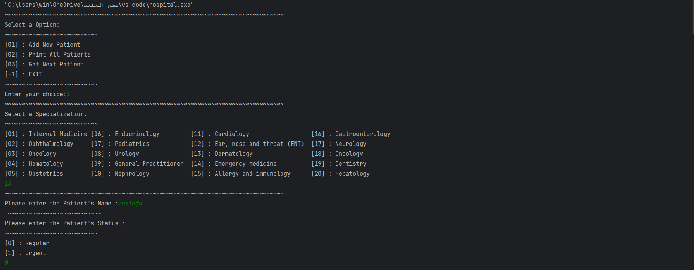
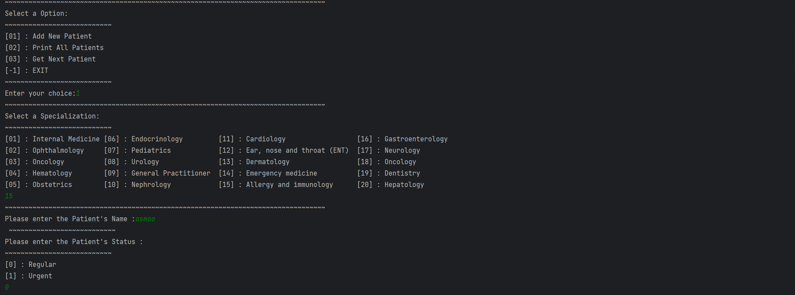
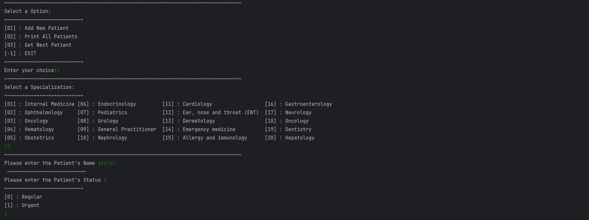
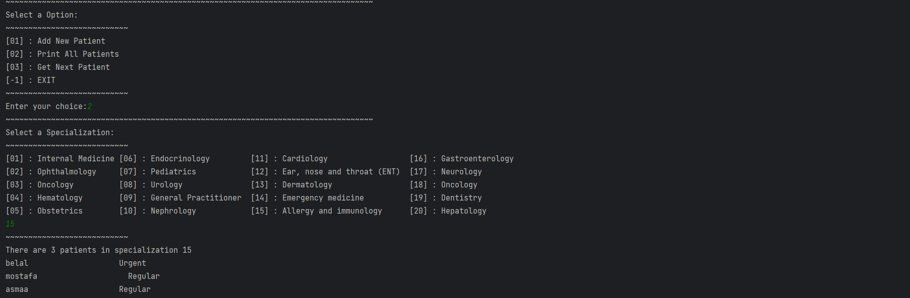
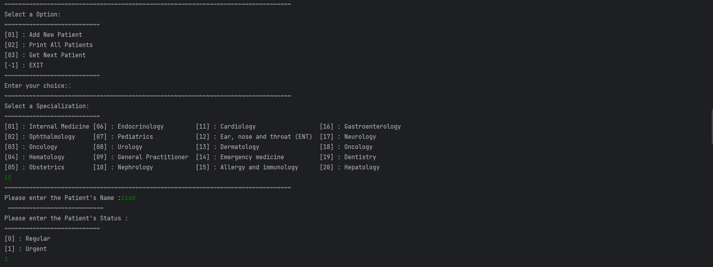
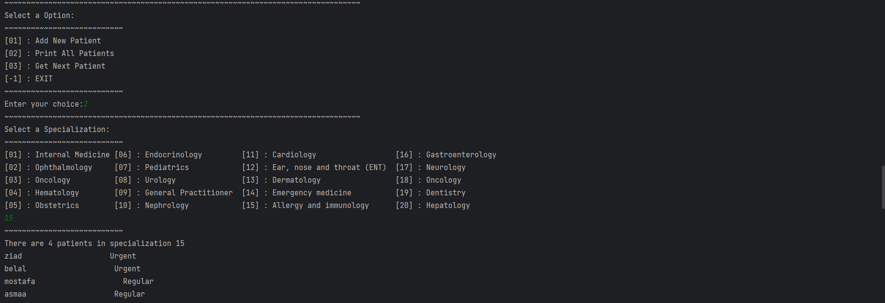

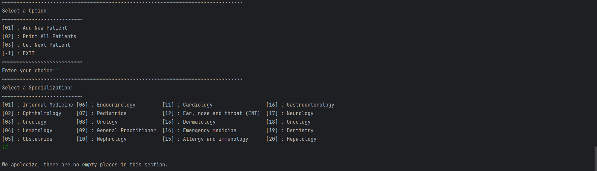
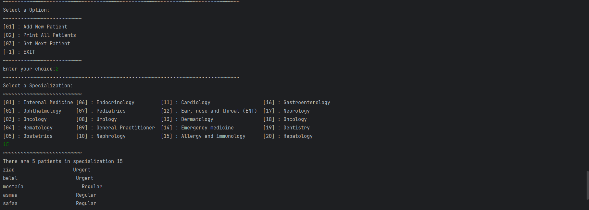
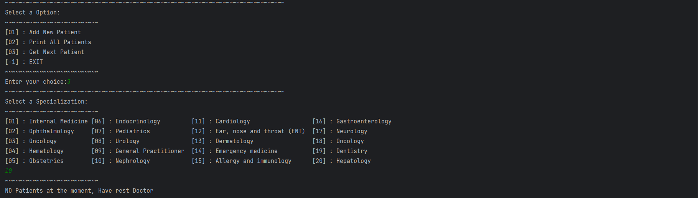
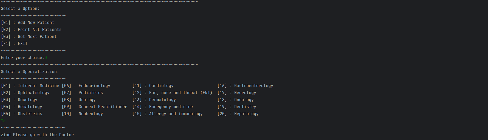

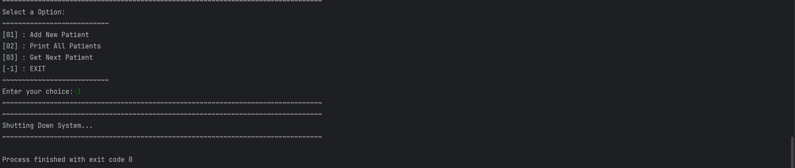
