# Project #2 - Library System

## Table of Contents

<!-- TOC depthFrom:1 depthTo:6 withLinks:1 updateOnSave:1 orderedList:0 -->

- [Project #2 - Library System](#c-data-structures-and-algorithms-cheat-sheet)
  - [Table of Contents](#table-of-contents)
  - [1.0 Library System](#10-library-system)
    - [1.1 Overview](#11-overview)
    - [1.2 Menu Function Use In System](#12-menu-function-use-in-system)
      - [1.2.0 Library System](#120-library-system)
      - [1.2.1 Add-Book](#121-add-book)
      - [1.2.2 Search Books By Prefix](#122-search-books-by-prefix)
        - [1.2.2.1 In Prefix](#1221-in-prefix)  
      - [1.2.3 Print Who Borrowed Book By Name](#123-print-who-borrowed-book-by-name)
      - [1.2.4 Print Library By Id](#124-print-library-by-id)
        - [1.2.4.1 Cmp Id](#1241-cmp-id)
      - [1.2.5 Print Library By Name](#125-print-library-by-name)
        - [1.2.5.1 Cmp Na](#1251-cmp-na)
      - [1.2.6 Add User](#126-add-user) 
      - [1.2.7 User Borrow Book](#127-user-borrow-book)
        - [1.2.7.1 Add User In Book Borrow](#1271-add-user-in-book-borrow)
        - [1.2.7.2 Add Id Book In User Borrow](#1272-add-id-book-in-user-borrow)
      - [1.2.8 User Return Book](#128-user-return-book)
        - [1.2.8.1 User Return Proper](#1281-user-return-proper)
        - [1.2.8.2 Book Return Proper](#1282-book-return-proper)
      - [1.2.9 Print Users](#129-print-users)
      - [1.2.10 Print Menu](#1210-print-menu)
      - [1.2.11 Git Id Book](#1211-git-id-book)
    - [1.3 Screenshots](#13-screenshots)
<!-- /TOC -->

---

## 1.0 Library System

---

---

### 1.1 Overview

**Library System information**

- Many libraries have a library system

   - Helps adding books and searching for them
   - Maintains information about the borrowed books
- We will create a simple version of this classical systems
- The main user for the system is an admin 
   - Who might add a book, user or perform some relevant operation
   - You don't need to provide login/logout functionalities in this console system

- The system starts with a menu
  - It shows all possible choices
  - The admin selects a choice.
       - Some operation is performed
  - Then the main menu is listed again

---

### 1.2 Menu Function Use In System

`Library Menu :`
0) library system
1) add book
2) search_books_by_prefix
3) print_who_borrowed_book_by_name
4) print_library_by_id
5) print_library_by_name
6) add_user
7) user borrow book
8) user_return_book
9) print_users
10) Exit

---

### 1.2.0 Library System

**Use for :**

Used to operate the system

code :

```c++
void Library_System (){
    while (true){
        int category = 0;
        cout << "~~~~~~~~~~~~~~~~~~~~~~~~~~~~~~~~~~~~~~~~~~~~~~~~~~~~~~~~~~~~~~~~~~~~~~~~~~~~~~~~~\n";
        cout << "Select a Option:\n";
        cout << "~~~~~~~~~~~~~~~~~~~~~~~~~~~\n";
        print_Menu();
        cout << "~~~~~~~~~~~~~~~~~~~~~~~~~~~\n";
        cout << "Enter your choice:";
        cin >> category;
        cout << "\n";
        //==========================================================================
        if (category == 10)
        {
            cout << "~~~~~~~~~~~~~~~~~~~~~~~~~~~~~~~~~~~~~~~~~~~~~~~~~~~~~~~~~~~~~~~~~~~~~~~~~~~~~~~~~\n";
            cout << "Shutting Down System...\n";
            cout << "~~~~~~~~~~~~~~~~~~~~~~~~~~~~~~~~~~~~~~~~~~~~~~~~~~~~~~~~~~~~~~~~~~~~~~~~~~~~~~~~~\n";
            break;
        }
        else if(category == 1){
            add_book();
        }
        else if(category == 2){
            search_books_by_prefix();
        }
        else if(category == 3){
            print_who_borrowed_book_by_name();
        }
        else if(category == 4){
            print_library_by_id();
        }
        else if(category == 5){
            print_library_by_name();
        }
        else if(category == 6){
            add_user();
        }
        else if(category == 7){
            user_borrow_book();
        }
        else if(category == 8){
            user_return_book();
        }
        else if(category == 9){
           print_users();
        }
        else{
            cout << "Your selection is not in the menu\n";
        }
    }
}
```

---

### 1.2.1 Add Book

**Use for :**

**Adding a book**

- Every system needs data. The core data here is the book and users
- The admin needs to be able to add books
- Each book has the following information
  - id (integer) - name - quantity
  - Example: 101, CppHowToProgram, 7
     - We have 7 copies for book CppHowToProgram (no spaces)
    - The book ID is 101
       - In real projects: our code typically generates the IDs

code :

```c++
void add_book(){
    //--------------------------------
    //----------count of books--------
    ++cnt_books;
    //-------------------------------
    cout << "~~~~~~~~~~~~~~~~~~~~~~~~~~~~\n";
    cout << "Enter book information:\n";
    cout << "~~~~~~~~~~~~~~~~~~~~~~~~~~~\n";
    cout << "[01] Enter book name : \n";
    cin >> arr_book[cnt_books].name_book;
    cout << "[02] Enter book id : \n";
    cin >> arr_book[cnt_books].id_book;
    cout << "[03] Enter book quantity : \n";
    cin >> arr_book[cnt_books].total_quantity;
    //-----------------set data----------------------
    arr_book[cnt_books].total_borrowed=0;
    arr_book[cnt_books].cnt_users_borrow_book=0;
}
```

---

### 1.2.2 Search Books By Prefix

**Use for :**

**Searching for a book**

- Searching your database of books is a typical operation
- We will search the system using book name.
- Instead of the complete book name, we will allow a `prefix`
  - Prefix: The first letters of a word
- Assume we have 3 books in the system, their names:
  - CppHowToProgram, CppForDummies, CppForAdvanced Levels, Core Java
- Query
  - Cpp ⇒ CppHowToProgram, Cpp For Dummies, CppForAdvanced Levels
  - CppFo ⇒ CppForDummies, CppForAdvanced Levels
  - Core ⇒ CoreJava
  - Java ⇒ Nothing

code :

```c++
void search_books_by_prefix(){
    string pfx;
    int n=cnt_books;
    bool ok= false;
    //------------------------------------
    cout << "~~~~~~~~~~~~~~~~~~~~~~~~~~~~\n";
    cout << "Enter book name prefix:\n";
    cin >> pfx;
    cout << "~~~~~~~~~~~~~~~~~~~~~~~~~~~\n";
    //-------------------------------------------
    for(int i=1;i<=n;i++){
        if(in_prefix(pfx , arr_book[i].name_book)){
            cout << arr_book[i].name_book << "\n";
            ok= true;
        }
    }
    //-------------------------------------------
    if(!ok){
        cout << "NO books such prefix\n";
    }
}
```

---

### 1.2.2.1 In Prefix

**Use for :**

It is a sub-function of the previous function used to detect the presence of a `prefix` in the word on which `Pointer` stands.

code :

```c++
bool in_prefix(string pfx ,string temp ){
    if(pfx.size()>temp.size()){
        return false;
    }
    else if(temp.substr(0,(int)pfx.size())==pfx){
        return true;
    }
    else{
        return false;
    }
}
```

---

### 1.2.3 Print Who Borrowed Book By Name

**Use for :**

**Listing users borrowed a book**

- Given that several users may borrow a book, the admins may want to know 
  who borrowed what. Remember we have several copies per book.

- Input: Book Name 
   - E.g. Math1 4
- Output: list of the user names who borrowed the book
  - E.g. Mostafa, John, Mark, Ali

code :

```c++
void print_who_borrowed_book_by_name(){
     string name_book;
     //--------------------------------
     cout << "Enter name book :\n";
     cin >> name_book;
     //-------------------------------
     for(int i=1;i<=cnt_books;i++){
         if(arr_book[i].name_book==name_book){
             if(arr_book[i].cnt_users_borrow_book==0){
                 cout << "No people have borrowed this book\n";
                 return;
             }
             for(int j=1;j<=arr_book[i].cnt_users_borrow_book;j++){
                 cout << arr_book[i].users_borrow_book[j] << "\n" ;
             }
             return;
         }
     }
     cout << "Invalid book name\n";
}
```

---

### 1.2.4 Print Library By Id

**Use for :**

**Listing books**

- Another typical operations is to just list all books in the system

  - But we can order data in several ways!

- We will allow sorted either based on IDS or Names

- Assume entered books were

  - ID: 1111, Name: Math1
  - ID: 5041, Name: ArabicLiterature
  - ID: 1011, Name: Math2
  
- Sorting by ID → Math2, Math1, ArabicLiterature

```c++
void print_library_by_id(){
    if(cnt_books==0){
        cout << "NOT books in library";
        return;
    }
    sort(arr_book+1,arr_book+1+cnt_books, cmp_id);
    //----------------------------------------------------------------
    for(int i=1;i<=cnt_books;i++){
        cout << "ID : " << arr_book[i].id_book << " Name : " << arr_book[i].name_book << " Total Quantity : " << arr_book[i].total_quantity << " Total Borrowed : " << arr_book[i].total_borrowed << "\n";
    }
}
```

---

### 1.2.4.1 Cmp Id

**Use for**

- This is a sub-function of the previous function.
- This function uses sorting by `ID`

code :

```c++
bool cmp_id(books& a,books& b){
    return a.id_book < b.id_book;
}
```

---
### 1.2.5 Print Library By Name
**Use for**

**Listing books**

- Another typical operations is to just list all books in the system

  - But we can order data in several ways!

- We will allow sorted either based on IDS or Names

- Assume entered books were

  - ID: 1111, Name: Math1
  - ID: 5041, Name: ArabicLiterature
  - ID: 1011, Name: Math2

- Sorting by name → ArabicLiterature, Math1, Math2

code :
```c++
void print_library_by_name(){
    if(cnt_books==0){
        cout << "NOT books in library";
        return;
    }
    sort(arr_book+1,arr_book+1+cnt_books, cmp_na);
    //----------------------------------------------------------------
    for(int i=1;i<=cnt_books;i++){
        cout << "ID : " << arr_book[i].id_book << " Name : " << arr_book[i].name_book << " Total Quantity : " << arr_book[i].total_quantity << " Total Borrowed : " << arr_book[i].total_borrowed << "\n";
    }
}
```

---
### 1.2.5.1 Cmp Na
**Use for**

- This is a sub-function of the previous function.
- This function uses sorting by `NAME`

code :
```c++
bool cmp_na(books& a,books& b){
    return a.name_book < b.name_book;
}
```
---
### 1.2.6 Add User

**Ues for**

**Add a user**

- Each user has only an Id(integer) and name 
  - Feel free to add more
- We only request 2 operations
  - Borrowing a book
  - Returning a book
- Feel free to add more features
  - List the system users, ordered by name or 
  - ID List borrowed book of a specific user
  - Add more info about user: email & address

code :

```c++
void add_user(){
    string name_user;
    int id;
    //--------------------------------------------
    cout << "[01] Enter user name :\n";
    cin >> name_user;
    cout << "[02] Enter national id :\n";
    cin >> id;
    //------------------------------------------
    //-------------up data----------------------
    cnt_users++;
    //-----------------new data------------------
    arr_users[cnt_users].name_user=name_user;
    arr_users[cnt_users].id_user=id;
}
```

---
### 1.2.7 User Borrow Book 

**Use for**

**Borrow a book**

- Borrowing books is a repetitive scenario in libraries
- Each book already have a specific number of copies (the quantity)
- To borrow a book, this quantity must be > 0 
  - Otherwise, this book can't be borrowed
- After borrowing, the quantity must be decreased
- The admin enters the user name and the book name
  - If there is enough quantity of the book, the system does the following:
    - Mark that this user borrowed a copy
    - Decrease the quantity with 1
- If there is no available copies, the system notifies the admin

code:
```c++
void user_borrow_book(){
    string name_user,name_book;
    //-----------------------------
    cout << "[01] Enter user name :\n";
    cin >> name_user;
    cout << "[02] Enter book name :\n";
    cin >> name_book;
    //---------------------------------------
    bool ok= false;
    for(int i=1;i<=cnt_books;i++){
        if(arr_book[i].name_book==name_book && arr_book[i].total_quantity-arr_book[i].total_borrowed>0){
            add_user_in_book_borrow(name_book,name_user);
            add_id_book_in_user_borrow(name_book,name_user);
            ok= true;
        }
    }
    //------------------------------
    if(!ok){
       cout << "we apologize !! --> this book not available now\n";
    }
}
```
---
### 1.2.7.1 Add User In Book Borrow

**Use for**

This is a sub-function of the previous function used to update the data in the books storage location

code :

```c++
void add_user_in_book_borrow(string name_book,string name_user){
    for(int i=1;i<=cnt_books;i++){
        if(arr_book[i].name_book==name_book){
            //-------------up data---------
            arr_book[i].total_borrowed++;
            arr_book[i].cnt_users_borrow_book++;
            //----------new data-----------
            arr_book[i].users_borrow_book[arr_book[i].cnt_users_borrow_book]=name_user;
            //-----------exit-----------
            break;
        }
    }
}
```
---
### 1.2.7.2 Add Id Book In User Borrow

**Use for**

This is a sub-function of the previous function used to update the data in the users storage location

code :

```c++
void add_id_book_in_user_borrow(string name_book,string name_user){
    for(int i=1;i<=cnt_users;i++){
        if(arr_users[i].name_user==name_user){
            //-------------up data----------------
            arr_users[i].cnt_id_book_borrow++;
            //---------new data-----------------
            arr_users[i].id_book_borrow[arr_users[i].cnt_id_book_borrow]= git_id_book(name_book);
        }
    }
}
```
---
### 1.2.8 User Return Book

**Use for**

**Return a book**

- Same logic, but this time the system do the reverse:
  - Mark that the user returned a copy
  - Increment the current quantity
- Note
  - Anytime we try to list the system books, overall data should be correct and proper

code :

```c++
void user_return_book(){
    string name_user,name_book;
    //-----------------------------
    cout << "[01] Enter user name :\n";
    cin >> name_user;
    cout << "[02] Enter book name :\n";
    cin >> name_book;
    //------------------------------------
    book_return_proper(name_book,name_user);
    user_return_proper(name_book,name_user);
}
```
---
### 1.2.8.1 User Return Proper

**Use for**

A sub-function of the previous function used to update the data `User`

code : 
```c++
void user_return_proper(string name_book,string name_user){
    int id= git_id_book(name_book);
    for(int i=1;i<=cnt_users;i++){
        if(arr_users[i].name_user==name_user){
            for(int j=1;j<=arr_users[i].cnt_id_book_borrow;j++){
                if(arr_users[i].id_book_borrow[j]==id){
                    remove_data_user(j,arr_users[i].id_book_borrow,arr_users[i].cnt_id_book_borrow);
                    //------------up data------------------------
                    arr_users[i].cnt_id_book_borrow--;
                    return;
                }
            }
        }
    }
}
```

---
### 1.2.8.2 Book Return Proper

**Use for**

A sub-function of the previous function used to update the data `Book`

code :
```c++
void book_return_proper(string name_book,string name_user){
    for(int i=1;i<=cnt_books;i++){
        if(arr_book[i].name_book==name_book){
            for(int j=1;j<=arr_book[i].cnt_users_borrow_book;j++){
                if(arr_book[i].users_borrow_book[j]==name_user){
                    remove_data_book(j,arr_book[i].users_borrow_book,arr_book[i].cnt_users_borrow_book);
                    //------------------up data----------------------
                    arr_book[i].cnt_users_borrow_book--;
                    arr_book[i].total_borrowed--;
                    return;
                }
            }
        }
    }
}
```

---
### 1.2.9 Print Users

**Use for**

Print Users

code :

```c++
void print_users(){
    for(int i=1;i<=cnt_users;i++){
        cout << "Name user : ";
        cout << arr_users[i].name_user;
        cout << "\n";
        cout << "National id : ";
        cout << arr_users[i].id_user;
        cout << "\n";
        //---------------------------------------
        if(arr_users[i].cnt_id_book_borrow==0){
            cout << "He did not borrow any books\n";
        }
        else{
            cout << "borrowed books : ";
            for(int j=1;j<=arr_users[i].cnt_id_book_borrow;j++){
                cout << arr_users[i].id_book_borrow[j] << " ";
            }
        }
        cout << "\n\n";
    }
}
```

---
### 1.2.10 Print Menu

**Use for**

Print Menu

code :

```c++
void print_Menu(){
    cout << "[01] : Add Book\n";
    cout << "[02] : Search Books By Prefix\n";
    cout << "[03] : Print Who Borrowed Book By Name\n";
    cout << "[04] : Print Library By Id\n";
    cout << "[05] : Print Library By Name\n";
    cout << "[06] : Add User\n";
    cout << "[07] : User Borrow Book\n";
    cout << "[08] : User Return Book\n";
    cout << "[09] : Add New Patient\n";
    cout << "[10] : EXIT\n";
}
```
---
### 1.2.11 Git Id Book
**Use for**

Git Id Book

code :
```c++
int git_id_book(string name_book){
    for(int i=1;i<=cnt_books;i++){
        if(arr_book[i].name_book==name_book){
             return arr_book[i].id_book;
        }
    }
}
```

---
### 1.3 Screenshots

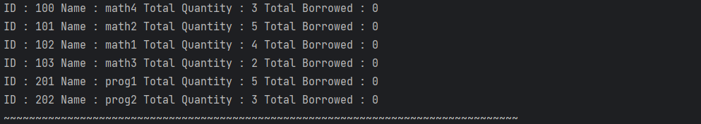
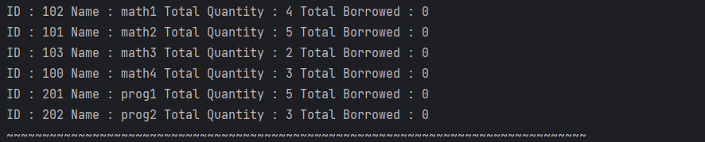
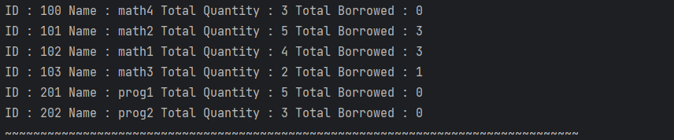
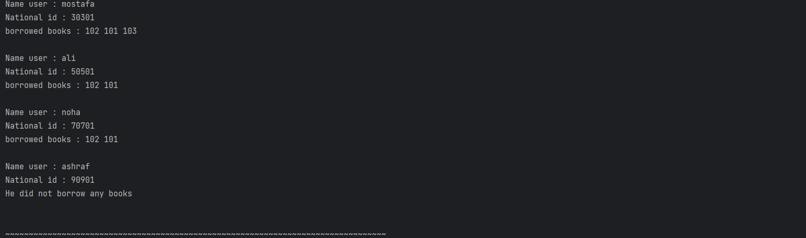
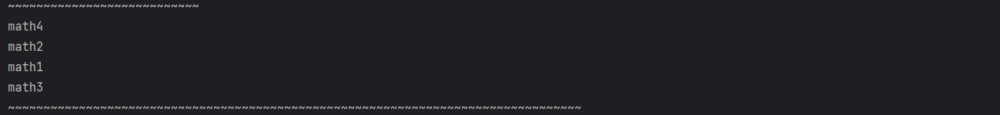
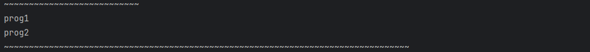

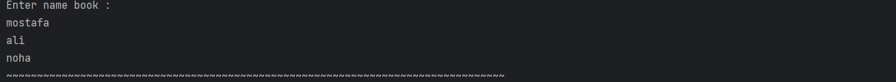
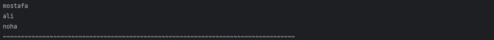
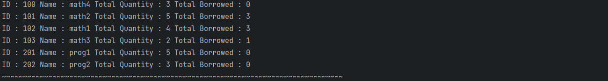
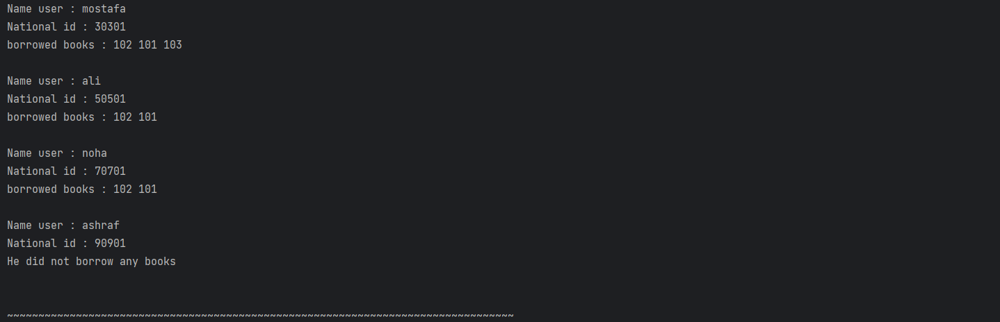
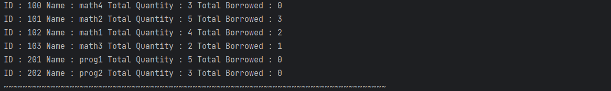

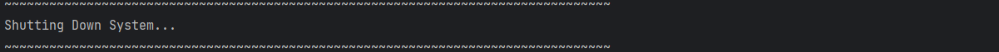
