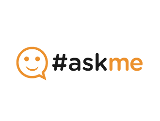

## AskMe - Big Picture

- People ask questions and others answers them
- This is files-based system
  - Every time the user run it, you see the previous state (users/questions/answers)
  - Multiple users can use it in same time (parallel)
    - You send question. I see it
    - I answer the question or remove it, you see this update
- Login/Sign up/Sign Out
  - Any system allow a user to sign up (name, email, password, username, password)
  - Also: As a user do you allow anonymous questions?
- User operations
  - Print questions: From you, To you, Feed Questions
  - Ask and answer questions. System support threads
  - Delete a question (which might be a thread)

----

----
## AskMe: Design

- Every user has a system generated ID
  - Same for every question
  - We can view these IDs on the site (not realistic)
- A thread question
  - If a question is answered. Others can ask questions in the original question thread
  - E.g. original question is parent for all of them 
  - If this parent question is removed, the whole thread is removed
- Correctness
  - You can’t do something wrong!
  - E.g. you can’t remove a question asked to someone else!
  - You can only see/edit the details of your question

---

---

