# Advanced Programming Techniques

## Table of Contents

<!-- TOC depthFrom:1 depthTo:6 withLinks:1 updateOnSave:1 orderedList:0 -->

- [Advanced Programming Techniques](#c-data-structures-and-algorithms-cheat-sheet)
  - [Table of Contents](#table-of-contents)
  - [1.0 Lecture 1](#10-lecture-1)
    - [1.1 What is OOP?](#11-what-is-oop)
    - [1.2 Advantages of OOP](#12-advantages-of-oop)
    - [1.3 What are Classes and Objects?](#13-what-are-classes-and-objects)
    - [1.4 Class](#14-class)
    - [1.5 C++ Access Modifiers](#15-c-access-modifiers)
    - [1.6 Constructors](#16-constructors)
       - [1.6.1 Types of Constructors](#161-types-of-constructors)
       - [1.6.2 Constructor Overloading](#162-constructor-overloading)
  - [2.0 Lecture 2](#20-lecture-2)
    - [2.1 Initialization Lists to Initialize Fields](#21-initialization-lists-to-initialize-fields)
    - [2.2 Class Destructor](#22-class-destructor)
    - [2.3 Pass Object to Function ](#23-pass-object-to-function)
    - [2.4 Return Object From Function](#24-return-object-from-function)
    - [2.5 Friend Class and Function in C++](#25-friend-class-and-function-in-c)
    - [2.6 const Member Functions & const Class Objects](#126-const-member-functions--const-class-objects)
  - [3.0 Lecture 3](#30-lecture-3)
     - [3.1 Static data members in C++](#31-static-data-members-in-c)
     - [3.2 this pointer](#32-this-pointer)
     - [3.3 C++ Inheritance](#33-c-inheritance)
  - [4.0 Lecture 3](#40-lecture-4)
     - [4.1 Constructors and Destructors in Single](#41-constructors-and-destructors-in-single)
     - [4.2 Constructors and Destructors in Multiple Inheritance](#42-constructors-and-destructors-in-multiple-inheritance)
     - [4.3 How to initialize Array of objects with parameterized constructors in C++](#43-how-to-initialize-array-of-objects-with-parameterized-constructors-in-c)
     - [4.4 When do we use Initializer List in C++?](#44-when-do-we-use-initializer-list-in-c)
     - [4.5 Virtual Functions](#45-virtual-functions)
     - [4.6 Polymorphism](#46-polymorphism)
     - [4.7 Abstract classes & pure virtual functions](#47-abstract-classes--pure-virtual-functions)
## <!-- /TOC -->

---------------------

## 1.0 Lecture 1

-----

-----


### 1.1 What is OOP?
- OOP stands for Object-Oriented Programming.
- Procedural programming is about writing procedures or
functions that perform operations on the data, while object oriented programming is about creating objects that contain
both data and functions.
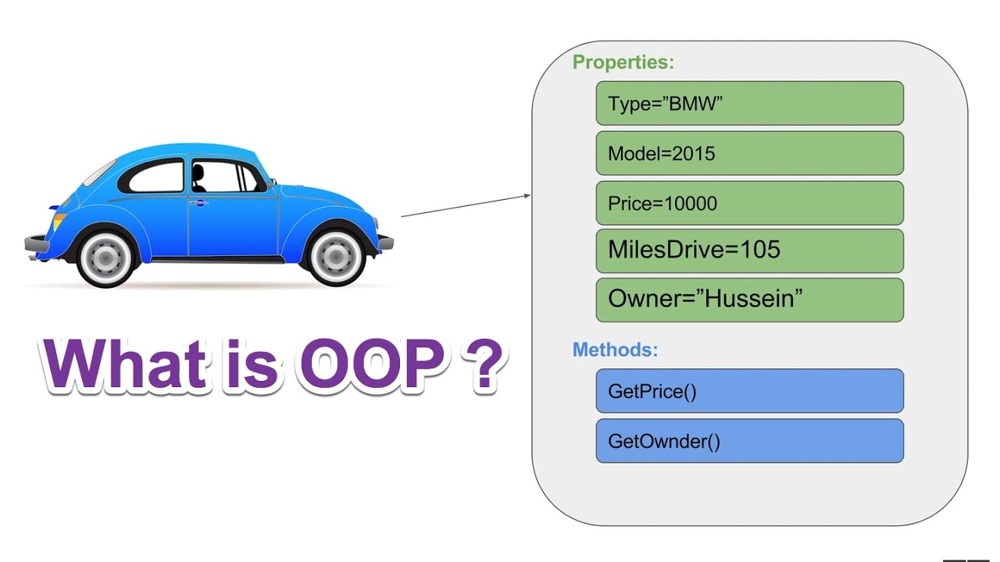

------------------------------

--------------------------
### 1.2 Advantages of OOP
- OOP is **faster** and **easier** to execute
-  OOP provides a **clear structure** for the programs
-  OOP helps to keep the C++ code **DRY** "Don't Repeat Yourself",
and makes the code easier to maintain, modify and debug
-  OOP makes it possible to create full reusable applications with
less code and shorter development time
- 
-------------------------------------------

-----
### 1.3 What are Classes and Objects?
Classes and objects are the two main aspects of object oriented programming.
- a class is a template for
objects, and an object is an
instance of a class.
- When the individual objects
are created, they inherit all
the variables and functions
from the class.

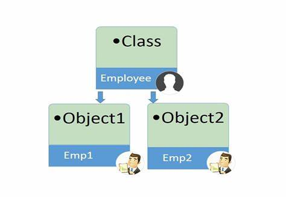

--------------------------------------

---------------------------------------
### 1.4 Class

1. Class Definitions
```c++
// name class 
class myclass{  // The class
    public:     // Access specifier
    int age;    // Attribute (int variable)------|
                //                               |---------> Class Members
    string name;//Attribute (string variable)----|
};
```
2. Accessing Data Members
```c++
// name class 
class myclass{  // The class
public:     // Access specifier
int age;    // Attribute (int variable)------|
            //                               |---------> Class Members
string name;//Attribute (string variable)----|
};
int main() { 
    myclass myObj; // Create an object of MyClass
    // Access attributes and set values 
    myObj.name = "Some text";
    myObj.age = 15;
    // Print attribute values
    cout << myObj.age << "\n";
    cout << myObj.name;
return 0;
}
```
output
```
15
some text
```
3. Class Methods (Functions)

- There are two ways to define functions that belongs to a class:
  1. `Inside class definition`
  2. `Outside class definition`


  1. Inside class definition
  
The member function is defined inside the class definition it can be defined directly. Similar to accessing a data member in the class we can also access the public member functions through the class object using the dot operator (.).

`Syntax:`
  ```
class class_name{
   public:
      return_type Method_name(){  // method inside class definition
         // body of member function
      }
};
  ```
`code`

```c++
// C++ program for Inside Class Definition
#include <iostream>
using namespace std;
class rectangle {
public:
    int length;
    int breadth;
    // area() function inside class
    int area() { return (length * breadth); }
    // perimeter() function inside class
    int perimeter() { return 2 * (length + breadth); }
};
int main()
{
    // Creating object
    rectangle r;
    r.length=2;
    r.breadth=3;
    cout << "perimeter: " << r.perimeter() << endl;
    cout << "area: " << r.area() << endl;
    return 0;
}
```
`output`
```
perimeter: 10
area: 6
```
  2. Inside class definition
     The member function is defined outside the class definition it can be defined using the scope resolution operator. Similar to accessing a data member in the class we can also access the public member functions through the class object using the dot operator (.)

   `Syntax:`
```
class Class_name{

public:

return_type Method_name(); // method outside class definition

};

// Outside the Class using scope resolution operator

return_type Class_name :: Method_name() {

  // body of member function

}
```
`code`
```c++
#include <iostream>
using namespace std;
class rectangle {
public:
    int length;
    int breadth;
    // area() function outside class
    int area();
    // perimeter() function outside class
    int perimeter();
};
// function defining using scope resolution operator "::"
int rectangle::area() { return (length * breadth); }
int rectangle::perimeter(){
    return 2 * (length + breadth);
}
int main()
{
    // Creating object
    rectangle r;
    r.length=2;
    r.breadth=3;
    cout << "perimeter: " << r.perimeter() << endl;
    cout << "area: " << r.area() << endl;
    return 0;
}
```
`output`
```
perimeter: 10
area: 6
```
-------------------------

---------------------------

### 1.5 C++ Access Modifiers

- One of the main features of object-oriented programming languages such as C++ is data hiding.

- Data hiding refers to restricting access to data members of a class. This is to prevent other functions and classes from tampering with the class data.

- However, it is also important to make some member functions and member data accessible so that the hidden data can be manipulated indirectly.

- The access modifiers of C++ allows us to determine which class members are accessible to other classes and functions, and which are not.

`for example`
```c++
class Patient {
    private:
        int patientNumber;
        string diagnosis;
    public:
      void billing() {
          // code
      }
      void makeAppointment() {
          // code
      }
};
```
Here, the variables `patientNumber` and `diagnosis` of the `Patient clas`s are hidden using the `private` keyword, while the member functions are made accessible using the `public` keyword.

---
- Types of C++ Access Modifiers

    In C++, there are 3 access modifiers:

      1. public
      2. private
      3. protected
1. public Access Modifier
   - The `public` keyword is used to create public members (data and functions).
   - The `public` members are accessible from any part of the program.

   `code`
```c++
#include <iostream>
using namespace std;
// define a class
class Sample {
    // public elements
   public:
    int age;
    void displayAge() {
        cout << "Age = " << age << endl;
    }
};

int main() {

    // declare a class object
    Sample obj1;
    cout << "Enter your age: ";
    // store input in age of the obj1 object
    cin >> obj1.age;
    // call class function
    obj1.displayAge();

    return 0;
}
```
`output`
```
Enter your age: 20
Age = 20
```
In this program, we have created a class named `Sample`, which contains a `public` variable age and a public function `displayAge()`.

In `main()`, we have created an object of the `Sample` class named `obj1`. We then access the `public` elements directly by using the codes `obj1.age` and `obj1.displayAge()`.

Notice that the `public elements` are accessible from `main()`. This is because public elements are `accessible from all parts of the program`.

2. private Access Modifier
   - The `private` keyword is used to create private members (data and functions).
   - The private members can only be accessed from within the class.
   - However, friend classes and friend functions can access private members.

`code`
```c++
#include <iostream>
using namespace std;
// define a class
class Sample {
    // private elements
   private:
    int age;
    // public elements
   public:
    void displayAge(int a) {
        age = a;
        cout << "Age = " << age << endl;
    }
};

int main() {

    int ageInput;
    // declare an object
    Sample obj1;
    cout << "Enter your age: ";
    cin >> ageInput;
    // call function and pass ageInput as argument
    obj1.displayAge(ageInput);
    return 0;
}
```
`output`
```
Enter your age: 20
Age = 20
```
`In main()`, the object `obj1` cannot directly access the class variable `age`.
```c++
// error
cin >> obj1.age;
```

3. protected Access Modifier
   - The `protected` keyword is used to create protected members (data and function).
   - The protected members can be accessed within the class and from the derived class.
   
`code`
```c++
#include <iostream>
using namespace std;

// declare parent class
class Sample {
    // protected elements
   protected:
    int age;
};
// declare child class
class SampleChild : public Sample {
   public:
    void displayAge(int a) {
        age = a;
        cout << "Age = " << age << endl;
    }
};

int main() {
    int ageInput;
    // declare object of child class
    SampleChild child;
    cout << "Enter your age: ";
    cin >> ageInput;
    // call child class function
    // pass ageInput as argument
    child.displayAge(ageInput);
    return 0;
}
```
`output`
```
Enter your age: 20
Age = 20
```
Here, `SampleChild` is an inherited class that is derived from `Sample`. The variable `age` is declared in `Sample` with the `protected` keyword.

This means that `SampleChild` can access `age` since Sample is its parent class.

We see this as we have assigned the value of `age` in `SampleChild` even though `age` is declared in the `Sample` class.

- Summary: public, private, and protected
  - `public` elements can be accessed by all other classes and functions.
  - `private` elements cannot be accessed outside the class in which they are declared, except by friend classes and functions.
  - `protected` elements are just like the private, except they can be accessed by derived classes.
  

| Specifiers| Same Class | 	Derived Class	  | Outside Class
|-----------|----------- |------------------|--------------
| public	   |Yes	| Yes	             |Yes|
| private	  |Yes	| No	              |No|
| protected	 |Yes	| Yes	             |No|

```
Note: By default, class members in C++ are private, unless specified otherwise.

```

-----------

-----
### 1.6 Constructors

------
### 1.6.1 Types of Constructors


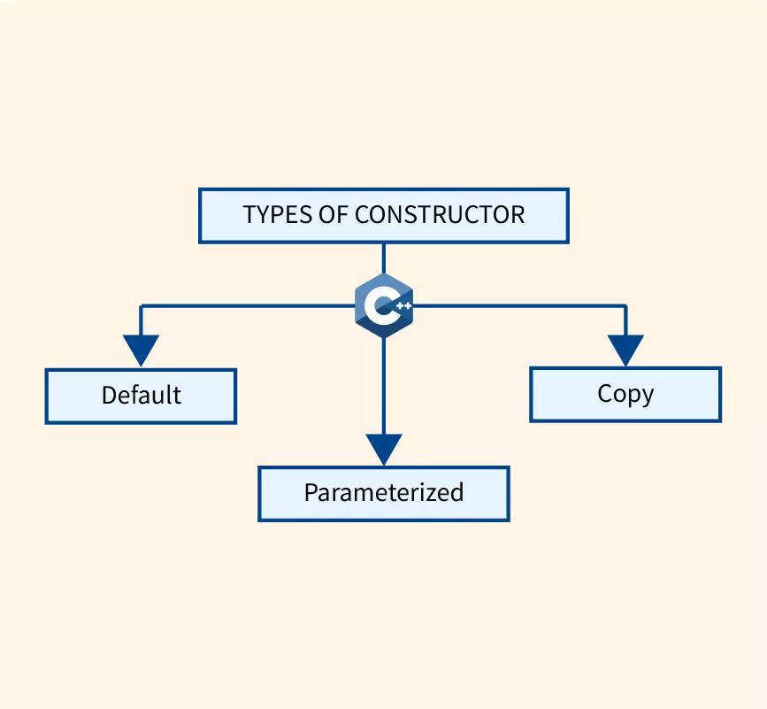

In this tutorial, we will learn about the C++ constructor and its type with the help examples.

A constructor is a special type of member function that is called automatically when an object is created.

In C++, a constructor has the same name as that of the class and it does not have a return type.

`For example`
```c++
class  Wall {
  public:
    // create a constructor
    Wall() {
      // code
    }
};
```
Here, the function Wall() is a constructor of the class Wall. Notice that the constructor

- has the same name as the class,
- does not have a return type, and
- is public
---
1. C++ Default Constructor

A constructor with no parameters is known as a default constructor. In the example above, Wall() is a default constructor.

`code`

```c++
// C++ program to demonstrate the use of default constructor

#include <iostream>
using namespace std;
// declare a class
class  Wall {
  private:
    double length;
  public:
    // default constructor to initialize variable
    Wall() {
      length = 5.5;
      cout << "Creating a wall." << endl;
      cout << "Length = " << length << endl;
    }
};
int main() {
  Wall wall1;
  return 0;
}
```
`output`
```
Creating a Wall
Length = 5.5
```
Here, when the `wall1` object is created, the `Wall()` constructor is called.

This sets the `length` variable of the object to 5.5.

```
Note: If we have not defined a constructor in our class, then the C++ compiler will
automatically create a default constructor with an empty code and no parameters.
```
----
2. C++ Parameterized Constructor

   In C++, a constructor with parameters is known as a parameterized constructor. This is the preferred method to initialize member data.

`code`
```c++
// C++ program to calculate the area of a wall

#include <iostream>
using namespace std;

// declare a class
class Wall {
  private:
    double length;
    double height;
  public:
    // parameterized constructor to initialize variables
    Wall(double len, double hgt) {
      length = len;
      height = hgt;
    }
    double calculateArea() {
      return length * height;
    }
};
int main() {
  // create object and initialize data members
  Wall wall1(10.5, 8.6);
  Wall wall2(8.5, 6.3);

  cout << "Area of Wall 1: " << wall1.calculateArea() << endl;
  cout << "Area of Wall 2: " << wall2.calculateArea();

  return 0;
}
```
`output`
```
Area of Wall 1: 90.3
Area of Wall 2: 53.55
```

Here, we have created a parameterized constructor `Wall()` that has 2 parameters: `double len` and `double hgt`. The values contained in these parameters are used to initialize the member variables `length` and `height`.

When we create an object of the `Wall` class, we pass the values for the member variables as arguments. The code for this is:

```
Wall wall1(10.5, 8.6);
Wall wall2(8.5, 6.3);
```

With the member variables thus initialized, we can now calculate the area of the wall with the `calculateArea()` function.

----
3. C++ Copy Constructor

The copy constructor in C++ is used to copy data of one object to another.

`code`
```c++
#include <iostream>
using namespace std;

// declare a class
class Wall {
  private:
    double length;
    double height;

  public:
    // initialize variables with parameterized constructor
    Wall(double len, double hgt) {
      length = len;
      height = hgt;
    }
    // copy constructor with a Wall object as parameter
    // copies data of the obj parameter
    Wall(Wall &obj) {
      length = obj.length;
      height = obj.height;
    }
    double calculateArea() {
      return length * height;
    }
};
int main() {
  // create an object of Wall class
  Wall wall1(10.5, 8.6);
  // copy contents of wall1 to wall2
  Wall wall2 = wall1; // or Wall wall2(wall1);
  // print areas of wall1 and wall2
  cout << "Area of Wall 1: " << wall1.calculateArea() << endl;
  cout << "Area of Wall 2: " << wall2.calculateArea();

  return 0;
}
```
`output`
```
Area of Wall 1: 90.3
Area of Wall 2: 90.3
```
In this program, we have used a copy constructor to copy the contents of one object of the `Wall` class to another. The code of the copy constructor is:

```
Wall(Wall &obj) {
  length = obj.length;
  height = obj.height;
}
```
Notice that the parameter of this constructor has the address of an object of the `Wall` class.

We then assign the values of the variables of the `obj` object to the corresponding variables of the object calling the copy constructor. This is how the contents of the object are copied.

In `main()`, we then create two objects `wall1` and `wall2` and then copy the contents of `wall1` to `wall2`:

```c++
// copy contents of wall1 to wall2
Wall wall2 = wall1;
```

Here, the wall2 object calls its copy constructor by passing the address of the wall1 object as its argument i.e. `&obj = &wall1`.

```
Note: A constructor is primarily used to initialize objects.
They are also used to run a default code when an object is created.
```

-----

-----

### 1.6.2 Constructor Overloading

In this tutorial, we will learn about constructor overloading in C++ with the help of examples.

Constructors can be overloaded in a similar way as `function overloading`.

Overloaded constructors have the same name (name of the class) but the different number of arguments.
Depending upon the number and type of arguments passed, the corresponding constructor is called.

`code 1`

```c++
// C++ program to demonstrate constructor overloading
#include <iostream>
using namespace std;

class Person {
   private:
    int age;

   public:
    // 1. Constructor with no arguments
    Person() {
        age = 20;
    }

    // 2. Constructor with an argument
    Person(int a) {
        age = a;
    }

    int getAge() {
        return age;
    }
};

int main() {
    Person person1, person2(45);

    cout << "Person1 Age = " << person1.getAge() << endl;
    cout << "Person2 Age = " << person2.getAge() << endl;

    return 0;
}
```
`output`
```
Person1 Age = 20
Person2 Age = 45
```

In this program, we have created a class `Person` that has a single variable `age`.

We have also defined two constructors `Person()` and `Person(int a)`:

- When the object `person1` is created, the first constructor is called because we have not passed any argument. This constructor initializes `age` to `20`.
- When `person2` is created, the second constructor is called since we have passed 45 as an argument. This constructor initializes `age` to `45`.

The function `getAge()` returns the value of `age`, and we use it to print the age of `person1` and `person2`.

-----
`code 2`

```c++
// C++ program to demonstrate constructor overloading
#include <iostream>
using namespace std;

class Room {
   private:
    double length;
    double breadth;
   public:
    // 1. Constructor with no arguments
    Room() {
        length = 6.9;
        breadth = 4.2;
    }
    // 2. Constructor with two arguments
    Room(double l, double b) {
        length = l;
        breadth = b;
    }
    // 3. Constructor with one argument
    Room(double len) {
        length = len;
        breadth = 7.2;
    }
    double calculateArea() {
        return length * breadth;
    }
};

int main() {
    Room room1, room2(8.2, 6.6), room3(8.2);
    cout << "When no argument is passed: " << endl;
    cout << "Area of room = " << room1.calculateArea() << endl;
    cout << "\nWhen (8.2, 6.6) is passed." << endl;
    cout << "Area of room = " << room2.calculateArea() << endl;
    cout << "\nWhen breadth is fixed to 7.2 and (8.2) is passed:" << endl;
    cout << "Area of room = " << room3.calculateArea() << endl;

    return 0;
}
```
`output`
```
When no argument is passed: 
Area of room = 28.98

When (8.2, 6.6) is passed.
Area of room = 54.12

When breadth is fixed to 7.2 and (8.2) is passed:
Area of room = 59.04
```
- When `room1` is created, the first constructor is called. `length` is initialized to `6.9` and `breadth` is initialized to `4.2`.
- When `room2` is created, the second constructor is called. We have passed the arguments `8.2` and `6.6`. `length is` initialized to the first argument `8.2` and `breadth` is initialized to `6.6`.
- When `room3` is created, the third constructor is called. We have passed one argument `8.2`. `length` is initialized to the argument `8.2`. `breadth` is initialized to the `7.2` by default.

-------------------------

This program will
through error because
default constructor will
not be generated
automatically if there is
any defined constructor
for the class.

So, in this
case you cannot create
object of the class with
default constructor

`code`
```c++
#include <iostream>
using namespace std;
class myInteger {
private:
   int value;
public:
  myInteger(int v){
    value = v;
  }
};
int main()
{
  myInteger I1;
  getchar();
  return 0;
}
```

-------------------------------

------------------------------------

## 2.0 Lecture 2

------

------

### 2.1 Initialization Lists to Initialize Fields

- What are initializer lists in C++?

  The **initializer list** is used to directly initialize data members of a class. An initializer list starts after the constructor name and its parameters.

  The list begins with a colon ( : ) and is followed by the list of variables that are to be initialized – all of the variables are separated by a comma with their values in curly brackets.

`Syntax`
```
Constructorname(datatype value1, datatype value2):datamember(value1),datamember(value2)
{
...
}
```

`code`
```c++
#include<iostream>
using namespace std;

class Base
{
  private:
  int value;
  public:
  // default constructor
  Base(int v):value(v)
  {
    cout << "Value is " << value;
  }
};

int main()
{
  Base myobject(10);
  return 0;
}
```
`output`
```
Value is 10
```

There are several cases where the use of an initializer list is absolutely necessary, these include:

1. Initializing a reference type data member

An initialization list is used to initialize a data member of reference type. Reference types can only be initialized once.

`code`

```c++
#include<iostream>
using namespace std;

class Base
{
  private:
  int &ref;
  public:
  Base(int &passed):ref(passed)
  {
    cout << "Value is " << ref;
  }
};

int main()
{
  int ref=10;
  Base myobject(ref);
  return 0;
}
```
`output`
```
Value is 10

```

2. Initializing const data member

const data members can be initialized only once, so they must be initialized in the initialization list.

`code`

```c++
#include<iostream>
using namespace std;

class Base
{
  private:
  const int var;
  public:
  Base(int constant_value):var(constant_value)
  {
    cout << "Value is " << var;
  }
};

int main()
{
  Base myobject(10);
}
```

`output`

```
Value is 10
```

3. Initializing member objects which do not have a default constructor

If you have a field that has no default constructor (or a parent class with no default constructor), then you must specify which constructor you wish to use.

```c++
#include<iostream>
using namespace std;

class Base_
{
  public:
  Base_(int x)
  {
    cout << "Base Class Constructor. Value is: " << x << endl;
  }
};

class InitilizerList_:public Base_
{
  public:
  // default constructor using initializer list
  InitilizerList_():Base_(10)
  {
    cout << "InitilizerList_'s Constructor" << endl;
  }
};

int main()
{
  InitilizerList_ mylist;
  return 0;
}
```
output`

```
Value is 10
```

----

---

### 2.2 Class Destructor

What is a destructor?

Destructor is an instance member function which is invoked automatically whenever an object is going to be destroyed. Meaning, a destructor is the last function that is going to be called before an object is destroyed.

- Destructor is also a special member function like constructor. Destructor destroys the class objects created by constructor.
- Destructor has the same name as their class name preceded by a tilde (~) symbol.
- It is not possible to define more than one destructor.
- The destructor is only one way to destroy the object create by constructor. Hence destructor can-not be overloaded.
- Destructor neither requires any argument nor returns any value.
- It is automatically called when object goes out of scope.
- Destructor release memory space occupied by the objects created by constructor.
- In destructor, objects are destroyed in the reverse of an object creation.

The thing is to be noted here, if the object is created by using new or the constructor uses new to allocate memory which resides in the heap memory or the free store, the destructor should use delete to free the memory.

`Syntax:`
```
Syntax for defining the destructor within the class
~ <class-name>()
{

}


Syntax for defining the destructor outside the class
<class-name>: : ~ <class-name>()
{

}
```
`code`

```c++
// Example:

#include<iostream>
using namespace std;

class Test
{
public:
    Test(){
        cout<<"\n Constructor executed";
	}
	~Test(){
         cout<<"\n Destructor executed";
    }
};
main(){
	Test t;
	return 0;
}

```
`output`

```
 Constructor executed
 Destructor executed
```

Properties of Destructor:

- Destructor function is automatically invoked when the objects are destroyed.
- It cannot be declared static or const.
- The destructor does not have arguments.
- It has no return type not even void.
- An object of a class with a Destructor cannot become a member of the union.
- A destructor should be declared in the public section of the class.
- The programmer cannot access the address of destructor.

----

---

### 2.3 Pass Object to Function

To pass an object as an argument we write the object name as the argument while calling the function the same way we do it for other variables.

`Syntax:`
```
function_name(object_name);
```
****Example**:** In this Example there is a class which has an integer variable ‘a’ and a function ‘add’ which takes an object as argument.

The function is called by one object and takes another as an argument. Inside the function, the integer value of the argument object is added to that on which the ‘add’ function is called. In this method, we can pass objects as an argument and alter them.

`code`
```c++
// C++ program to show passing
// of objects to a function

#include <bits/stdc++.h>
using namespace std;

class Example {
public:
	int a;

	// This function will take
	// an object as an argument
	void add(Example E)
	{
		a = a + E.a;
	}
};

// Driver Code
int main(){
	// Create objects
	Example E1, E2;
	// Values are initialized for both objects
	E1.a = 50;
	E2.a = 100;
	cout << "Initial Values \n";
	cout << "Value of object 1: " << E1.a
		<< "\n& object 2: " << E2.a
		<< "\n\n";
	// Passing object as an argument
	// to function add()
	E2.add(E1);
	// Changed values after passing
	// object as argument
	cout << "New values \n";
	cout << "Value of object 1: " << E1.a
		<< "\n& object 2: " << E2.a
		<< "\n\n";
	return 0;
}

```
`output`

```
Initial Values 
Value of object 1: 50
& object 2: 100

New values 
Value of object 1: 50
& object 2: 150
```

----

---

### 2.4 Return Object From Function

`Syntax:`

```
object = return object_name;
```

Example: In the above example we can see that the add function does not return any value since its return-type is void.

In the following program the add function returns an object of type ‘Example'(i.e., class name) whose value is stored in E3.

In this example, we can see both the things that are how we can pass the objects as well as return them.

When the object E3 calls the add function it passes the other two objects namely E1 & E2 as arguments.

Inside the function, another object is declared which calculates the sum of all the three variables and returns it to E3.

This code and the above code is almost the same, the only difference is that this time the add function returns an object whose value is stored in another object of the same class ‘Example’ E3.

Here the value of E1 is displayed by object1, the value of E2 by object2 and value of E3 by object3.

`code`
```c++
// C++ program to show passing
// of objects to a function

#include <bits/stdc++.h>
using namespace std;

class Example {
public:
	int a;

	// This function will take
	// object as arguments and
	// return object
	Example add(Example Ea, Example Eb)
	{
		Example Ec;
		Ec.a = Ea.a + Eb.a;

		// returning the object
		return Ec;
	}
};
int main()
{
	Example E1, E2, E3;

	// Values are initialized
	// for both objects
	E1.a = 50;
	E2.a = 100;
	E3.a = 0;

	cout << "Initial Values \n";
	cout << "Value of object 1: " << E1.a
		<< ", \nobject 2: " << E2.a
		<< ", \nobject 3: " << E3.a
		<< "\n";

	// Passing object as an argument
	// to function add()
	E3 = E3.add(E1, E2);

	// Changed values after
	// passing object as an argument
	cout << "New values \n";
	cout << "Value of object 1: " << E1.a
		<< ", \nobject 2: " << E2.a
		<< ", \nobject 3: " << E3.a
		<< "\n";

	return 0;
}
```

`output`
```
Initial Values 
Value of object 1: 50, 
object 2: 100, 
object 3: 0
New values 
Value of object 1: 50, 
object 2: 100, 
object 3: 150
```

---

---

### 2.5 Friend Class and Function in C++

In this tutorial, we will learn to create friend functions and friend classes in C++ with the help of examples.

Data hiding is a fundamental concept of object-oriented programming. It restricts the access of private members from outside of the class.

Similarly, protected members can only be accessed by derived classes and are inaccessible from outside. 

`For example`

```c++
class MyClass {
    private:
        int member1;
}
int main() {
    MyClass obj;
    // Error! Cannot access private members from here.
    obj.member1 = 5;
}
```
However, there is a feature in C++ called **friend functions** that break this rule and allow us to access member functions from outside the class.

Similarly, there is a **friend class** as well, which we will learn later in this tutorial.

----

- friend Function in C++

A **friend function** can access the **private** and **protected** data of a class. We declare a friend function using the `friend` keyword inside the body of the class.

`For example`

```
class className {
    ... .. ...
    friend returnType functionName(arguments);
    ... .. ...
}
```
 `code 1`

```c++
// C++ program to demonstrate the working of friend function

#include <iostream>
using namespace std;

class Distance {
    private:
        int meter;
        // friend function
        friend int addFive(Distance);
    public:
        Distance() : meter(0) {}
};

// friend function definition
int addFive(Distance d) {

    //accessing private members from the friend function
    d.meter += 5;
    return d.meter;
}

int main() {
    Distance D;
    cout << "Distance: " << addFive(D);
    return 0;
}
```
`output`
```
Distance: 5
```
Here, `addFive()` is a friend function that can access both **private** and **public** data members.

Though this example gives us an idea about the concept of a friend function, it doesn't show any meaningful use.

A more meaningful use would be operating on objects of two different classes. That's when the friend function can be very helpful.


`code 2: Add Members of Two Different Classes` 
```c++
// Add members of two different classes using friend functions

#include <iostream>
using namespace std;

// forward declaration
class ClassB;

class ClassA {
    public:
        // constructor to initialize numA to 12
        ClassA() : numA(12) {}
    private:
        int numA;
         // friend function declaration
         friend int add(ClassA, ClassB);
};
class ClassB {
    public:
        // constructor to initialize numB to 1
        ClassB() : numB(1) {}
    private:
        int numB;
 
        // friend function declaration
        friend int add(ClassA, ClassB);
};
// access members of both classes
int add(ClassA objectA, ClassB objectB) {
    return (objectA.numA + objectB.numB);
}
int main() {
    ClassA objectA;
    ClassB objectB;
    cout << "Sum: " << add(objectA, objectB);
    return 0;
}
```
`output`
```
Sum: 13
```
In this program, `ClassA` and `ClassB` have declared `add()` as a friend function. Thus, this function can access **private** data of both classes.

One thing to notice here is the friend function inside `ClassA` is using the `ClassB`. However, we haven't defined `ClassB` at this point.
```
// inside classA
friend int add(ClassA, ClassB);
```
For this to work, we need a forward declaration of ClassB in our program.
```
// forward declaration
class ClassB;
```
`code 3: Member Fun of Another Class as Friend Fun
`

```c++
class A;  // forward declaration of A needed by B
class B{
public:
    void fB(A& a);
};
class A{
    int i;
public:
    friend void fA(A& a);    //specifying function fA as a friend of A, fA is not member function of A
    friend void B::fB(A& a); //specifying B class member function fB as a friend of A
};
// fA is Friend function of A
void fA(A& a){
    a.i  = 11; // accessing and modifying Class A private member i
    cout<<a.i<<endl;
}
// B::fB should be defined after class A definition only because this member function can access Class A members
void B::fB(A& a){
    a.i  = 22; // accessing and modifying Class A private member i in Class B member function fB
    cout<<a.i<<endl;
}
int main(){
    A a;
    fA(a);    // calling friend function of class A
    B b;
    b.fB(a);  // calling B class member function fB, B:fB is friend of class A

    return 0;
}
```


------

- friend Class in C++

We can also use a friend Class in C++ using the friend keyword. For example,

```
class ClassB;

class ClassA {
// ClassB is a friend class of ClassA
friend class ClassB;
... .. ...
}

class ClassB {
... .. ...
}
```
When a class is declared a friend class, all the member functions of the friend class become friend functions.

Since `ClassB` is a friend class, we can access all members of `ClassA` from inside `ClassB`.

However, we cannot access members of `ClassB` from inside `ClassA`. It is because friend relation in C++ is only granted, not taken.

`code`

```c++
// C++ program to demonstrate the working of friend class

#include <iostream>
using namespace std;

// forward declaration
class ClassB;
class ClassA {
    private:
        int numA;
        // friend class declaration
        friend class ClassB;
    public:
        // constructor to initialize numA to 12
        ClassA() : numA(12) {}
};
class ClassB {
    private:
        int numB;
    public:
        // constructor to initialize numB to 1
        ClassB() : numB(1) {}
    // member function to add numA
    // from ClassA and numB from ClassB
    int add() {
        ClassA objectA;
        return objectA.numA + numB;
    }
};
int main() {
    ClassB objectB;
    cout << "Sum: " << objectB.add();
    return 0;
}
```
`Output`
```
Sum: 13
```
- Advantages of Friend Functions
  - A friend function is able to access members without the need of
  inheriting the class.
  - The friend function acts as a bridge between two classes by accessing
  their private data.
  - It can be declared either in the public or private or protected part of
  the class.
- Disadvantages of Friend Functions
  - Friend functions have access to private members of a class from
  outside the class which violates the law of data hiding.

- Important Points About Friend Functions and Classes
1. Friends should be used only for limited purposes. Too many
   functions or external classes are declared as friends of a class
   lessens the value of encapsulation of separate classes in OOP.
2. Friendship is **not mutual**. If class A is a friend of B, then B doesn’t
   become a friend of A automatically.
3. Friendship is not inherited.
4. The concept of friends is not in Java.

-----------------------------------

-----------------------------------

### 1.2.6 const Member Functions & const Class Objects

Constant member functions are those functions that are
denied permission to change the values of the data members
of their class.
- To make a member function constant, the keyword “const” is
  appended to the function prototype and also to the function
  definition header.
- Like member functions and member function arguments, the
  objects of a class can also be declared as const.
- an object declared as const cannot be modified and hence,
  can invoke only const member functions as these functions
  ensure not to modify the object.
  A const object can be created by prefixing the const keyword
  to the object declaration.
- Any attempt to change the data member of const objects
  results in a compile-time error.

`code`

```c++
//Constant Object 
#include <iostream>
using namespace std;
class time {
private:
  int h, m, s;
public:
void print() const //constant function
{ 
  cout<<"The Time" << h << ":" << m << s<< endl;
}
time(int i, int j, int k)
{
h = i;
m = j;
s = k;  
}
};
void main(){
  const time noon(12,0,0) //constant object
  time noon(12,0,0) // not constant object
  noo.print();
 // عند تعريف اوبجكت من نوع كونست لا يستطيع الوصول الا للدوال التي من نوع كونست 
     // اما عند تعريف اوبجكت ليس من نوع كونست نستطيع الوصول الي جميع الدوال سواء من نوع كونستنت او لا
}

```

----

----

## 3.0 Lecture 3

---

---

### 3.1 Static data members in C++

- Static data members are class members that are declared using static
  keywords. static member has certain special characteristics. Which are:
- Only one copy of that member is created for the entire class and is
  shared by all the objects of that class, no matter how many objects are
  created.
- It is initialized before any object of this class is being created, even
  before main starts.
- Static members (functions or variables) **must be explicitly defined
  outside the class using the scope resolution operator**.
- static member functions are independent of any particular object of
  the class.
- static member function can be called even if no class objects.


- static member function can only access
  1. static data member 
  2. other static member functions
  3. any other functions from outside the class

`code`

```c++
//this type of function can be accessed in two ways :
#include <bits/stdc++.h>
#include <iostream>
using namespace std;
class student {
static int count;
string name;
int frist,second,final,total,id;
public:
   static void print_count() //static function
   {
    cout<<"students constructed: "<< count << endl;
   }
   student(){ // constructor
   name="NO name";
   frist=second=final=total=id=0;
   count++;
   print_count();
   }
};
int student::count=0;
int main(){
student::print_count(); // if only print_count is static
student print_count();  // if static or not
student s1,s2;
student st[3];

}

```
`output`
```
students constructed: 0
students constructed: 1
students constructed: 2
students constructed: 3
students constructed: 4
students constructed: 5
```

----

----

### 3.2 this pointer

- Every object in C++ has access to its own address through an
  important pointer called this pointer.
- The this pointer is an implicit parameter to all member
  functions. Therefore, inside a member function, this may be
  used to refer to the invoking object.
- Friend functions do not have a this pointer, because friends
  are not members of a class. Only member functions have a
  this pointer

`code`
```c++
#include <iostream>
using namespace std;
class Box {
public:
Box(double l = 2.0, double b = 2.0, double h = 2.0) {
   cout <<"Constructor called." << endl;
   length = l;
   breadth = b; 
   height = h;
}
double Volume() {return length * breadth * height; }
int compare (Box box) {return this->Volume() > box. Volume();}
private:
double length; double breadth; double height;
};
int main(void) {
Box Box1(3.3, 1.2, 1.5);
// Declare box1
Box Box2(8.5, 6.0, 2.0); // Declare box2
if (Box1.compare (Box2)) {
cout << "Box2 is smaller than Box1" <<endl;
}
else {
cout << "Box2 is equal to or larger than Box1" <<endl;
}
return 0;
}
```
`output`
```
Constructor called.
Constructor called.
Box2 is equal to or larger than Box1
```


---

---
### 3.3 C++ Inheritance

**Introduction**

Suppose there is a class named Car; under the Car class, there are subclasses like BMW, Mercedes, etc.; under the Car name like Mercedes, there are further subclasses named as models of the cars.

This is a classic example of understanding Inheritance.

Now let’s understand what Inheritance is.

The capability of a class to inherit properties from another class is called Inheritance. Like in the example above, the Mercedes class inherits the property of the class Car.

Inheritance is one of the important fundamentals of Object Oriented Programming principles and is very useful. It helps in the reusability of code, which saves lots of time, making it an important concept to learn in the programming world.

A class is a blueprint that defines the variable and the methods common to all objects of a certain kind. Like in the example mentioned above Car is a class.

There are two types of classes in inheritance:

 - Parent Class or Base Class :- It is a class whose property is inherited by a subclass. Like in the example discussed above, Car is a parent class.

 - Child Class or Derived Class :- It is a class that inherits the property of another class. Like in the example discussed above, BMW and Mercedes are child class.

**Why and When to use Inheritance in C++?**

We use inheritance in C++ for the reusability of code from the existing class. C++ strongly supports the concept of reusability. Reusability is yet another essential feature of OOP(Object Oriented Programming).

It is always good to reuse something that already exists rather than trying to create the one that is already present, as it saves time and increases reliability.

We use inheritance in C++ when both the classes in the program have the same logical domain and when we want the class to use the properties of its superclass along with its properties.

For example, there is a base class or parent class named “Animal,” and there is a child class named “Dog,” so, here dog is an animal, so in “Dog class,” all the common properties of the “Animal” class should be there, along with its property of dog animal.

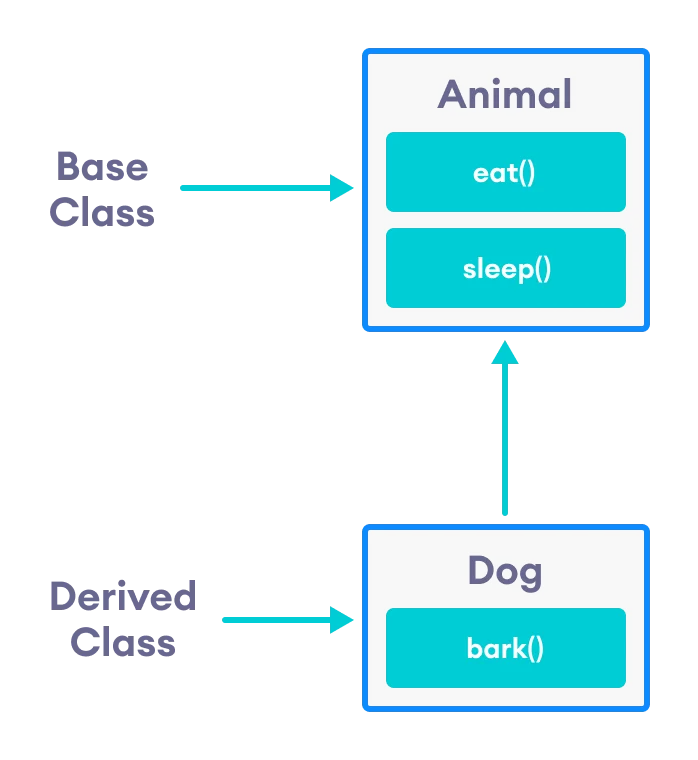

**Modes of inheritance in C++**

There are three modes of inheritance:

 - Public mode
 - Protected mode
 - Private mode

**Public mode:**

In the public mode of inheritance, when a child class is derived from the base or parent class, then the public member of the base class or parent class will become public in the child class also, in the same way, the protected member of the base class becomes protected in the child class, and private members of the base class are not accessible in the derived class.

**Protected mode:**

In protected mode, when a child class is derived from a base class or parent class, then both public and protected members of the base class will become protected in the derived class, and private members of the base class are again not accessible in the derived class. In contrast, protected members can be easily accessed in the derived class.

**Private mode:**

In private mode, when a child class is derived from a base class, then both public and protected members of the base class will become private in the derived class, and private members of the base class are again not accessible in the derived class.

Given table will summarize the above three modes of inheritance and show the Base class member access specifier when derived in all three modes of inheritance in C++:


**Types of inheritance in C++**

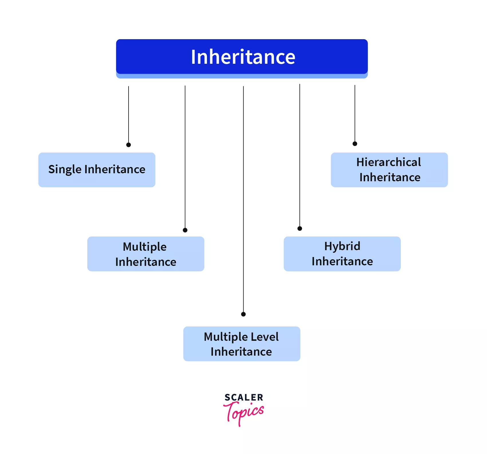

-----

**Single Inheritance in C++:**

When the derived class inherits only one base class, it is known as Single Inheritance.

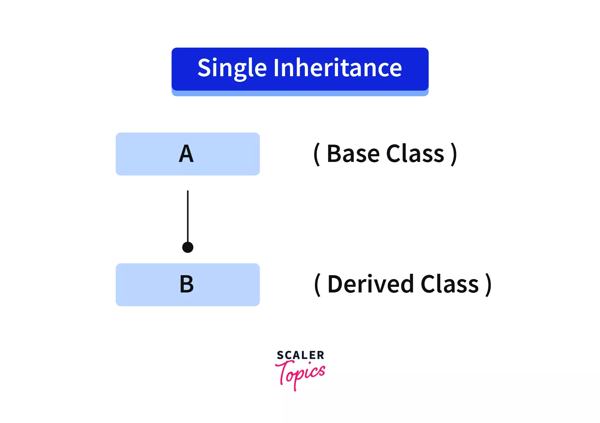

In the above diagram, A is a Base class, and B is a derived class. Here the child class inherits only one parent class.

`Example of Single Inheritance:
`

```c++
class Base {
  public:
    float salary = 900;
};
class Derived: public Base {
  public: 
    float bonus = 100;
    void sum() {
      cout << "Your Total Salary is: " << (salary + bonus) << endl;
    }
};
int main() {
    
  // Creating an object of the derived class.
  Derived x;
    
  // Gets the salary variable of Base class.
  cout << "Your Salary is:" << x.salary << endl;
  // Gets the bonus variable of the Derived class.
  cout << "Your Bonus is:" << x.bonus << endl;
  x.sum();
  return 0;
}
```
`output`
```c++
Your Salary is: 900
Your Bonus is: 100
Your Total Salary is: 1000
```

In the above example, Base is the class name and the parent class, which contains the property named salary and the value 900.

In the same way, there is another class named Derived, which is the child class, which inherits the property of the parent class and has its property named as a bonus which contains the value of 100.

In the child class, there is a function named sum(), which is used to add the salary and bonus. In the main function, an object is created named “x” of the “Derived” class which is a child class, and using that object, the properties, and the sum function are called from the derived class, which will add the salary and bonus and gives it as output.

---

**Multiple Inheritance in C++**

When a derived class(child class) inherits more than one base class(parent class), it is called multiple inheritance.


In the above diagram, “A” and “B” are base classes, and “C” is a derived class that inherits more than one base class(parent class).

`Example of Multiple Inheritance:
`
```c++
class Base1 {
  public:
    float salary = 900;
};

class Base2 {
  public:
    float bonus = 100;
};

class Derived: public Base1, public Base2 {
  public: 
    void sum() {
      cout << "Your Total Salary is: " << (salary + bonus) << endl;
    }
};
int main() {
    
  // Creating an object of the derived class and calling the sum() function.
  Derived x;
  x.sum();
  return 0;
}
```
`Output`
```c++
Your Total Salary is: 1000
```
The above program has two base classes named Base1 and Base2, which contain the properties salary and bonus.

A derived class named ”derived” inherits parent classes Base1 and Base2. In the derived class, the function name sum is used to give the sum of salary and bonus.

In the main function, there is an object named x that is created from a derived class called the sum() function, which will add bonus and salary and give it as output.

----
**Diamond problem in Multiple Inheritance:**

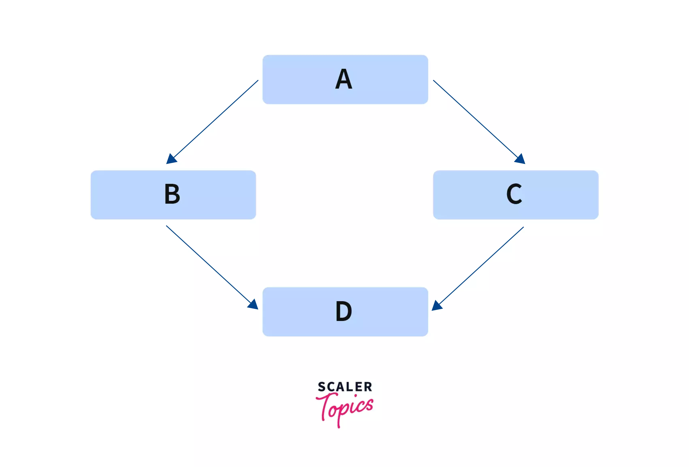

In multiple inheritance, we can face a diamond problem. Let’s take an example in the above figure: “B” and “C” classes are inherited from a single Base class that is “A,” and then“D” is inherited from both “B'' and “C”, as this situation is creating a diamond shape, therefore, this problem is known as “diamond problem”.

Now here, “B” and “C” classes will have the member variable of class “A” as they are inherited from “A”, as “D” is inherited from “B” and “C” so it will contain two copies of “A’s” member variable that is one from “B” and one from “C”, thus causing ambiguities.

The compiler will get confused about which will be taken in D from the two copies of A’s member variable.

`Solution of Diamond Problem:
`

The solution to the diamond problem is Virtual inheritance. It is a technique that ensures that only one copy of the superclasses or base class member variables is inherited by the second-level derivatives that are grandchild.

So in the above example, we can declare class “A” as a `virtual base` class. Now only one copy of the class “A” member variable will be copied to class “B” and “C”.

**What is Virtual Class?**

Virtual Class is defined by writing a keyword “virtual” in the derived classes, allowing only one copy of data to be copied to Class B and Class C (referring to the above example). It prevents multiple instances of a class appearing as a parent class in the inheritance hierarchy when multiple inheritances are used.

Need for Virtual Base Class in C++
To prevent the error and let the compiler work efficiently, we’ve to use a virtual base class when multiple inheritances occur. It saves space and avoids ambiguity.

When a class is specified as a virtual base class, it prevents duplication of its data members. Only one copy of its data members is shared by all the base classes that use the virtual base class.

If a virtual base class is not used, all the derived classes will get duplicated data members. In this case, the compiler cannot decide which one to execute.

Let us look at an example without a virtual base class in C++ and see what the output looks like:

```c++
#include <iostream>
using namespace std;

class A {
  public:
    A() {
        cout << "Constructor A\n";
    }
    void display() {
      cout << "Hello form Class A \n";
    }
};

class B: public A {
};

class C: public A {
};

class D: public B, public C {
};

int main() {
  D object;
  object.display();
}
```
`Output`
```c++
error: non-static member 'display' found in multiple base-class subobjects of type 'A':
    class D -> class B -> class A
    class D -> class C -> class A
    object.display();
           ^
note: member found by ambiguous name lookup
    void display()
         ^
1 error generated.
```
In the above example, we create a Class A and then two of its derived classes, Class B and Class C. Class A has a method that prints out a statement. All the derived classes must have inherited data members from Class A.

Next, we declare Class D, which inherits class B and class C. Since Classes B and C are child classes of A and then D is the child class of B and C, Class D inherits data members of Class A from both B and C. Hence, duplication occurs, and the compiler doesn’t know what to execute and throws an error.

Output After removing line object.display():

```c++
Constructor A
Constructor A
```

Explanation: If we remove the line object.display() in main, the program will compile successfully, and the above output will be printed. It means two objects of class A were created, one from B and the other from C. That's why the call is ambiguous.

But this situation is avoided if the virtual base class is used.

**How to Declare Virtual Base Class in C++?**

Syntax

If Class A is considered as the base class and Class B and Class C are considered as the derived classes of A.

`Note: The word “virtual” can be written before or after the word “public”.
`

```c++
class B: virtual public A {
  // statement 1
};
class C: public virtual A {
  // statement 2
};
```
**Let us see an example:**

```c++
#include <iostream>
using namespace std;

class A {
  public:
    A() // Constructor
    {
        cout << "Constructor A\n";
    }
};

class B: public virtual A {
};

class C: public virtual A {
};

class D: public B, public C {
};

int main() {
  D object; // Object creation of class D.

  return 0;
}
```
`Output`
```c++
Constructor A
```

In this case, we are using a virtual base class in C++, so only one copy of data from Class A was inherited to Class D; hence, the compiler will be able to print the output.

When we mention the base class as virtual, we avoid the situation of duplication and let the derived classes get only one copy of the data.

There are a few details that one needs to remember.

 - Virtual base classes are always created before non-virtual base classes. This ensures all bases are created before their derived classes.
 - Note that classes B and C still have calls to class A, but they are simply ignored when creating an object of class D. If we are creating an object of class B or C, then the constructor of A will be called.
 - If a class inherits one or more classes with virtual parents, the most derived class is responsible for constructing the virtual base class. Here, class D is responsible for creating class A object.

**A Pure Virtual Function**

A pure virtual function is a function that does nothing, which means that you can declare a pure virtual function in the base class that does not have a description in the base class.

Let’s take an example of a class Animal(base class) that doesn’t implement moving, but all the animals(derived classes) must know how to move, considering that all animals can move.

Syntax for Pure Virtual Function C++

```c++
class Animal {
  public:
    // Pure Virtual Function
    virtual void move() = 0;
};
```
**Let’s see an example using a pure virtual function:**
```c++
#include <iostream>
using namespace std;

class Animal {
  public:
    // Pure Virtual Function
    virtual void move() = 0;
};

class Lion: public Animal {
  public: 
    void move() {
      cout << "Lions walk in an unusual manner." << endl;
    }
};

class Wolf: public Animal {
  public: 
    void move() {
      cout << "Wolves can move for hours at a speed of 5-6 miles per hour." << endl;
    }
};

int main() {
  Lion l;
  Wolf w;

  l.move();
  w.move();
}
```
`Output:
`
```c++
Lions walk in an unusual manner.
Wolves can move for hours at a speed of 5-6 miles per hour.
```
In this example, we have created a base class Animal, which consists of a Pure Virtual Function named move(). Next, we have created two derived classes of the base class Animal, namely Lion and Wolf. Since we have declared a pure virtual function in our base class Animal, it is necessary to define the function move() in our derived classes, Lion and Wolf.

----

**Multilevel Inheritance in C++:**

When a derived(child) class inherits the base class and acts as the base class(parent class) to the other class, it is called Multilevel Inheritance. There can be any number of levels i.e any number of derived classes in multilevel inheritance.

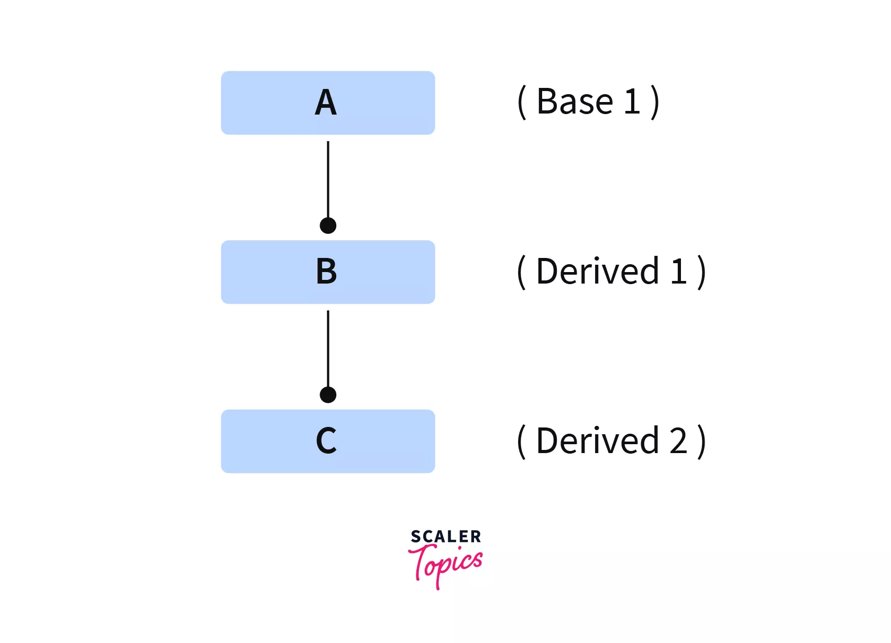

In the above diagram, class ”B” is derived from class ”A,” and class ”B” is now the base class (parent class) for class “C,” and class “C” is derived from class “B”. Now class “C” inherits the property of Classes “A” and “B”.

`Example of Multilevel Inheritance:
`
```c++
class BaseClass {
  public:
    void print() {
      cout << "This is an example of Multilevel Inheritance";
    }
};

class DerivedClass: public BaseClass {};

// Here class is derived from another derived class.
class DerivedClass2: public DerivedClass {};

int main() {
  DerivedClass2 Obj;
  Obj.print();
  return 0;
}
```
`Output:
`
```
This is an example of Multilevel Inheritance
```

The above program contains a base class named BaseClass which contains the message. This is an example of Multilevel Inheritance, there is a derived class named DerivedClass, which inherits the base class(parent class), and then there is one more derived class named DerivedClass2, which inherits the last derived class.

In the main function, the object is created named obj of DerivedClass2. obj calls the print function of the base class, which is the topmost parent class. This shows that DerivedClass2 inherits the property of DerivedClass and BaseClass.

----

**Hierarchical Inheritance in C++:**

When more than one class is inherited from a single base class, it is called Hierarchical Inheritance.

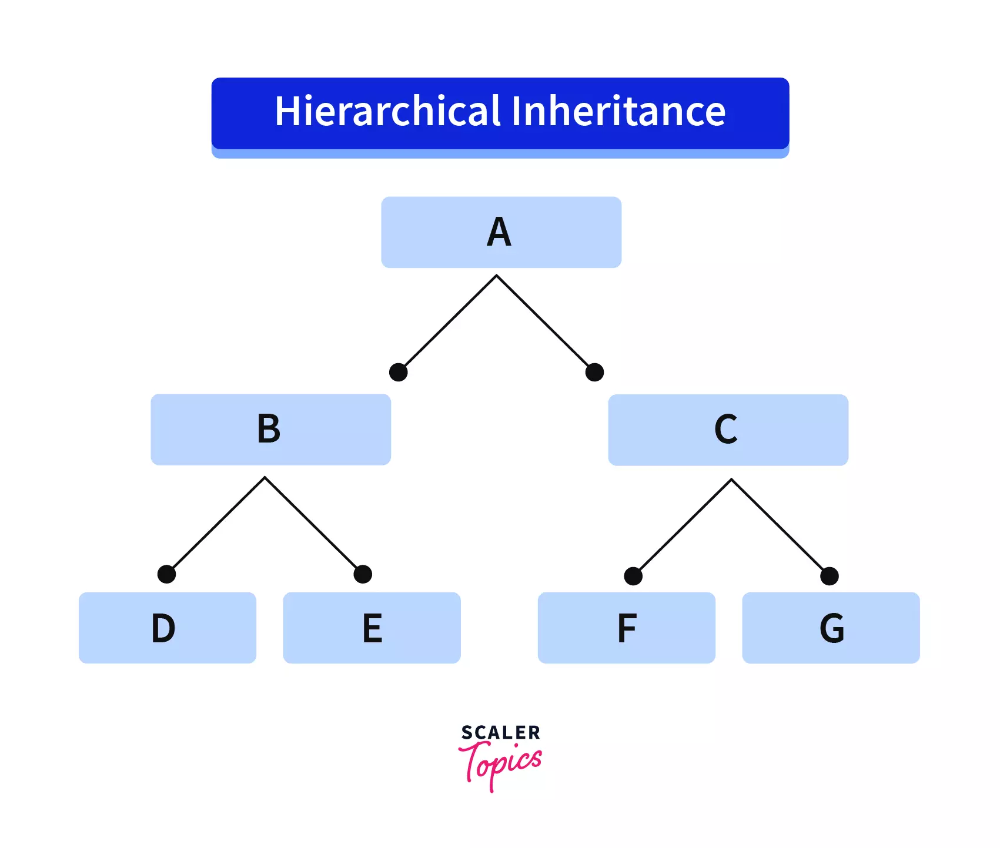

In the above diagram, “A” is a base class, and “B” and “C” are derived classes, which inherit the parent class “A”. “D” and “E” is further derived classes that inherited the base class “B,” which is derived class to class “A”, similarly “E” and “G” are the derived class that inherits base class “C,” which is derived class to “A”.

`Example of Hierarchical Inheritance:
`
```c++
class Single_base_class {
  public:
    int x, y;
    void data() {
      cout << "\nEnter the value of x and y ->\n";
      cin >> x >> y;
    }
};
// Class derived1 is derived from single_base_class.
class Derived1: public Single_base_class {
  public: 
    void product() {
      cout << "\nThe Product is= " << x * y;
    }
};

// Class derived1 is also derived from class single_base_class.
class Derived2: public Single_base_class {
  public: 
    void sum() {
      cout << "\nThe Sum is= " << x + y;
    }
};
int main() {
    
  // Creating objects of both classes and calling functions on them.
  Derived1 obj1;
  Derived2 obj2;
  obj1.data();
  obj1.product();
  obj2.data();
  obj2.sum();
  return 0;
}
```
`Output`
```
Enter the  value of x and y:
5
5
The Product is= 25
Enter the value of x and y:
5
5
The Sum is= 10
```
In the above example, there is a base class named “Single_base_class,” which contains a data function that collects the input from the user. There is a derived class named “Derived1,” which extends the base class “Single_base_class”, Derived1 class contains a product function that is used to do a product of two numbers, here “x” and “y”.

There is one more derived class named “Derived2,” which also inherits the base class “Single_base_class” it contains the sum function to add the numbers, and in the main function object is created, which is used to call the function created in the derived classes and then we get the output as shown above.

---

**Hybrid Inheritance in C++:**

It is a combination of one or more types of inheritance.

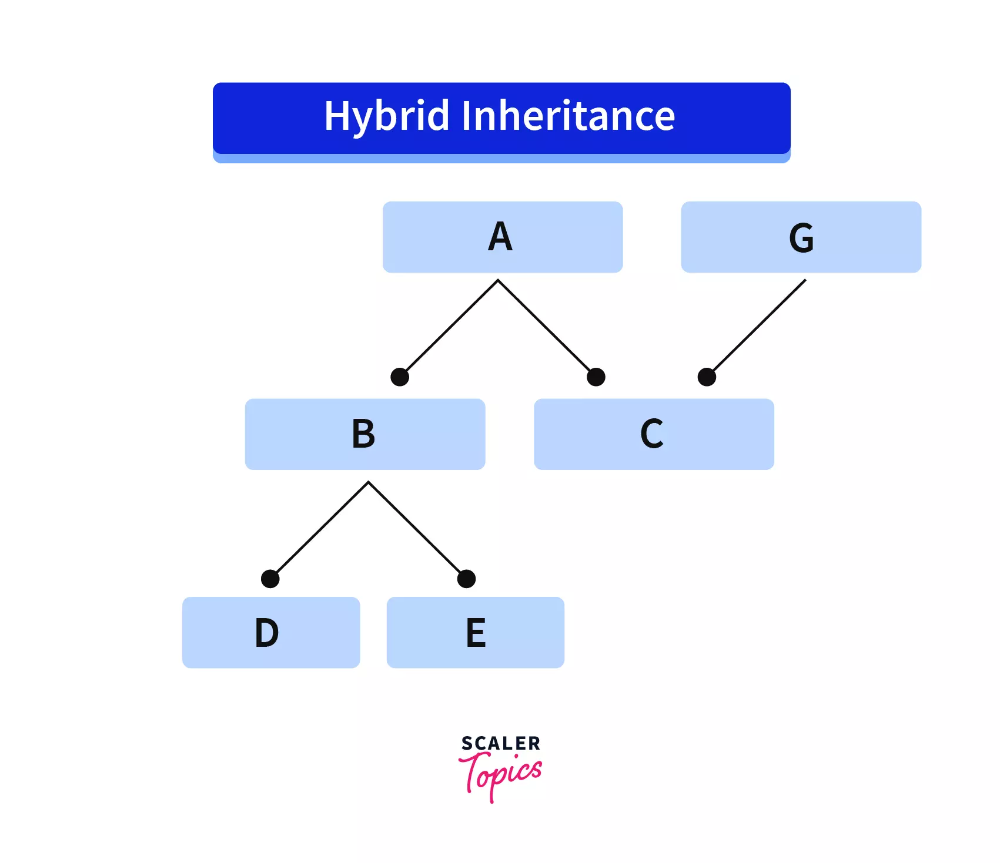

The above diagram shows more than one type of inheritance or a combination of different types of inheritance.

`Example of Hybrid Inheritance:
`

```c++
class World {
  public:
    World() {
      cout << "This is World!\n";
    }
};

// Here is Single Inheritance.
class Continent: public World {
  public: 
    Continent() {
      cout << "This is Continent\n";
    }
};

class Country {
  public:
    Country() {
      cout << "This is the Country\n";
    }
};

// Here is multiple Inheritance.
class India: public Continent, public Country {
  public: 
    India() {
      cout << "This is India!";
    }
};

int main() {
  India myworld;
  return 0;
}
```
`output`
```c++
This is the World!
This is Continent
This is the Country
This is India!
```

In the above program, there is a base class named World, and then there is a derived class named Continent which extends the base class “World” here; we can see single inheritance.

There is a base class named Country, and there is a derived class named India which inherits the “Continent” and “Country” classes. Here we can see multiple inheritance. Hence this is an example of Hybrid inheritance.

**Advantages of Inheritance in C++**

The advantages of inheritance are:

- Inheritance in C++ promotes Code reusability. When a derived class inherits the base class, then the derived class can access all the functionality, and the base class's code can be reused in the derived class.
- It improves code readability as you don’t have to rewrite the same code repeatedly; hence, the code looks cleaner and readable.
- It saves time and effort as the code is already written and is inherited; therefore, it saves time to write code again.
- Inheritance supports extensibility as new classes can be easily added to existing classes.


---

---

### 4.0 Lecture 4

---

---

### 4.1 Constructors and Destructors in Single

`Let us look at below example to understand what happens :`

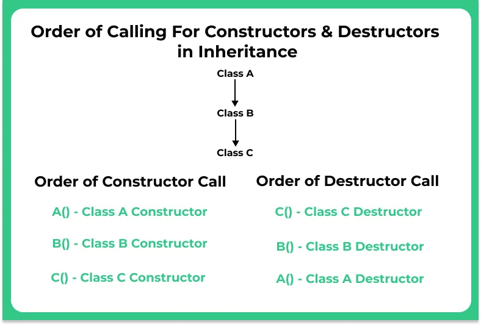

`C++ program to the sequence of execution of constructor and destructor inheritance`

```c++
#include <iostream>
using namespace std;

class parent //parent class
{
    public:
    parent() //constructor
    {
        cout << "Parent class Constructor\n";
    }

    ~parent()//destructor
    {
        cout << "Parent class Destructor\n";
    }
};

class child : public parent//child class
{

    public:
    child() //constructor
    {
    cout << "Child class Constructor\n";
    }

    ~ child() //destructor
    {
    cout << "Child class Destructor\n";
    }
};

int main()
{
    //automatically executes both child and parent class
    //constructors and destructors because of inheritance
    child c;

    return 0;
}
```
`Output`

```c++
Parent class Constructor 
Child class Constructor 
Child class Destructor 
Parent class Destructor
```

**Inheritance in Parametrized Constructor/ Destructor**

In the case of the default constructor, it is implicitly accessible from parent to the child class but parameterized constructors are not accessible to the derived class automatically, for this reason, an explicit call has to be made in the child class constructor to access the parameterized constructor of the parent class to the child class using the following syntax

```c++
<class_name>:: constructor(arguments)
```
**Note**
```c++

Whenever you are using the parameterized constructor in the parent class it  is mandatory to define a default constructor explicitly
```
`Example program`

```c++
#include <iostream>
using namespace std;

class parent
{

    int x;
    public:

    // parameterized constructor
    parent(int i)
    {
        x = i;
        cout << "Parent class Parameterized Constructor\n";
    }
};

class child: public parent
{

    int y;
    public:

    // parameterized constructor
    child(int j) : parent(j)  //Explicitly calling
    {
        y = j;
        cout << "Child class Parameterized Constructor\n";
    }
};

int main()
{
    child c(10);

    return 0;
}
```
`output`

```c++
Parent class Parameterized Constructor
Child class Parameterized Constructor
```
---

---

### 4.2 Constructors and Destructors in Multiple Inheritance

```
class C: public A, public B;
```

Constructors are called upon the order in which they are inherited
First class A constructors are executed followed by class B constructors, then class C constructors


---

---

### 4.3 How to initialize Array of objects with parameterized constructors in C++

1. **Using bunch of function calls** as elements of array:  It’s just like normal array declaration but here we initialize the array with function calls of constructor as elements of that array.
`code`
```c++
#include <iostream>
using namespace std;

class Test {
	// private variables.
private:
	int x, y;

public:
	// parameterized constructor
	Test(int cx, int cy)
	{
		x = cx;
		y = cy;
	}
	// method to add two numbers
	void add() { cout << x + y << endl; }
};
int main()
{
	// Initializing 3 array Objects with function calls of
// parameterized constructor as elements of that array
	Test obj[] = { Test(1, 1), Test(2, 2), Test(3, 3) };

	// using add method for each of three elements.
	for (int i = 0; i < 3; i++) {
		obj[i].add();
	}

	return 0;
}
```
`output` 
```c++
2
4
6
```

2. **Using malloc()**: To avoid the call of a non-parameterized constructor, use malloc() method. “malloc” or “memory allocation” method in C++ is used to dynamically allocate a single large block of memory with the specified size. It returns a pointer of type void which can be cast into a pointer of any form.

```c++
#include <iostream>
#define N 5

using namespace std;

class Test {
	// private variables
	int x, y;

public:
	// parameterized constructor
	Test(int x, int y)
	{
		this->x = x;
		this->y = y;
	}

	// function to print
	void print() { cout << x << " " << y << endl; }
};

int main()
{
	// allocating dynamic array
	// of Size N using malloc()
	Test* arr = (Test*)malloc(sizeof(Test) * N);

	// calling constructor
	// for each index of array
	for (int i = 0; i < N; i++) {
		arr[i] = Test(i, i + 1);
	}

	// printing contents of array
	for (int i = 0; i < N; i++) {
		arr[i].print();
	}

	return 0;
}
```

`output`

```c++
0 1
1 2
2 3
3 4
4 5
```

3. **Using new keyword**: The new operator denotes a request for memory allocation on the Heap. If sufficient memory is available, the new operator initializes the memory and returns the address of the newly allocated and initialized memory to the pointer variable. Here, pointer-variable is the pointer of type data-type. Data-type could be any built-in data type including array or any user-defined data types including structure and class.

For dynamic initialization new keyword require non parameterized constructor if we add a parameterized constructor. So we will use a dummy constructor for it.

```c++
#include <iostream>
#define N 5

using namespace std;

class Test {
	// private variables
	int x, y;

public:
	// dummy constructor
	Test() {}

	// parameterized constructor

	Test(int x, int y)
	{
		this->x = x;
		this->y = y;
	}

	// function to print
	void print() { cout << x << " " << y << endl; }
};

int main()
{
	// allocating dynamic array
	// of Size N using new keyword
	Test* arr = new Test[N];

	// calling constructor
	// for each index of array
	for (int i = 0; i < N; i++) {
		arr[i] = Test(i, i + 1);
	}

	// printing contents of array
	for (int i = 0; i < N; i++) {
		arr[i].print();
	}

	return 0;
}

```
`output`
```c++
0 1
1 2
2 3
3 4
4 5
```

If we don’t use the dummy constructor compiler would show the error given below

`Compiler Error:`

```
error: no matching function for call to ‘Test::Test()’
Test *arr=new Test[N];
```

4. **Using Double pointer (pointer to pointer concept):** A pointer to a pointer is a form of multiple indirections, or a chain of pointers. Normally, a pointer contains the address of a variable. When we define a pointer to a pointer, the first pointer contains the address of the second pointer, which points to the location that contains the actual value as shown below.
   Here we can assign a number of blocks to be allocated and thus for every index we have to call parameterized constructor using the new keyword to initialize.
```c++
#include <iostream>
#define N 5

using namespace std;

class Test {
	// private variables
	int x, y;

public:
	// parameterized constructor

	Test(int x, int y)
		: x(x)
		, y(y)
	{
	}

	// function to print
	void print() { cout << x << " " << y << endl; }
};

int main()
{
	// allocating array using
	// pointer to pointer concept
	Test** arr = new Test*[N];

	// calling constructor for each index
	// of array using new keyword
	for (int i = 0; i < N; i++) {
		arr[i] = new Test(i, i + 1);
	}

	// printing contents of array
	for (int i = 0; i < N; i++) {
		arr[i]->print();
	}

	return 0;
}
```
`output`
```c++
0 1
1 2
2 3
3 4
4 5
```


5. **Using Vector of type class:** Vector is one of the most powerful element of Standard Template Library makes it easy to write any complex codes related to static or dynamic array in an efficient way. It takes one parameter that can be of any type and thus we use our Class as a type of vector and push Objects in every iteration of the loop. 
Vectors are same as dynamic arrays with the ability to resize itself automatically when an element is inserted or deleted, with their storage being handled automatically by the container. Vector elements are placed in contiguous storage so that they can be accessed and traversed using iterators. In vectors, data is inserted at the end.

```c++
#include <iostream>
#include <vector>
#define N 5

using namespace std;

class Test {
	// private variables
	int x, y;

public:
	// parameterized constructor

	Test(int x, int y)
		: x(x)
		, y(y)
	{
	}

	// function to print
	void print() { cout << x << " " << y << endl; }
};

int main()
{
	// vector of type Test class
	vector<Test> v;

	// inserting object at the end of vector
	for (int i = 0; i < N; i++)
		v.push_back(Test(i, i + 1));

	// printing object content
	for (int i = 0; i < N; i++)
		v[i].print();

	return 0;
}
```
`output`
```c++
0 1
1 2
2 3
3 4
4 5
```

---

---

### 4.4 When do we use Initializer List in C++?

1) **For initialization of non-static const data members:**
   const data members must be initialized using Initializer List. In the following example, “t” is a const data member of Test class and is initialized using Initializer List. Reason for initializing the const data member in the initializer list is because no memory is allocated separately for const data member, it is folded in the symbol table due to which we need to initialize it in the initializer list.
   Also, it is a Parameterized constructor and we don’t need to call the assignment operator which means we are avoiding one extra operation.
```c++
#include<iostream>
using namespace std;

class Test {
	const int t;
public:
	Test(int t):t(t) {} //Initializer list must be used
	int getT() { return t; }
};

int main() {
	Test t1(10);
	cout<<t1.getT();
	return 0;
}
```
`output`
```c++
10
```
2) **For initialization of reference members:**
   Reference members must be initialized using Initializer List. In the following example, “t” is a reference member of Test class and is initialized using Initializer List.

```c++
// Initialization of reference data members
#include<iostream>
using namespace std;

class Test {
	int &t;
public:
	Test(int &t):t(t) {} //Initializer list must be used
	int getT() { return t; }
};

int main() {
	int x = 20;
	Test t1(x);
	cout<<t1.getT()<<endl;
	x = 30;
	cout<<t1.getT()<<endl;
	return 0;
}

```
`output`
```c++
20
30
```

3) **For initialization of member objects which do not have default constructor:**
   In the following example, an object “a” of class “A” is data member of class “B”, and “A” doesn’t have default constructor. Initializer List must be used to initialize “a”.

```c++
#include <iostream>
using namespace std;

class A {
	int i;
public:
	A(int );
};

A::A(int arg) {
	i = arg;
	cout << "A's Constructor called: Value of i: " << i << endl;
}

// Class B contains object of A
class B {
	A a;
public:
	B(int );
};

B::B(int x):a(x) { //Initializer list must be used
	cout << "B's Constructor called";
}

int main() {
	B obj(10);
	return 0;
}

```
`output`
```c++
A's Constructor called: Value of i: 10
B's Constructor called
```

If class A had both default and parameterized constructors, then Initializer List is not must if we want to initialize “a” using default constructor, but it is must to initialize “a” using parameterized constructor.

4) **For initialization of base class members :** Like point 3, the parameterized constructor of the base class can only be called using Initializer List.

```c++
#include <iostream>
using namespace std;

class A {
	int i;
public:
	A(int );
};

A::A(int arg) {
	i = arg;
	cout << "A's Constructor called: Value of i: " << i << endl;
}

// Class B is derived from A
class B: A {
public:
	B(int );
};

B::B(int x):A(x) { //Initializer list must be used
	cout << "B's Constructor called";
}

int main() {
	B obj(10);
	return 0;
}
```
output`
```c++
A's Constructor called: Value of i: 10
B's Constructor called
```

5) **When constructor’s parameter name is same as data member**
   If constructor’s parameter name is same as data member name then the data member must be initialized either using this pointer or Initializer List. In the following example, both member name and parameter name for A() is “i”.

```c++
#include <iostream>
using namespace std;

class A {
	int i;
public:
	A(int );
	int getI() const { return i; }
};

A::A(int i):i(i) { } // Either Initializer list or this pointer must be used
/* The above constructor can also be written as
A::A(int i) {
	this->i = i;
}
*/

int main() {
	A a(10);
	cout<<a.getI();
	return 0;
}
```
`output`
```c++
10
```

6) For Performance reasons:
   It is better to initialize all class variables in Initializer List instead of assigning values inside body. Consider the following example:
```c++
// Without Initializer List
class MyClass {
	Type variable;
public:
	MyClass(Type a) { // Assume that Type is an already
					// declared class and it has appropriate
					// constructors and operators
	variable = a;
	}
};
```

Here compiler follows following steps to create an object of type MyClass
1. Type’s constructor is called first for “a”.

2. Default construct “variable”
3. The assignment operator of “Type” is called inside body of MyClass() constructor to assign

```
   variable = a;
```
4. And then finally destructor of “Type” is called for “a” since it goes out of scope.

Now consider the same code with MyClass() constructor with Initializer List

```c++
// With Initializer List
class MyClass {
	Type variable;
public:
	MyClass(Type a):variable(a) { // Assume that Type is an already
					// declared class and it has appropriate
					// constructors and operators
	}
};
```
With the Initializer List, the following steps are followed by compiler:
1. 1. Type’s constructor is called first for “a”.

2. Parameterized constructor of “Type” class is called to initialize: variable(a). The arguments in the initializer list are used to copy construct “variable” directly.
3. The destructor of “Type” is called for “a” since it goes out of scope.
   As we can see from this example if we use assignment inside constructor body there are three function calls: constructor + destructor + one addition assignment operator call. And if we use Initializer List there are only two function calls: copy constructor + destructor call. See this post for a running example on this point.
   This assignment penalty will be much more in “real” applications where there will be many such variables. Thanks to ptr for adding this point.
   Please write comments if you find anything incorrect, or you want to share more information about the topic discussed above.


---

---

### 4.5 Virtual Functions

- Virtual function is a member function which is declared
  within a base class and is re-defined (overridden) by a
  derived class. When you refer to a derived class object
  using a pointer or a reference to the base class, you can
  call a virtual function for that object and execute the
  derived class’s version of the function.
- Virtual functions ensure that the correct function is
  called for an object, regardless of the type of reference
  (or pointer) used for function call.
- Virtual functions are declared with a virtual keyword in
  base class.
- The resolving of function call is done at runtime.


  **Virtual Functions Rules**

  1. Virtual functions cannot be static.
  2. A virtual function can be a friend function of
  another class.
  3. Virtual functions should be accessed using pointer
  or reference of base class type.
  4. The prototype of virtual functions should be the
  same in the base as well as derived class.
  5. They are always defined in the base class and
  overridden in a derived class.
  6. A class may have virtual destructor but it cannot
  have a virtual constructor

---

---

### 4.6 Polymorphism

- The word polymorphism means having many forms.
- polymorphism occurs when there is a hierarchy of classes
  and they are related by inheritance.
- C++ polymorphism means that a call to a member
  function will cause a different function to be executed
  depending on the type of object that invokes the function.
- A real-life example of polymorphism is a person who at the
  same time can have different characteristics. A man at the
  same time is a father, a husband, and an employee. So the
  same person exhibits different behavior in different
  situations. This is called polymorphism. Polymorphism is
  considered one of the important features of ObjectOriented Programming.
- Use of virtual functions is example of polymorphism

**There are two types of polymorphism in C++:**


- **Compile time polymorphism:**

The overloaded functions are invoked by matching the type and number of arguments. This information is available at the compile time and, therefore, compiler selects the appropriate function at the compile time. It is achieved by function overloading and operator overloading which is also known as static binding or early binding. Now, let's consider the case where function name and prototype is same.

```c++
 class A                                  //  base class declaration.  
  {  
       int a;  
       public:  
       void display()  
       {   
             cout<< "Class A ";  
        }  
  };  
class B : public A                       //  derived class declaration.  
{  
    int b;  
    public:  
   void display()  
  {  
        cout<<"Class B";  
  }  
};  
```
In the above case, the prototype of display() function is the same in both the base and derived class. Therefore, the static binding cannot be applied. It would be great if the appropriate function is selected at the run time. This is known as run time polymorphism.

- **Run time polymorphism:**
  Run time polymorphism is achieved when the object's method is invoked at the run time instead of compile time. It is achieved by method overriding which is also known as dynamic binding or late binding.


**Differences b/w compile time and run time polymorphism**


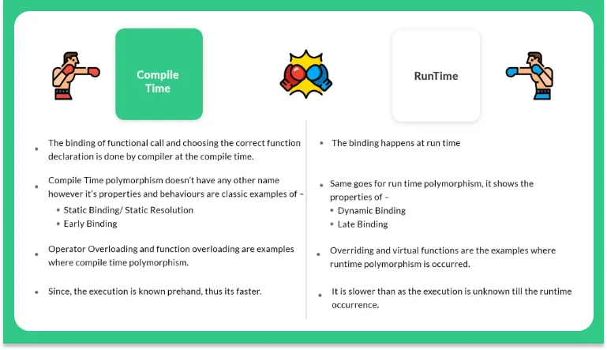

`C++ Run time Polymorphism
`
```c++
#include <iostream>    
using namespace std;    
class Shape {                                        //  base class  
    public:    
virtual void draw(){                             // virtual function  
cout<<"drawing..."<<endl;      
    }        
};     
class Rectangle: public Shape                  //  inheriting Shape class.  
{      
 public:    
 void draw()      
   {      
       cout<<"drawing rectangle..."<<endl;      
    }      
};    
class Circle: public Shape                        //  inheriting Shape class.  
  
{      
 public:    
 void draw()      
   {      
      cout<<"drawing circle..."<<endl;      
   }      
};    
int main(void) {    
    Shape *s;                               //  base class pointer.  
    Shape sh;                               // base class object.  
       Rectangle rec;    
        Circle cir;    
      s=&sh;    
     s->draw();     
        s=&rec;    
     s->draw();      
    s=?    
    s->draw();     
}    
```

`Output`
```c++
drawing...
drawing rectangle...
drawing circle...

```

---

----

### 4.7 Abstract classes & pure virtual functions

Sometimes implementation of all function cannot be
provided in a base class because we don’t know the
implementation. Such a class is called abstract class. For
example, let Shape be a base class. We cannot provide
implementation of function draw() in Shape, but we know
every derived class must have implementation of draw().
pure virtual function (or abstract function) is a virtual
function for which we can have implementation, But we must
override that function in the derived class, otherwise the
derived class will also become abstract class
A class is abstract if it has at least one
pure virtual function

```c++
// C++ program to calculate the area of a square and a circle

#include <iostream>
using namespace std;

// Abstract class
class Shape {
   protected:
    float dimension;

   public:
    void getDimension() {
        cin >> dimension;
    }

    // pure virtual Function
    virtual float calculateArea() = 0;
};

// Derived class
class Square : public Shape {
   public:
    float calculateArea() {
        return dimension * dimension;
    }
};

// Derived class
class Circle : public Shape {
   public:
    float calculateArea() {
        return 3.14 * dimension * dimension;
    }
};

int main() {
    Square square;
    Circle circle;

    cout << "Enter the length of the square: ";
    square.getDimension();
    cout << "Area of square: " << square.calculateArea() << endl;

    cout << "\nEnter radius of the circle: ";
    circle.getDimension();
    cout << "Area of circle: " << circle.calculateArea() << endl;

    return 0;
}
```

`output`
```c++
Enter the length of the square: 4
Area of square: 16

Enter radius of the circle: 5
Area of circle: 78.5
```

---

---
